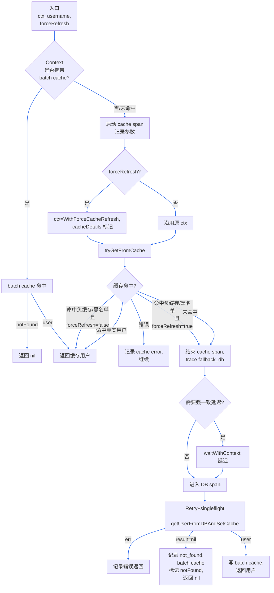
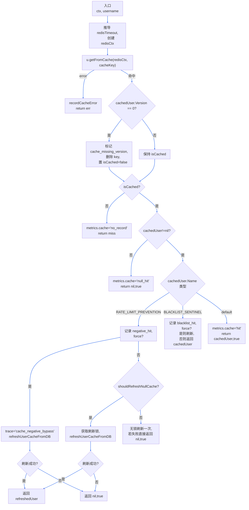
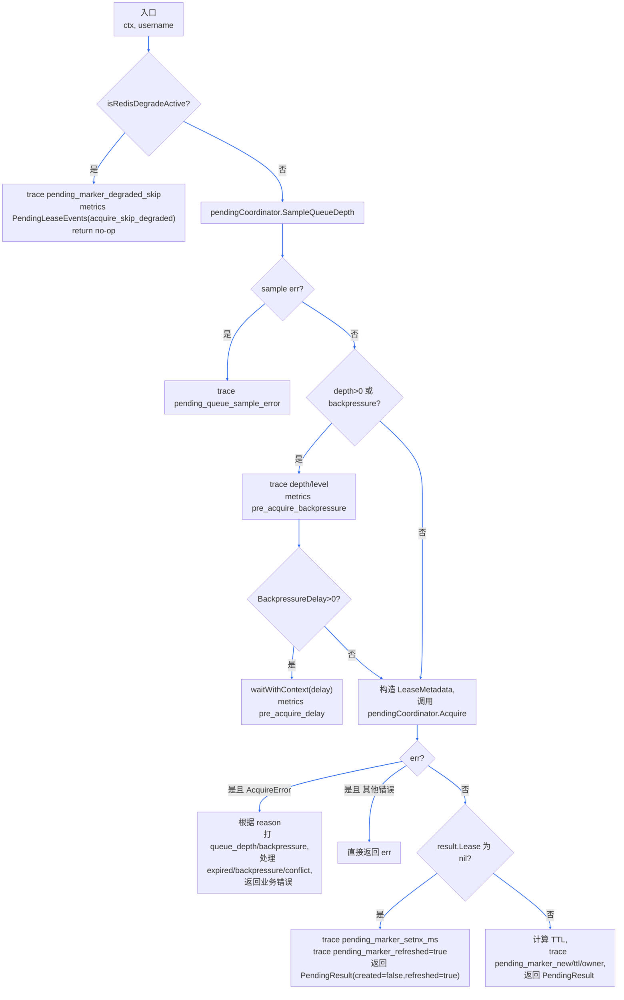
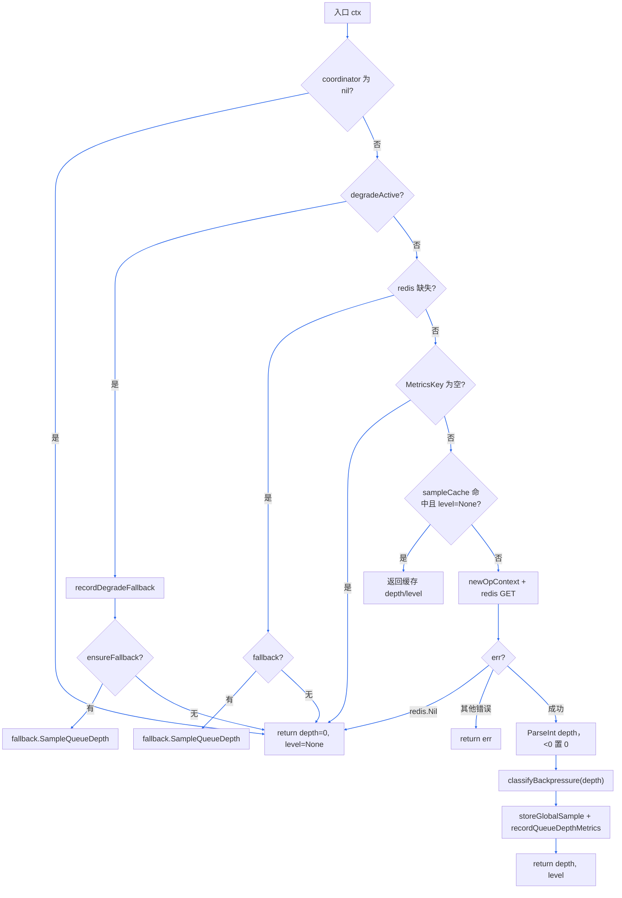

## 公共流程：`checkUserExist`

`checkUserExist(ctx, username, forceRefresh)` 是创建、删除、更新等链路里复用最频繁的“用户名存在性”查询。它在一次请求中串联了批量缓存、Redis 读取、强一致性探测以及数据库兜底，保证不同场景下既能命中缓存，又不会被过期数据误导。整体流程如下：

### 关键步骤解读

1. **批量缓存（Batch Lookup Cache）**：某些入口（例如 `DeleteCollection`）会调用 `WithBatchLookupCache(ctx)`，让一次请求内的多次存在性检查共享一个短 TTL 的 map。`checkUserExist` 首先尝试命中它，命中即可避免 Redis/DB I/O，并把结果重新写回缓存维持一致视图。
2. **缓存查询阶段**：开启 trace span 并记录 `forceRefresh` 等标签。若 `forceRefresh=true`，会用 `WithForceCacheRefresh` 包裹上下文，后续 `tryGetFromCache` 命中负缓存/黑名单时会立即触发回源；否则沿用原逻辑（负缓存只做自刷新，黑名单直接判不存在）。
3. **强一致性探测**：当调用来自强一致场景（例如删除、更新）或显式 `forceRefresh=true`，会在回源前执行一次小延迟探测（`strongConsistencyProbeDelay`），避免刚写入的数据还没复制完成导致读到旧状态。
4. **数据库兜底**：通过 `util.RetryWithBackoff` + `singleflight group` 访问主库，必要时强制走主库 (`storectx.WithForcePrimary`)。成功读到用户后刷新缓存并写入 batch cache；确定不存在则写入 `notFound` 哨兵，后续同请求直接返回。
5. **Tracing & Metrics**：缓存 span / DB span 会在每条路径记录 `cache_result`, `fallback_db`, `verify_user_gone_*` 等标签，同时向 `metrics.CacheHits`、`metrics.RequestsMerged` 上报，便于对照观测。

该流程位于 `internal/apiserver/service/v1/user/user_service.go::checkUserExist`，供创建、删除、更新、改密、批量操作等所有用户相关 API 共享。未来如需扩展其他强一致场景，只需在入口按需开启 `WithBatchLookupCache` 或 `forceRefresh` 即可沿用整套机制。

## 公共流程：`tryGetFromCache`

`tryGetFromCache(ctx, username)` 专注于读取 Redis 中的用户缓存，并根据命中内容决定是否立即返回、触发刷新或回源数据库。它是 `checkUserExist` 与 `Get` API 的公共基础模块。流程如下：

### 关键步骤解读

1. **Redis 访问与错误统计**：根据配置推导 `redisTimeout`，用 `context.WithTimeout` 包裹调用，失败时通过 `recordCacheError` 将错误按类型（timeout、network 等）打到 `metrics.CacheErrors`，并直接返回错误给调用方。
2. **版本缺失保护**：缓存命中但 `ObjectMeta.Version == 0` 被视为无效快照，立即删除 Redis key 并当作 miss 处理，避免把过期或截断的数据返回给业务。
3. **强制刷新与哨兵处理**：当 `forceCacheRefreshFromContext(ctx)` 为真时，如果命中负缓存或黑名单哨兵，就立即调用 `refreshUserCacheFromDB` 回源数据库；否则沿用默认策略（负缓存仅做一次或带锁刷新，黑名单直接返回哨兵）。
	- 对负缓存（`RATE_LIMIT_PREVENTION`）而言：`force=true` 时直接强制刷新；`force=false` 时先通过 `shouldRefreshNullCache` 尝试获取刷新权（需要获取 Redis 锁，避免并发雪崩），拿到锁后刷新缓存，否则只做一次无锁刷新尝试并返回原来的 negative 哨兵。对应的流程节点也标出了 `shouldRefreshNullCache` 分支。
4. **命中分类与指标**：根据命中类型分别递增 `metrics.CacheHits` 的 `hit`、`null_hit`、`blacklist_hit`、`no_record` 标签，并打上 `trace` 标签（如 `protection_negative_cache_hit`、`cache_negative_bypass`），方便观测缓存质量。

实现位于 `internal/apiserver/service/v1/user/get_service.go::tryGetFromCache`，所有用户查询相关接口都会经过此步骤，以保证缓存命中与回源策略一致。

## 公共流程：`markUserPendingForCreate`

`markUserPendingForCreate(ctx, user)` 是创建流水线里负责写入用户名占位（pending lease）的步骤，实质调用 `markUserPendingCreate(ctx, username)` 与 `pendingCoordinator` 协作：在 Redis/任意实现里写 SetNX、感知背压、必要时降级跳过，让并发创建/补偿任务能够感知“此用户名正在创建中”。核心流程如下：

### 关键步骤解读

1. **降级短路**：一旦 `enableRedisDegrade` 触发（占位或缓存通道异常），`markUserPendingCreate` 会直接在入口返回，标记 `pending_marker_degraded_skip=true` 并上报 `PendingLeaseEvents{acquire_skip_degraded}`，避免在 Redis 故障时继续放大错误。
2. **排队深度采样**：通过 `pendingCoordinator.SampleQueueDepth` 获取当前 `QueueDepth` 与 `BackpressureLevel`，并在 trace 上记录。若 level≠none，会依据 `BackpressureDelay(level, depth)` 注入一次 `waitWithContext` 延迟，并上报 `pre_acquire_backpressure`/`pre_acquire_delay` 事件；这就是题目里提到的 `SampleQueueDepth` 核心用途。
3. **Acquire 主流程**：构建 `LeaseMetadata`（包含 requestID、operator、backend），调用 `pendingCoordinator.Acquire`。
   - 返回 `AcquireError` 时，会根据 `Reason`（backpressure/conflict）和 `PendingState` 补充 `pending_queue_depth`、`pending_backpressure_level` 等标签，并将 “expired lease 正在恢复” 转成 `code.ErrServerBusy`，提示调用方稍后重试。
   - 其他错误直接透传给上层，由创建流程决定是否触发降级。
4. **SetNX 成功/续租**：`result.Lease == nil` 表示只刷新了计时器（或 coordinator 只返回统计信息），会记录 `pending_marker_setnx_ms`、`pending_marker_refreshed=true` 并将 `PendingResult.Refreshed=true` 返回，供上游判断是否是幂等重入。若 `Lease` 不为空，则计算剩余 TTL，写入 `pending_marker_new/pending_marker_ttl_ms/pending_lease_owner` 等 trace 标签，并把 backend、OwnerID、TTL 等元数据塞进 `PendingResult`，方便 `afterUserPending` 以及异步操作通道继续传播。
5. **指标联动**：失败/降级/背压路径会按场景递增 `metrics.PendingLeaseEvents`（例如 `expired_conflict`、`acquire_degraded`），配合 trace 标签定位 Redis 占位瓶颈。

该流程由 `internal/apiserver/service/v1/user/create_service.go::markUserPendingForCreate` 调用，实际逻辑在 `user_service.go::markUserPendingCreate`；任何需要新建用户占位或观测 pending 行为的组件，都可以复用这一套机制。

## 公共流程：`pendingCoordinator.SampleQueueDepth`

`SampleQueueDepth(ctx)` 是 `PendingCoordinator` 对外暴露的“瞬时队列深度+背压等级”探针，供 API 侧在写占位前评估当前排队情况，也是背景降级/本地 fallback 的连接点。源码位于 `internal/pkg/usercache/pending_state_machine.go::SampleQueueDepth`，主要步骤如下：

### 关键步骤解读

1. **降级短路 + fallback**：一旦 `degradeActive(ctx)` 判定为真，说明 Redis 指标链路不可用；函数会打 `recordDegradeFallback("sample_queue_depth")` 并尝试通过 `ensureFallback()` 切换到内存/本地文件实现继续采样。如果 fallback 也不可用，就直接返回 `0 / BackpressureNone`，让上游理解为“无法感知排队，先按无背压处理”。
2. **Redis 与指标 key 校验**：即便 coordinator 没降级，也会一路验证 `redis` 实例与 `cfg.MetricsKey`。任何一个缺失都不会强行访问 Redis，直接返回默认值或 fallback 结果。
3. **缓存命中策略**：`sampleCacheTTL`>0 时会缓存最近一次 level==`BackpressureNone` 的结果，且只要缓存未过期就直接复用，避免每次都打 Redis。非 None 等级则每次实时采样，以便及时感知背压。
4. **Redis 读取与指标**：真正查询时会用 `newOpContext` 派生一个带超时的 ctx，调用 `redis.GetKeyWithCommandTimeout`，并通过 `metrics.RecordRedisOperation("pending_lease_metrics_get", ...)` 监控延迟/错误。`redis.Nil` 被视为“尚未记录队列深度”，直接返回 0。
5. **回填深度与等级**：解析出的 depth 会被裁剪为非负数，再通过 `classifyBackpressure` 得到等级；随后写入全局 sample cache 并上报 `PendingLeaseQueueDepth`、`PendingLeaseBackpressureLevel` 等指标，供 dashboard 观察。返回值被 `markUserPendingCreate`、`tryAcquirePendingLease` 等调用方用于决定是否注入额外 `BackpressureDelay`。

若后续接入新的 fallback 介质（例如嵌入式 KV 或 RPC），只需在 `ensureFallback()` 里返回对应实现即可复用整条判定逻辑，无需改动上层业务。

## 公共流程：`背压相关参数含义`
1. **LeaseTTL**	租约理论过期时间的计算基数	决定「租约理论过期时间 = 租约创建时间 + LeaseTTL」，是过期判定的 “核心业务阈值”.
[对应 “10:00 创建 + TTL10 分钟 → 10:10 理论过期” 中的 “10 分钟”。]
2. **ExpiredGracePeriod**	租约过期后的宽限期	在租约被判定为过期后，允许其继续存活一段时间以等待恢复操作完成，避免因短暂延迟误判为永久过期
[对应 “10:10 理论过期 + 宽限期2分钟 → 10:12 真正过期” 中的 “2 分钟”。]
3. **ReleaseRetention**	正常释放租约后在 Redis 里保留的时间	保证在正常释放后的一段时间内，其他并发创建请求仍然能感知到“该用户名刚被创建”，避免短时间内重复创建
[对应 “10:00 创建 → 10:10 正常释放 + 保留5分钟 → 10:15 删除” 中的 “5 分钟”。对应 “正常释放快照保留 1s~5s” 中的 “1s~5s”，是 “留痕但不长期占用资源” 的设计]
4. **ExpiredRetention**	过期租约在 Redis 里保留的时间.	租约标记为过期后，其状态（如过期时间、过期原因）在内存 / Redis 中保留的时长
[对应 “10:10 理论过期 + 宽限期2分钟 → 10:12 真正过期 + 保留10分钟 → 10:22 删除” 中的 “10 分钟”。对应 “过期租约快照保留 5m~30m” 中的 “5m~30m”，是 “允许足够时间让补偿任务发现并处理” 的设计
租约被 maybeExpireLocked 标记为过期后，其状态（如过期时间、过期原因）会保留 ExpiredRetention 时长，用于：
异常排查（比如排查 “为什么这个租约过期”，需看过期原因 / 时间）；统计过期率（比如统计 10s 内的过期租约数）；补偿任务发现（比如异步补偿任务需要扫描过期租约并处理）。]