# Create API 全链路分析

本文聚合创建用户（Create API）在 *cdmp-mini* 中的全生命周期执行路径，覆盖架构视角、执行流程、组件交互、状态演进、数据流与依赖关系，便于排查高并发、背压与一致性相关问题。

---
## 0. 名词解释
1. 背压
在数据流处理过程，，当下游消费者处理速度跟不上上游生产者的速度时，为了防止系统过载或崩溃，上游会主动减缓数据发送速率，称为背压（Backpressure）。在 *cdmp-mini* 中，背压主要通过 `PendingCoordinator` 实现。
2. 降级
降级（Degradation）是指在系统负载过高或部分组件不可用时，主动降低服务质量或功能，以保证核心功能的可用性。在 *cdmp-mini* 中，降级主要体现在 Redis 不可用时跳过租约写入。
核心是先明确降级的本质定义，再区分「重试」「错误处理」「降级」的边界，最后结合你的场景判断是否属于降级。
一、先明确：什么是降级？
降级（Service Degradation）的核心目标是：当系统 / 依赖资源出现异常（如超时、报错、过载）时，为了保证核心功能可用、避免雪崩，主动放弃部分非核心功能，或用「低成本、低质量但可用」的方式替代原逻辑。
降级的关键特征：
「主动妥协」：不是被动报错，而是提前设计的兜底方案；
「核心可用」：牺牲非核心，保核心；
「替代逻辑」：用更简单的逻辑（如默认值、缓存占位符、空结果）替代原复杂逻辑。
二、先区分：重试 ≠ 降级
你提到的「出现超时等错误→重试」，不算降级，原因：
重试的目标是「恢复原逻辑的正常执行」，本质是「尽力让原功能正常工作」，而非「放弃原功能、用兜底方案替代」；
重试是「纠错手段」，降级是「容错手段」—— 只有重试失败后，不再执着于原逻辑，才会进入降级环节。
举个例子：
调用用户唯一性校验接口超时→重试 3 次（重试，试图恢复原逻辑）；
重试 3 次仍超时→不再调用接口，直接用 Redis 占位符判断（降级，放弃原接口，用兜底逻辑）。
三、你的场景：Redis 写入占位符是否算降级？
结论：如果这个占位符是「替代原唯一性校验逻辑的兜底方案」，则属于降级；如果只是「记录错误状态」，则不算。
分两种情况拆解：
情况 1：算降级（符合降级核心特征）
比如你的核心逻辑是：
校验用户手机号唯一性 → 调用数据库 / 第三方接口 → 返回「唯一 / 不唯一」
异常场景：调用数据库超时→重试 3 次无效→不再查库，而是读取 Redis 中的占位符（比如「暂定为唯一」/「暂定为不唯一」）作为校验结果，同时在 Redis 写入这个占位符标记此时符合降级：
放弃了「精准查库校验唯一性」的原逻辑（非核心？或为了保系统稳定性暂时妥协）；
用「Redis 占位符」这个低成本方案替代，保证「校验功能不报错、核心流程能走通」；
是主动设计的兜底，而非被动报错。
情况 2：不算降级（仅为错误记录）
如果重试失败后，在 Redis 写入占位符（比如「校验失败 - 超时」），但后续流程直接抛出错误、终止校验，没有用这个占位符替代原校验逻辑 —— 此时 Redis 占位符只是「错误状态记录」，不算降级（因为没有兜底的替代逻辑，核心功能仍不可用）。
四、「错误处理机制」≠ 降级，但降级是错误处理的一种高级形式
错误处理是一个「大范畴」，降级是错误处理中「面向稳定性的兜底策略」，二者是包含关系：
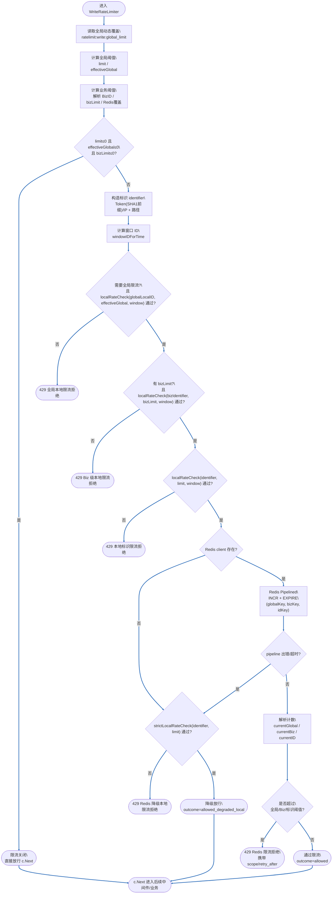

要点：

- 第一层是本地桶 `localRateCheck`，对「路径级全局」、Biz 维度以及「标识 + 路径」做快速预筛（顺序：Global -> Biz -> Identifier），避免 Redis 异常时所有流量都打到后端；
- 第二层使用 Redis `INCR + EXPIRE` 固定窗口计数，通过 `Pipelined` 一次性对全局 / Biz / 标识三个 key 进行计数与过期设置，**已经不再使用 Lua 脚本**；
- 当 Redis client 为空或 pipeline 出错/超时时，回退到 `strictLocalRateCheck`，若仍超限则以 429 拒绝，否则作为 `allowed_degraded_local` 放行（在指标中可区分降级放行）；
- 对于真正由 Redis 计数判定的超限，会携带 `scope`（global/biz/identifier）和经 `TTL` 估算的 `retry_after`，方便客户端或排障时理解是哪一层在挡流量；
- 在各个决策点，会同步打点到 `write_rate_limiter_total` 与 `write_rate_limiter_requests_total`，并在 Trace 的 `spanDetails` / `RequestContext.Extra` 中记录 `limit_config`/`limit_effective`、BizKey 及覆盖来源 key，具体指标含义见 2.2.1.1 小节。
### 组件 1.1.x：写入限流实现与动态配置/埋点约定

这一小节补充说明 Router 层 `write-limit` 中间件（WriteRateLimiter）的具体实现方式，以及与 Redis 配置、trace 埋点、日志/指标之间的约定，方便运维和排障时快速定位「配置值 vs 生效值 vs 谁改的」。

#### 1. 写入限流的三层语义

- 标识级（per-identifier）限流：
    - 粒度：`token/IP + 路径`，形如 `write:<token-or-ip-hash>:<fullPath>`；
    - 用途：限制单个调用方在某条 API 上的写入速率；
    - 本地计数：进程内固定窗口计数，先挡掉明显超限流量，避免所有请求都打到 Redis；
    - Redis 计数：固定窗口桶，key 形如 `ratelimit:write:<identifier>:<windowID>`，通过 `INCR + EXPIRE` 统计当前窗口内的请求数，并在客户端“事后判断”是否超限。

- 业务级（Biz）限流：
    - 粒度：`BizKey + token/IP`，形如 `writebiz:<bizKey>:<token-or-ip-hash>`；
    - 用途：限制同一调用方在某个业务域上的整体写入速率（跨多条路由），防止单一业务被打爆；
    - 本地计数：key 为 `writebiz:<bizKey>:<token-or-ip-hash>`，窗口与标识级一致；
    - Redis 计数：key 形如 `ratelimit:writebiz:<bizKey>:<token-or-ip-hash>:<windowID>`，与标识级同样使用 `INCR + EXPIRE` + 事后判断。

- 全局路径级（Global）限流：
    - 粒度：`路径`，形如 `write:global:<fullPath>`；
    - 用途：对单条写接口做兜底限流，防止整条路由在异常情况下被打爆；
    - 本地计数：key 为 `write:global:<fullPath>`；
    - Redis 计数：key 形如 `ratelimit:write:global:<fullPath>:<windowID>`，同样通过 `INCR + EXPIRE` 做窗口计数。

> 顺序约定：
> - 本地限流阶段：依次检查 标识级 → Biz 级 → 全局级；
> - Redis 限流阶段：依次检查 全局级 → Biz 级 → 标识级；
> - 一旦某一层判定超限，其余层不再继续检查，并返回 429。

#### 2. Redis 配置 Key 与动态覆盖

写入限流支持通过 Redis 做「阈值热更新」，运维可以在线调整限流阈值，而无需重启进程。当前约定了两类配置 key：

- 全局基础阈值覆盖（per-identifier limit 覆盖）
    - Key 约定：`ratelimit:write:global_limit`（实际 Redis Key 会加上 RedisCluster 的前缀，例如 `cdmp:ratelimit:write:global_limit`）；
    - 语义：
        - 写入的是「标识级写限流 limit 的全局覆盖值」，而不是计数桶；
        - 中间件在每个请求进入时，以 150ms 的超时从 Redis 读取该 key，若存在有效正整数 `gLimit`：
            - 覆盖本次请求的 `limit`（原配置值）；
            - 后续本地/Redis 限流逻辑都基于覆盖后的值执行；
        - 若读取失败或值不合法，则回退为配置中的原始 `limit`。

- Biz 维度基础阈值覆盖（bizLimit 覆盖）
    - Key 约定：`ratelimit:write:biz_limit:{<bizKey>}`；
    - 语义：
        - 写入的是「某个 BizKey 对应的业务级写限流阈值覆盖值」，同样不是计数桶；
        - 中间件先通过 `bizid.ResolveBizByRoute` 解析出 biz，再通过 `bizid.GetBizLimit(biz.Key)` 读到配置中的 `bizLimit`；
        - 随后在同一个短超时上下文里，从 Redis 读取 `ratelimit:write:biz_limit:{<bizKey>}`：
            - 若存在有效正整数 `bLimit`，则覆盖本次请求的 `bizLimit`；
            - Biz 级本地/Redis 限流都会基于覆盖后的 `bizLimit` 执行；
            - 若读取失败或值不合法，则继续使用配置中的原始 `bizLimit`。

> 使用建议：
> - 正常情况下通过配置中心/DB 管理 `limit` 与 `bizLimit` 的基础值；
> - 需要临时调大/调小限流阈值时，可以先在 Redis 中写入覆盖 key，并观察生效情况；
> - 覆盖 key 建议设置合理的过期时间，避免长期偏离配置中心。

#### 3. Trace / RequestContext.Extra 埋点约定

为了在日志与追踪系统中清晰地区分「配置值 vs 生效值 vs 覆盖来源」，WriteRateLimiter 在 spanDetails 以及 `RequestContext.Extra` 中约定了以下字段：

- 通用字段（路径 & 窗口）
    - `write_limit_path`：当前路由路径（FullPath）；
    - `write_limit_window`：窗口长度字符串，如 `1s`、`5s`。

- 标识级基础阈值（limit）
    - 配置值（配置文件 / 启动参数）：
        - spanDetails：`limit_config`；
        - RequestContext.Extra：`write_limit_limit_config`；
    - 生效值（考虑 Redis 覆盖后）：
        - spanDetails：`limit`（如有覆盖，会在记录 `limit_before_override` 后更新为生效值）；
        - RequestContext.Extra：`write_limit_limit_effective`；
    - 覆盖前值与来源：
        - spanDetails：
            - `limit_before_override`：覆盖前的配置值；
            - `limit_override_key`：当前生效覆盖值来自的 Redis key（通常为 `ratelimit:write:global_limit` 加前缀）；
        - RequestContext.Extra：`write_limit_override_key`。

- 全局路径级阈值（effectiveGlobal）
    - 配置值：
        - RequestContext.Extra：`write_limit_global_limit`（原始 globalLimit 或由 globalFactor 推导的值）。
    - 当前实现中，全局兜底阈值暂不通过 Redis 单独热更新，主要通过基础配置和 `globalFactor` 控制。如后续引入类似 `ratelimit:write:global_path_limit:<path>` 的覆盖 key，可复用 limit/bizLimit 的同一套埋点模式。

- Biz 维度基础阈值（bizLimit）
    - Biz 元信息：
        - spanDetails：`biz_key`、`biz_name`；
        - RequestContext.Extra：`write_biz_key`；
    - 配置值：
        - spanDetails：`biz_limit_config`（来自 `bizid.GetBizLimit`）；
        - RequestContext.Extra：`write_biz_limit_config`；
    - 生效值（考虑 Redis 覆盖后）：
        - spanDetails：`biz_limit`；
        - RequestContext.Extra：`write_biz_limit_effective`；
    - 覆盖前值与来源：
        - spanDetails：
            - `biz_limit_before_override`：覆盖前的配置值；
            - `biz_limit_override_key`：当前生效覆盖值来自的 Redis key（`ratelimit:write:biz_limit:{<bizKey>}` 加前缀）；
        - RequestContext.Extra：`write_biz_limit_override_key`。

> 观测侧使用示例：
> - 排查「某路径写入被大量拒绝」时，可以通过 `write_limit_limit_config` vs `write_limit_limit_effective` 观察是否被 Redis 覆盖；
> - 查看某 Biz（如 `biz_key=user_create_high_priority`）是否被临时收紧/放宽限流，可对比 `write_biz_limit_config` vs `write_biz_limit_effective`，并通过 `write_biz_limit_override_key` 定位修改来源；
> - 结合 trace 的 `http_status`、`BusinessMetrics` 与指标 `WriteLimiterTotal` 的标签（`local_rate`/`local_biz`/`local_global`/`redis_limit`/`redis_limit_biz`/`redis_limit_global`/`redis_timeout` 等），可以做出完整的「限流决策路径」还原。

---

## 模块 1 学习导航：入口保护与限流 (Days 1-5)

**对应组件**：`WriteRateLimiter` (写入限流), `Router`, `Controller`

### 💡 设计思路
在流量进入业务逻辑之前，必须有一道“防洪堤”。设计思路是 **“分层防御”**：
1.  **本地内存**：挡住极端的突发流量，保护 Redis。
2.  **Redis 分布式**：控制全局和业务维度的速率。
3.  **降级策略**：Redis 挂了不能影响核心业务，必须有本地兜底。

### 🔍 核心关注点
*   **Pipeline 优化**：为什么用 Redis Pipeline 而不是 Lua？（减少 RTT，提高吞吐）。
*   **Context 控制**：为什么 Redis 操作都要带 Timeout？（防止雪崩）。
*   **三层限流**：Global / Biz / Identifier 优先级的处理逻辑。

### ✅ 每日 Checklist
*   **Day 1 (Router & Controller)**
    *   [ ] 阅读 `internal/pkg/server/router.go`，画出中间件加载顺序图。
    *   [ ] 阅读 `cmd/iam-apiserver/apiserver.go`，理解 Gin 引擎的初始化。
    *   [ ] **产出**：手写一个简单的 Gin Server，包含一个 Global Middleware 和一个 Group Middleware。
*   **Day 2 (WriteRateLimiter 基础)**
    *   [ ] 阅读 `internal/pkg/middleware/common/write_limiter.go` 的 `localRateCheck` 函数。
    *   [ ] **产出**：在 `limiter-lab` 中实现一个纯内存的固定窗口限流器。
*   **Day 3 (Redis Pipeline)**
    *   [ ] 阅读 `write_limiter.go` 中 `client.Pipelined` 部分代码。
    *   [ ] **产出**：写一个 Demo，对比“循环调用 Redis INCR”和“使用 Pipeline 批量 INCR”的耗时差异。
*   **Day 4 (降级与覆盖)**
    *   [ ] 阅读 `write_limiter.go` 中的 `strictLocalRateCheck` 和 Override 逻辑。
    *   [ ] **产出**：在 Demo 中模拟 Redis 连接超时，验证程序是否自动降级为本地限流。
*   **Day 5 (模块验收)**
    *   [ ] **闭卷挑战**：不看代码，画出 `WriteRateLimiter` 的完整流程图（含本地、Redis、降级分支）。

---

## 模块 2 学习导航：唯一性校验与缓存预热 (Days 6-12)

**对应组件**：`unique.Checker`, `UserService.prepareUserForCreate`

### 💡 设计思路
创建用户的核心痛点是 **“快”** 和 **“准”**。
*   **快**：通过缓存预热（Cache Warmup），让后续的检查尽量走缓存。
*   **准**：通过 Redis 占位符（Placeholder）防止并发冲突，数据库作为最终兜底。

### 🔍 核心关注点
*   **Race Condition**：高并发下如何保证唯一性？（Redis SETNX + 数据库唯一索引）。
*   **缓存击穿**：为什么要有 `ensureContactCacheReady`？（防止冷启动时大量请求打穿到 DB）。
*   **错误映射**：如何区分“业务冲突”和“系统错误”？

### ✅ 每日 Checklist
*   **Day 6 (Service Pipeline 骨架)**
    *   [ ] 阅读 `internal/apiserver/service/user_create.go`，梳理 `createPipeline` 的步骤。
    *   [ ] **产出**：画出 `createPipeline` 的主流程图。
*   **Day 7 (缓存预热)**
    *   [ ] 阅读 `ensureContactCacheReady` 相关代码。
    *   [ ] **产出**：解释代码中 `sync.Once` 或互斥锁在预热中的作用。
*   **Day 8 (唯一性检查 - 理论)**
    *   [ ] 阅读 `internal/pkg/unique` 包的设计。
    *   [ ] **产出**：画出“检查中 -> 冲突 -> 通过”的状态机图。
*   **Day 9 (唯一性检查 - 实现)**
    *   [ ] 阅读 `unique.Checker` 的 `Check` 方法。
    *   [ ] **产出**：在 `pending-lab` 中模拟两个并发请求检查同一个 Key，验证只有一个能通过。
*   **Day 10 (降级策略)**
    *   [ ] 阅读 `shouldDegradeForError` 逻辑。
    *   [ ] **产出**：列出 3 种会触发降级的错误类型（如 DB 超时、Redis 错误等）。
*   **Day 11 (综合调试)**
    *   [ ] 在本地环境运行 `create` 接口，打断点观察 `ensureUserUnique` 的变量值。
*   **Day 12 (模块验收)**
    *   [ ] **闭卷挑战**：口述当 Redis 挂掉时，唯一性检查是如何降级并保证数据最终一致性的？

---

## 模块 3 学习导航：背压控制与租约管理 (Days 13-19)

**对应组件**：`PendingCoordinator`, `LagProtect`

### 💡 设计思路
当系统处理不过来时，与其让系统崩溃，不如 **“优雅地拒绝”**。
*   **背压（Backpressure）**：通过监测队列深度或租约数量，主动拒绝新请求。
*   **租约（Lease）**：给每个正在处理的请求发一个“限时令牌”，超时自动释放，防止死锁。

### 🔍 核心关注点
*   **LagProtect**：为什么要在 Router 层就做采样？（尽早拒绝，节省资源）。
*   **Pre-acquire Delay**：为什么在获取租约前要 sleep 一下？（平滑流量，削峰填谷）。
*   **Lua 脚本**：保证“检查+写入”的原子性。

### ✅ 每日 Checklist
*   **Day 13 (LagProtect)**
    *   [ ] 阅读 `internal/pkg/middleware/common/lag_protect.go`。
    *   [ ] **产出**：解释 `SampleBackpressure` 是如何计算“健康度”的。
*   **Day 14 (PendingCoordinator 结构)**
    *   [ ] 阅读 `internal/pkg/usercache/pending_state_machine.go`。
    *   [ ] **产出**：画出 Pending 租约的生命周期图（Acquire -> Release/Expire）。
*   **Day 15 (Acquire 逻辑)**
    *   [ ] 深入阅读 `Acquire` 方法及其 Lua 脚本（或 Redis 命令组合）。
    *   [ ] **产出**：在 `pending-lab` 中实现一个基于 Redis SETNX 的简单租约锁。
*   **Day 16 (背压采样)**
    *   [ ] 阅读 `SampleBackpressure` 实现。
    *   [ ] **产出**：编写一个单测，模拟队列满载时，采样函数返回 `StatusOverload`。
*   **Day 17 (延迟策略)**
    *   [ ] 阅读 `markUserPendingCreate` 中的 `AlignDelayWithDeadline`。
    *   [ ] **产出**：计算题：如果请求超时剩 500ms，背压建议延迟 800ms，实际延迟多少？
*   **Day 18 (集成测试)**
    *   [ ] 结合 `WriteRateLimiter` 和 `PendingCoordinator` 看日志。
*   **Day 19 (模块验收)**
    *   [ ] **闭卷挑战**：手写一段伪代码，实现“如果队列深度 > 1000，则拒绝请求；否则获取 5秒 的租约”。

---

## 模块 4 学习导航：异步队列与 Worker (Days 20-26)

**对应组件**：`OperationPipeline`, `Worker`, `QueueCoordinator`

### 💡 设计思路
为了提升吞吐量，将耗时操作 **“异步化”**。
*   **Pipeline 模式**：将操作封装为 Task，入队即返回。
*   **Worker 池**：后台协程消费队列，执行真正的业务逻辑。
*   **状态机**：记录每个 Task 的状态（Pending -> Processing -> Done），支持断点续传。

### 🔍 核心关注点
*   **模式决策**：`decideOperationMode` 如何决定走同步还是异步？
*   **幂等性**：Worker 挂了重启，同一个任务被消费两次怎么办？
*   **补偿机制**：任务失败了怎么重试？

### ✅ 每日 Checklist
*   **Day 20 (OperationPipeline 基础)**
    *   [ ] 阅读 `internal/common/service/operation/pipeline.go`。
    *   [ ] **产出**：理解 `Submit` 和 `ProcessOnce` 接口定义。
*   **Day 21 (模式决策)**
    *   [ ] 阅读 `decideOperationMode` 逻辑。
    *   [ ] **产出**：配置一个 `Rollout` 策略，验证请求是否按比例进入队列。
*   **Day 22 (队列实现)**
    *   [ ] 阅读 `QueueCoordinator` 的 Redis 实现。
    *   [ ] **产出**：在 `pipeline-lab` 中实现一个基于 Redis List 的简单队列。
*   **Day 23 (Worker 循环)**
    *   [ ] 阅读 Worker 的启动和消费循环代码。
    *   [ ] **产出**：写一个简单的 Go 协程池，模拟 Worker 消费。
*   **Day 24 (状态存储)**
    *   [ ] 阅读 `RequestStateStore` 实现。
    *   [ ] **产出**：解释状态更新如何保证原子性（CAS 或 锁）。
*   **Day 25 (补偿机制)**
    *   [ ] 阅读 Compensation Worker 相关代码。
    *   [ ] **产出**：模拟一个执行失败的任务，观察补偿 Worker 是否将其捞起。
*   **Day 26 (模块验收)**
    *   [ ] **闭卷挑战**：画出异步模式下，从 `Submit` 到 `Worker` 执行再到 `StateStore` 更新的时序图。

---

## 模块 5 学习导航：可观测性与最终集成 (Days 27-30)

**对应组件**：`Metrics`, `Trace`, `Audit`, `Kafka Producer`

### 💡 设计思路
代码写完了，怎么知道它跑得好不好？
*   **可观测性**：Metrics 告警，Trace 定位，Log 查证。
*   **最终一致性**：通过 Kafka 消息保证数据最终落库。

### 🔍 核心关注点
*   **关键指标**：哪些指标能反映系统健康度？（如 `write_limiter_total`, `pending_lease_active`）。
*   **Trace 串联**：如何通过一个 TraceID 串起 HTTP 入口和 Kafka 消费？

### ✅ 每日 Checklist
*   **Day 27 (Kafka 投递)**
    *   [ ] 阅读 `SendCreateMessage` 和 Kafka Producer 封装。
    *   [ ] **产出**：理解消息体结构，知道哪些字段是必须的。
*   **Day 28 (Metrics & Trace)**
    *   [ ] 全局搜索 `metrics.Inc` 和 `trace.StartSpan`。
    *   [ ] **产出**：列出 Create 流程中最重要的 5 个监控指标。
*   **Day 29 (全链路 Review)**
    *   [ ] 从 `Router` 开始，顺藤摸瓜读一遍所有代码，不放过任何一个函数调用。
    *   [ ] **产出**：整理一份“Create 流程代码地图”（思维导图）。
*   **Day 30 (最终验收)**
    *   [ ] **终极挑战**：找一个空白的 Go 文件，尝试凭记忆写出 `UserService.Create` 的核心伪代码，包含：
        1.  模式决策
        2.  Pipeline 初始化
        3.  唯一性检查
        4.  Pending 租约获取
        5.  Kafka 发送
        6.  错误处理与降级

---

## 1. 架构图（Architecture Diagram）

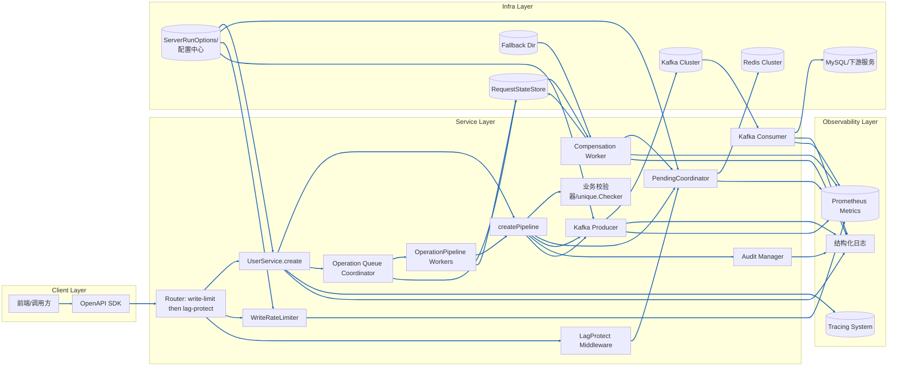

- **架构分层说明**

| 层级                | 组件                                                                                                                                                                                                                                  | 职责                                                                                                                                                                           |
| ------------------- | ------------------------------------------------------------------------------------------------------------------------------------------------------------------------------------------------------------------------------------- | ------------------------------------------------------------------------------------------------------------------------------------------------------------------------------ |
| Client Layer        | `UI`、`SDK`                                                                                                                                                                                                                           | 外部调用方通过前端页面或 OpenAPI SDK 进入，统一处理鉴权、重试与幂等头部。                                                                                                      |
| Service Layer       | `UserService.create`、`createPipeline`、`unique.Checker`、`RateLimiter`、`PendingCoordinator`、`Audit Manager`、`Kafka Producer`、`Kafka Consumer`、`Operation Queue Coordinator`、`OperationPipeline Workers`、`Compensation Worker` | 接口入口承担限流、模式判定与 trace 建立；流水线执行业务校验、租约占位、审计与 Kafka 投递；异步模式下请求写入操作队列，由后台 Worker 拉起同一流水线，失败场景交由补偿线程恢复。 |
| Observability Layer | `Logger`、`Prometheus Metrics`、`Tracing System`                                                                                                                                                                                      | 统一采集结构化日志、指标与分布式追踪，为 SLO 监控、链路定位和容量分析提供数据。                                                                                                |
| Infra Layer         | `Redis Cluster`、`Kafka Cluster`、`MySQL/下游服务`、`ServerRunOptions`、`RequestStateStore`、`Fallback Dir`                                                                                                                           | Redis 提供租约、缓存与去重；Kafka 承载异步消息链路；MySQL/下游服务用于最终持久化；配置中心提供动态限流与降级参数；状态存储与 Fallback 目录支撑异步任务恢复与失败持久化。       |

- `UI → SDK → Router(write-limit → lag-protect) → UserService.create`：入口先经过写入限流、lagProtect（采样 PendingCoordinator 背压），顺序与代码一致，再进入 API 层做模式决策与业务处理。
- `UserService.create → createPipeline`：同步模式直接进入流水线，依次执行 `unique.Checker` 校验、`PendingCoordinator` 背压占位、`Audit Manager` 记录审计，并在 `Kafka Producer` 处发出创建消息。
- `Operation Queue Coordinator → OperationPipeline Workers`：异步或灰度命中的请求写入队列，由 Worker 后台调用同一条 `createPipeline`，执行过程中持续写入 `RequestStateStore` 并与 `Logger`、`Metrics`、`Tracing System` 对齐观测数据。
- `Kafka Producer → Kafka Cluster → Kafka Consumer → MySQL/下游服务`：消息经 Kafka 投递、消费与最终写库，消费者将结果和错误反馈至日志与指标，用于判断是否需要补偿。
- `Compensation Worker ↔ PendingCoordinator/RequestStateStore/Fallback Dir`：补偿线程读取失败记录或降级文件，交互 Redis 释放租约、补发 Kafka 消息，并将修复进度写回状态存储和监控系统。

---

## 2. 主流程图（Flow Chart）

> 路由层入口保护（新增说明）：在进入 `UserService.create` 之前，Gin 路由会先经过两类保护中间件：
> - LagProtect（背压采样）：调用 `PendingCoordinator.SampleBackpressure`，按 `SampleInterval` 复用采样结果，并把样本写入 context；超阈值返回 429。该阶段不启用心跳检测（HeartbeatTimeout=0），仅做队列深度采样。
> - 写入限流（write-rate-limit）：基于路径的窗口限流，决策（pass/limit/reject）会落入 tracing span `write-rate-limit`，拒绝时返回 429。
> 通过后才会进入下图的业务流水线。

```mermaid
%%{init: {'themeVariables': {'lineColor': '#1E63B5', 'flowchartLinkColor': '#1E63B5', 'lineWidth': 3, 'fontSize': '24px'}}}%%
flowchart TD
    Start([开始])
    RateLimit{"write-limit 窗口超限?"}
    Reject429([429 写入限流拒绝])
    LagSample["lagProtect 采样 PendingCoordinator"]
    LagReject([429 背压/滞后拒绝])
    LagOver{"背压等级超阈值?"}
    Mode["decideOperationMode (服务层) 选择执行模式"]
    QueueKind{"operation kind 在 QueueKinds?"}
    SubjectBlock{"subject 命中 BlockList?"}
    SubjectAllow{"subject 命中 AllowList?"}
    ModeSyncPref{"配置/名单命中 Sync?"}
    ModeQueuePref{"配置/名单命中 Queue?"}
    ModeRollout{"配置 Mode=Rollout?"}
    RolloutZero{"RolloutPercent ≤ 0?"}
    RolloutFull{"RolloutPercent ≥ 100?"}
    StickyKey["采样键: (PreferSubject 命中时 subject→StickyHeader,
                 否则 StickyHeader→subject) → 序号"]
    RolloutSample{"Rollout 采样命中 Queue?"}
    ModeSync{"执行同步管道?"}
    Controller["UserController.Create 控制层"]
    HandlerReady{"ensureCreateHandler 成功?"}
    MetricsWrap["metrics.MonitorBusinessOperation 包裹执行"]
    ExecuteHandler["handler.Execute → invokeCreateUserService"]
    QueueDegrade{"队列降级 / Redis 队列不可用?"}
    Queue["operationPipeline.Submit 入队\n(Upsert 状态 + Enqueue)"]
    QueueReturn["可选 inline 预跑\nHTTP 请求返回"]
    AsyncProcess["OperationPipeline Workers 异步执行 createPipeline"]
    AsyncFail{"异步执行失败?"}
    Compensate["Compensation Worker 补偿/回滚"]
    Begin["createBeginHook 初始化上下文"]
    Normalize["normalizeUserForCreate 规范化字段"]
    Prepare["prepareUserForCreate 预处理"]
    Ensure["ensureUserUnique 唯一性校验"]
    Resolve["resolveUserExistence 兜底存在性"]
    Existing{"已存在实体?"}
    Backpressure["PendingCoordinator 采样与背压评估\n(含 pre-acquire 延迟)"]
    Acquire["markUserPendingForCreate 写入租约\n(内部调用 markUserPendingCreate)"]
    AcquireErr{"调用返回错误?\n(含 Redis/网络错误)"}
    Degradeable{"shouldDegradeForError 满足?\n(可重试/临时错误)"}
    DegradeTrace["markCreateDegraded 记录降级\n并标记 create_degraded"]
    LeaseError["返回占位/背压错误"]
    AfterPending["afterUserPending 标记 trace"]
    Produce["SendCreateMessage 发布 Kafka"]
    Broker["Kafka 集群"]
    Consume["用户创建 Consumer"]
    ConsumerPersist["消费侧持久化/回写"]
    ConsumerFail{"消费失败?"}
    Retry["Kafka 重试/补偿"]
    Respond([返回成功])
    Fail([返回错误])

    classDef default font-size:24px;
    linkStyle default stroke:#1E63B5,stroke-width:3px

    Start --> RateLimit
    RateLimit -- 是 --> Reject429
    RateLimit -- 否 --> LagSample --> LagOver
    LagOver -- 是 --> LagReject
    LagOver -- 否 --> Controller --> HandlerReady
    HandlerReady -- 否 --> Fail
    HandlerReady -- 是 --> MetricsWrap --> ExecuteHandler --> Mode --> QueueKind
    QueueKind -- 否 --> ModeSync
    QueueKind -- 是 --> SubjectBlock
    SubjectBlock -- 是 --> ModeSync
    SubjectBlock -- 否 --> SubjectAllow
    SubjectAllow -- 是 --> QueueDegrade
    SubjectAllow -- 否 --> ModeSyncPref
    ModeSyncPref -- 是 --> ModeSync
    ModeSyncPref -- 否 --> ModeQueuePref
    ModeQueuePref -- 是 --> QueueDegrade
    ModeQueuePref -- 否 --> ModeRollout
    ModeRollout -- 是 --> RolloutZero
    %% 理论上 Mode 已经被规范化为 sync/queue/rollout 三种之一，
    %% 因此前两步判定为否时，只可能是 rollout；
    %% 这里的 "否" 仅作为防御性分支，保持与代码默认分支一致：回退为 queue。
    ModeRollout -- 否 --> QueueDegrade
    RolloutZero -- 是 --> ModeSync
    RolloutZero -- 否 --> RolloutFull
    RolloutFull -- 是 --> QueueDegrade
    RolloutFull -- 否 --> StickyKey --> RolloutSample
    RolloutSample -- 是 --> QueueDegrade
    RolloutSample -- 否 --> ModeSync
    %% 队列模式：若 Redis 队列处于降级/不可用状态，会在 Submit 前直接拒绝入队，
    %% 返回 ErrServerBusy 并提示调用方稍后重试；只有在队列健康时才真正执行
    %% operationPipeline.Submit 入队并进入异步处理。
    QueueDegrade -- 是 --> Fail
    QueueDegrade -- 否 --> Queue
    Queue --> QueueReturn --> Respond
    Queue --> AsyncProcess
    AsyncProcess --> AsyncFail
    AsyncFail -- 否 --> Respond
    AsyncFail -- 是 --> Compensate --> Respond
    ModeSync -- 是 --> Begin --> Normalize --> Prepare --> Ensure --> Resolve --> Existing
    Existing -- 是 --> Fail
    Existing -- 否 --> Backpressure --> Acquire --> AcquireErr
    AcquireErr -- 是 --> Degradeable
    Degradeable -- 是 --> DegradeTrace --> Produce
    Degradeable -- 否 --> LeaseError --> Fail
    AcquireErr -- 否 --> AfterPending --> Produce --> Broker --> Consume --> ConsumerFail
    Produce -->|发送失败| Fail
    ConsumerFail -- 是(失败) --> Retry
    Retry -. 重放 .-> Consume
    ConsumerFail -- 否(成功) --> ConsumerPersist --> Respond

    classDef decision fill:#fff3cd,stroke:#f0ad4e,stroke-width:1px
    class QueueKind,SubjectBlock,SubjectAllow,ModeSyncPref,ModeQueuePref,ModeRollout,RolloutZero,RolloutFull,RolloutSample,ModeSync,Existing,AcquireErr,Degradeable,ConsumerFail decision
```

要点：
- 路由入口与代码一致：write-limit → lagProtect → controller，见 [internal/pkg/server/router.go](../cdmp-mini/internal/pkg/server/router.go#L193-L207)。
- lagProtect 仅做 PendingCoordinator 采样与 429 拒绝，不会写入/修改 `operationMode`，模式决策发生在服务层 `decideOperationMode`。
- `decideOperationMode` 在请求入口判定同步/异步执行路径；默认值来自运行时配置，若选择异步会直接入队 `operationPipeline`，API 立即返回，同时后台 `OperationPipeline Workers` 拉起同一套 `createPipeline`。
- 模式决策顺序：先按 QueueKinds 判断当前操作是否允许进入队列/灰度；未命中则直接同步。命中后再按 BlockList 强制 Sync、AllowList 强制 Queue，剩余按配置顺序 Sync→Queue→Rollout；Rollout 采样键优先 StickyHeader，fallback subject、序号，对应上图的决策分支。
- 控制层：`UserController.Create` 先经 `ensureCreateHandler` 构建 handler，失败直接返回 `ErrServerBusy`；成功后用 `metrics.MonitorBusinessOperation` 包裹执行，内部调用服务层 `UserService.Create`，在进入流水线前先执行 `decideOperationMode`。
- handler 执行：`handler.Execute` 内部包含 decode/enhance/validate/prepare/timeout，并调用 `invokeCreateUserService` 进入服务层的 create 流水线（后续 `createBeginHook` 等钩子）。
- `createBeginHook` 建立 trace、降级标记与通用上下文，串联后续步骤的观测维度。
- `prepareUserForCreate` 完成密码加密及联系方式缓存预热，为唯一性检查提前构建热路径。
- `ensureUserUnique` 与 `PendingCoordinator` 串联：先进行全量预检与限流，再按租约背压策略决定是否进入写入阶段，过程中可能触发降级。
- `Backpressure` 阶段：`markUserPendingCreate` 在调用 `Acquire` 之前会基于 `PendingCoordinator.SampleBackpressure` 的结果计算 `delay`，并通过 `AlignDelayWithDeadline` 对齐请求剩余超时时间，最终执行一次有限时的 pre-acquire 延迟（上限 `pendingBackpressureMaxDelay`）。这一步已经完成了对「队列已趋近饱和」场景的削峰处理。
- `Acquire` 阶段：
    - 若队列真实打满或冲突，由 `AcquireError` 映射为业务错误（`ErrServerBusy`，带「排队中」「正在创建」等文案），此类属于硬性背压，当前请求会被打回，调用方应按业务码退避重试；
    - 若出现 Redis/网络等「短暂性错误」，不会包装成 `AcquireError`，而是作为普通错误返回给调用方，由 `markUserPendingForCreate` 上层根据 `shouldDegradeForError` 判定是否进入占位降级；
    - 全局 Redis 降级（`isRedisDegradeActive`）会通过 `PendingCoordinatorConfig.DegradeActive` 传入 `PendingCoordinator`，由其内部自动选择 Redis 或内存 backend，调用方始终通过统一的 Acquire 接口交互，不再在上层直接跳过 Pending。
- `shouldDegradeForError` 现实现：
    - 优先调用 `isRetryableError`，识别超时、连接重置、临时网络错误、数据库/Redis 短暂不可用等可重试错误；
    - 兜底将显式标记为 `code.ErrDatabaseTimeout` 的错误也视为可降级；
    - 对于命中的错误会认为是「依赖短暂抖动」，而非「业务逻辑错误」，因此不再打断创建主流程，而是走降级路径。
- `markUserPendingForCreate` 在 Redis 正常或进入全局降级态时都会统一调用 `PendingCoordinator.Acquire`：
    - 正常态下，Acquire 直接使用 Redis backend 写入租约；
    - 当 `shouldDegradeForError` 判定为可降级错误时，不再强依赖占位成功：调用 `markCreateDegraded` 将本次请求标记为降级（`create_degraded=true`），附带原因（如 `redis_placeholder_error`），并写入 `PendingLeaseEvents` 指标（如 `acquire_degraded` / `acquire_skip_degraded`），随后返回空的 `PendingResult{}` 且 error=nil，允许流水线继续后续步骤（唯一性与 Kafka 发送），只是不再依赖租约做并发保护；
    - 当全局 Redis 降级激活时，`PendingCoordinator` 会通过 `DegradeActive` 回调自动退化为使用本地内存 backend 维护租约，避免上层直接跳过 Pending，同时仍保留一定的并发保护能力。
- 综合来看：真正的「队列积压/背压超阈值」通过 `AcquireFailureBackpressure/Conflict` 直接体现为业务拒绝；而 Redis 自身的短暂抖动则通过 `shouldDegradeForError` 进入「轻量级降级」，优先保证创建主流程可用性。
- `SendCreateMessage` 将用户实体推送至 Kafka，消费者异步完成持久化与下游派发，是创建 API 得以快速返回的关键。
- 消费侧逻辑：`Consume → ConsumerFail` 为判定节点；仅失败时进入 Kafka 重试/补偿（含重放/死信处理），成功路径是 `ConsumerFail(否) → ConsumerPersist → Respond`。
- 异步管道失败（如占位未释放、Kafka 投递失败）时，会携带 `pending` 元信息触发 `Compensation Worker`，对租约释放、消息补发和缓存对齐进行补充处理，保证「异步补充模式」闭环。

---

### decideOperationMode 决策流程

`decideOperationMode` 负责在 `UserService.Create/Update/Delete` 入口决定当前请求走同步管道还是进入异步队列，核心基于控制器快照、操作类型、名单规则与灰度百分比做出选择：

- **控制器缺失默认排队**：未初始化或运行时故障时直接退回 `OperationModeQueue`，保障服务可用。
设计目的：兜底保障服务可用性，避免故障扩散
**核心痛点**
控制器是「操作模式决策」的核心依赖，若控制器未初始化（c == nil）或运行时故障（如配置加载失败、状态异常），若返回「同步模式」，高并发场景下会直接压垮数据库 / 下游服务，导致服务不可用；而「队列模式」是「流量削峰」的兜底方案，即使队列消费慢，也能保证请求不丢失、服务不崩溃。
**设计合理性**
1. **队列模式的容错性更强**
同步模式：请求必须「立即处理、同步返回」，依赖下游服务实时可用，故障时直接失败；
队列模式：请求先存入队列（如 Kafka/Redis List），异步消费，即使下游故障，队列可暂存请求，下游恢复后补发，避免请求丢失。
2. **符合「故障时优先保服务可用」的原则**
控制器故障属于「决策层异常」，而非「业务层异常」，此时应选择「最安全的操作模式」—— 队列模式能隔离故障、缓冲流量，而同步模式会放大故障。
3. **反例（若默认同步）**
秒杀场景下，控制器初始化失败→默认同步模式→10 万并发请求直接打向数据库→数据库连接池耗尽→服务宕机→全量请求失败；而默认队列模式→请求存入队列，即使消费慢，至少服务能响应，后续可人工扩容消费端
- **操作类型白名单**：`QueueKinds` 定义允许进入异步管道的操作，未命中的操作强制走同步。
**设计目的：精细化管控异步风险，避免非核心操作占用队列资源**
**核心痛点**
并非所有操作都适合异步：
1. 适合异步的操作：非实时、允许延迟的（如「用户行为日志」「订单状态异步通知」「积分更新」）；
2. 不适合异步的操作：实时性要求高、需同步返回结果的（如「用户登录验证」「支付结果查询」「库存扣减」）。
若所有操作都走队列，会导致「实时操作延迟返回」（用户体验差）、「队列资源被非核心操作占满」（核心操作排队超时）
**设计合理性**
**白名单机制更安全（黑名单易遗漏）**
1. 白名单（QueueKinds）：明确「只有这些操作能走队列」，未配置的操作默认同步，符合「最小权限原则」，避免误将核心操作纳入异步；
若用黑名单（禁止异步的操作）：易遗漏新增的核心操作，导致非预期的异步延迟。
2. 资源聚焦核心操作：
队列的吞吐能力有限，白名单可保证「只有核心异步操作占用队列资源」，非核心操作走同步，避免队列堆积。
3. 典型场景
QueueKinds 配置 ["order_create", "refund"]（订单创建、退款）：
这两类操作允许异步（用户可接受「下单后稍等生效」），走队列削峰；
而「login」「pay_query」（登录、支付查询）未在白名单中，

- **用户名单优先级**：阻止名单 (`BlockUsers`) 优先级最高，命中后立即同步；允许名单 (`AllowUsers`) 命中后直接队列。
**设计目的：通过名单机制实现「精细化用户级流量管控」**  
1. 核心痛点
不同用户的「服务体验优先级」和「风险等级」不同：
* 风险用户（如恶意刷单、测试账号）：若走队列，可能利用队列异步特性发起大量无效请求，导致队列堆积；
* 核心用户（如 VIP、企业用户）：需优先保证其操作的异步体验（避免同步延迟）；
* 普通用户：按全局规则（灰度 / 默认）处理即可。
**设计合理性**
1. BlockUsers 优先级最高
风险用户必须「强制同步」—— 同步模式下，请求的处理效率受限于下游服务的限流 / 熔断规则，可直接拦截恶意请求（如同步调用时触发接口限流）；若走队列，恶意请求会先占满队列，导致核心请求无法入队。
2. AllowUsers 次之：
核心用户「强制走队列」—— 保证其操作不受灰度比例限制，优先体验异步的低延迟（或避免同步模式的性能瓶颈），符合「核心用户优先」的业务策略。
3. 优先级分层符合业务认知：
「风险隔离」（BlockUsers）>「核心保障」（AllowUsers）>「全局规则」，是企业级服务的典型分级管控逻辑。
**典型场景**
* BlockUsers：["blacklist_001", "test_*"]（黑名单用户、测试账号）→ 强制同步，避免占用队列资源；
* AllowUsers：["vip_001", "enterprise_001"]（VIP 用户、企业用户）→ 强制走队列，优先处理；
* 普通用户：按全局灰度规则（如 30% 走队列）处理。
- **Mode 决策顺序**：`sync → queue → rollout`，逐项匹配；灰度模式下再结合 `RolloutPercent`、`StickyHeader` 和 subject 进行一致性采样。
**设计目的：风险可控的灰度放量，避免全量切换的突发问题**
**核心痛点**
* 直接将「同步模式」切换为「全量队列模式」风险极高,队列消费能力不足→请求堆积→用户体验差.
* 异步逻辑有 BUG→全量请求异常；
* 不同用户的体验不一致（某次请求走同步、某次走队列）。
**设计合理性**
1. Mode 决策顺序（sync → queue → rollout）：从保守到激进，逐步放量
* 优先匹配「sync」（全量同步）：故障兜底模式，一键切回可快速止损；
* 其次匹配「queue」（全量队列）：灰度验证通过后，全量切换；
* 最后匹配「rollout」（灰度）：介于同步和队列之间的过渡模式，逐步放量，可控试错。
这种顺序符合「灰度发布」的核心原则：小流量验证→逐步放量→全量上线，避免一次性切换的风险。
2. 灰度一致性采样（RolloutPercent + StickyHeader + subject）：保证体验一致
* RolloutPercent：精准控制放量比例（如 10%→30%→50%→100%），放量过程中可实时监控队列消费、业务异常率，异常时立即调低比例；
* StickyHeader/subject：保证「同一用户 / 同一标识始终命中同一模式」（粘性），避免「某次请求走队列、某次走同步」的体验不一致问题（如用户下单时走队列延迟生效，查询时走同步查不到订单，导致用户困惑）；
* 无标识时用自增序列：保证采样随机性，避免灰度比例偏斜（如仅高 ID 用户命中队列）。
**总结：设计的核心逻辑闭环**
所有设计都围绕「安全兜底→精细化管控→风险可控放量」的核心思路：
1. 故障时（控制器缺失）→ 队列兜底（保服务可用）；
2. 操作层面→ 白名单管控（仅核心操作异步）；
3. 用户层面→ 黑白名单分级（隔离风险、保障核心）；
4. 全局模式→ 灰度放量（小流量试错、逐步上线）。
这种设计既保证了「故障时的服务可用性」，又实现了「异步化改造的风险可控」，同时兼顾「核心用户体验」和「资源合理分配」，是企业级高可用服务的典型设计范式。

**粘性哈希混合策略**
- 默认：`StickyHeader` 仍然优先，便于网关 / 测试通过请求头强制落入指定模式。
- 新增配置：`operation-rollout-prefer-subject-kinds`、`operation-rollout-prefer-subject-users` 可在灰度阶段为特定操作或用户启用「subject 优先」。命中后若 subject 可用，将直接作为哈希 key；subject 缺失时才回落到 `StickyHeader` 或自增序列。
- 效果：既保留历史行为兼容性，又允许对重点账号/操作按账号维度粘性落位，降低 Header 维护成本，支撑更细粒度的灰度和差异化策略。
[注释]:
目前 UserService.Create 的模式决策完全由 operationModeController 的配置决定：默认是同步 (sync)，除非显式切换到 queue 或 rollout。代码里没有“检测到高并发就自动改成灰度”的逻辑——要么你在外部配置中心/管理接口调用 UpdateOperationMode 更新成 rollout，要么保持同步模式。

如果想做到“默认同步 + 高并发时自动灰度”这一策略，得额外做两件事：

设定触发条件：比如根据 preflight_limiter_wait 的平均时长、PendingQueueDepth 指标、请求错误率等判断当前负载已经逼近阈值。
在触发后调用 UpdateOperationMode(OperationModeConfig{Mode: OperationModeRollout, RolloutPercent: xxx})，并在负载恢复时再切回同步。
核心还是要有外部的“策略引擎”或控制面来根据监控做动态调节。生产环境常见的做法是：默认同步 → 观测到高并发风险时切到 rollout（10%→30%→50%）→ 确认稳定再切 queue，全过程由 SRE/自动化脚本根据指标驱动。单靠当前代码，无法自动完成这一步。
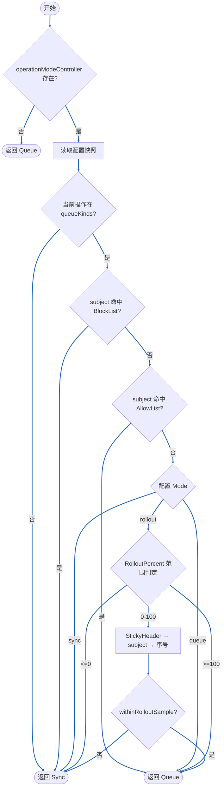
**stickyHeader / subject / 序号 + PreferSubject 补充说明**：
判断是否命中队列（RolloutPercent 范围）时，先为本次请求生成采样 Key，逻辑为：
    ↓
1. 计算 `preferSubject` 标志：
    → 若当前 `kind` 在 `PreferSubjectKinds` 中，或 `subject` 在 `PreferSubjectUsers` 中，则 `preferSubject = true`；
    → 否则 `preferSubject = false`。
    ↓
2. 初始化 `key = ""`。
    ↓
3. 若 `preferSubject == true` 且 `subject` 非空：
    → 使用归一化后的 subject（小写 + 去空格）作为 Key；
    → 否则继续下一步。
    ↓
4. 若配置了 `StickyHeader` 且从 ctx 中能取到非空的 Header 值：
    → 使用 Header 值作为 Key；
    → 否则继续下一步。
    ↓
5. 若此时 `key` 仍为空且 `subject` 非空：
    → 使用归一化后的 subject 作为 Key（无 Header 或 Header 为空时的回退逻辑）。
    ↓
6. 若 `key` 依然为空：
    → 生成自增序号，拼出 `"rollout:<序号>"` 作为 Key。
    ↓
7. 调用 `withinRolloutSample(key, RolloutPercent)`：
    → 使用 FNV32a 对 Key 做哈希，判断 `hash(key) % 100 < RolloutPercent`？
    → 是 → 命中灰度采样，本次请求走队列模式；
    → 否 → 未命中采样，本次请求走同步模式。
决策完成后，`decideOperationMode` 会返回枚举值驱动后续逻辑：同步模式进入 `createPipeline`，异步模式写入 `operationPipeline`，灰度模式按照采样决定。

| 判定阶段     | 条件                                       | 结果                                                                                      |
| ------------ | ------------------------------------------ | ----------------------------------------------------------------------------------------- |
| 控制器初始化 | `ensureOperationModeController` 返回 `nil` | 默认 `queue`，避免阻塞创建能力                                                            |
| 操作类型     | 不在 `QueueKinds` 中                       | 强制同步，保障特殊操作实时性                                                              |
| 用户名单     | 命中 `BlockUsers` / `AllowUsers`           | Block → Sync；Allow → Queue                                                               |
| Mode=Sync    | 固定同步                                   | 返回 `sync`                                                                               |
| Mode=Queue   | 固定排队                                   | 返回 `queue`                                                                              |
| Mode=Rollout | `RolloutPercent <=0`                       | 降级同步                                                                                  |
| Mode=Rollout | `RolloutPercent >=100`                     | 全量排队                                                                                  |
| Mode=Rollout | 0~100 之间                                 | 使用 Sticky Header/subject/自增序号生成 key，`withinRolloutSample` 决定 `queue` 或 `sync` |

#### Mode + RolloutPercent 组合一览

> 下表只讨论「全局模式 + 灰度百分比」这一层的行为，假定已经命中 `QueueKinds` 且未命中任何用户黑白名单。

| 配置 Mode（原始）            | 配置 RolloutPercent（原始） | 归一化后 Mode | 归一化后 RolloutPercent | 最终实际行为（不含名单/QueueKinds 覆盖）                                        |
| ---------------------------- | --------------------------- | ------------- | ----------------------- | ------------------------------------------------------------------------------- |
| 空串/仅空格                  | 任意                        | `queue`       | 0~100 间归一化          | 始终排队（等价于全量队列模式）                                                  |
| 其它非法值（如 "abc"）       | 任意                        | `queue`       | 0~100 间归一化          | 始终排队（非法值会被回退为 queue）                                              |
| `sync` / `SYNC` / 混合大小写 | 任意                        | `sync`        | 0~100 间归一化          | 始终同步（RolloutPercent 不参与决策）                                           |
| `queue` / `QUEUE`            | 任意                        | `queue`       | 0~100 间归一化          | 始终排队（RolloutPercent 不参与决策）                                           |
| `rollout` / `ROLLOUT`        | `< 0`                       | `rollout`     | 0（归一化后）           | 视作 `RolloutPercent <= 0`，实际等价于同步模式                                  |
| `rollout`                    | `0`                         | `rollout`     | 0                       | 同上：`RolloutPercent <= 0`，全部同步                                           |
| `rollout`                    | `1 ~ 99`                    | `rollout`     | 1 ~ 99                  | 灰度：约 RolloutPercent% 请求进入队列，其余同步（按 StickyHeader/subject 采样） |
| `rollout`                    | `>= 100`                    | `rollout`     | 100（归一化后）         | 视作 `RolloutPercent >= 100`，实际等价于全量队列模式                            |

---

## 2.1 写入限流（WriteRateLimiter）详解

本小节聚焦路由层的写入限流中间件 `WriteRateLimiter`，从流程图、时序图、状态图、数据流、依赖关系和泳道 6 个角度，补充主流程图中 `write-limit` 这个节点的细节。代码实现见 [cdmp-mini/internal/pkg/middleware/common/write_limiter.go](../cdmp-mini/internal/pkg/middleware/common/write_limiter.go) 和 [cdmp-mini/internal/pkg/middleware/common/traffic_hooks.go](../cdmp-mini/internal/pkg/middleware/common/traffic_hooks.go)。

在路由注册处（见 [cdmp-mini/internal/pkg/server/router.go](../cdmp-mini/internal/pkg/server/router.go#L150-L218)）：

- 调用 `common.NewTrafficHooks` 生成统一的流量护栏 `TrafficHooks{Coordinator, LagProtect, WriteLimit}`；
- 对 `/v1/users`、`/api/users` 下的写路径，统一按顺序挂载：`writeLimit → lagProtect → controller`；
- 其中 `writeLimit` 即 `WriteRateLimiter` 的包装，负责「单位时间写请求次数」的固定窗口限流；`lagProtect` 负责基于 `PendingCoordinator` 背压样本的滞后保护。

### 2.1.1 写入限流内部流程图（Flow Chart）

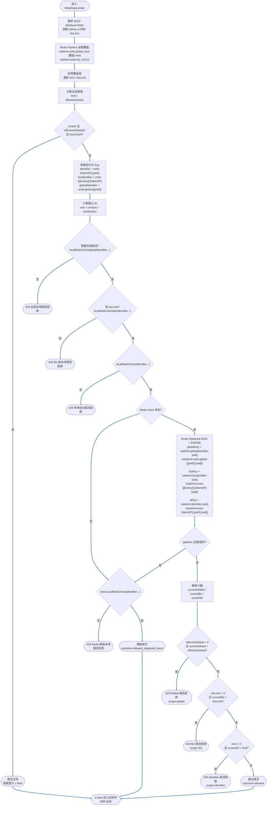

要点：

- 第一层是本地桶 `localRateCheck`，对「路径级全局」、Biz 维度以及「标识 + 路径」做快速预筛（顺序：Global -> Biz -> Identifier），避免 Redis 异常时所有流量都打到后端；
- 第二层使用 Redis `INCR + EXPIRE` 固定窗口计数，通过 `Pipelined` 一次性对全局 / Biz / 标识三个 key 进行计数与过期设置，已经不再使用 Lua 脚本；
- 当 Redis client 为空或 pipeline 出错/超时时，回退到 `strictLocalRateCheck`，若仍超限则以 429 拒绝，否则作为 `allowed_degraded_local` 放行（在指标中可区分降级放行）；
- 对于真正由 Redis 计数判定的超限，会携带 `scope`（global/biz/identifier）和经 `TTL` 估算的 `retry_after`，方便客户端或排障时理解是哪一层在挡流量；
- 在各个决策点，会同步打点到 `write_rate_limiter_total` 与 `write_rate_limiter_requests_total`，并在 Trace 的 `spanDetails` / `RequestContext.Extra` 中记录 `limit_config`/`limit_effective`、BizKey 及覆盖来源 key，具体指标含义见 2.2.1.1 小节。

### 2.1.2 写入限流时序图（Sequence Diagram）

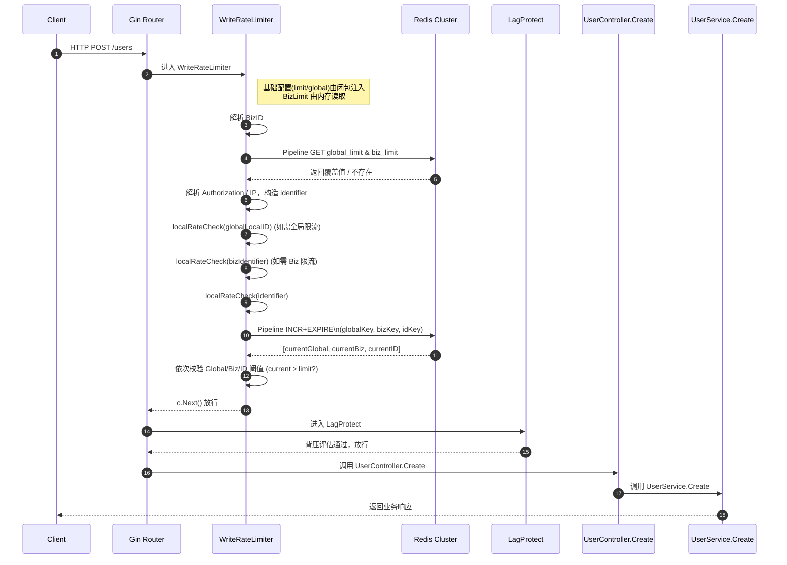

- 若在本地限流阶段已判断需要限流，`WriteRateLimiter` 会直接 `AbortWithStatusJSON(429, ...)`，时序在 WL 处终止；
- 若本地通过但 Redis client 不存在或 pipeline 出错，会走严格本地限流降级分支：超限则 429，否则以 `allowed_degraded_local` 放行；
- 当 Redis 计数判定超限时，`WriteRateLimiter` 会返回 429 并附带 `scope` 与 `retry_after` 信息，同时在 metrics/trace 中记录对应的 outcome 和限流维度；
- 被限流时，`LagProtect` 与后续 Controller / Service 均不会被调用。

### 2.1.3 写入限流状态图（State Diagram）

从单个 `identifier` 或 `globalKey` 的角度看，Redis 里的计数器状态演进如下：

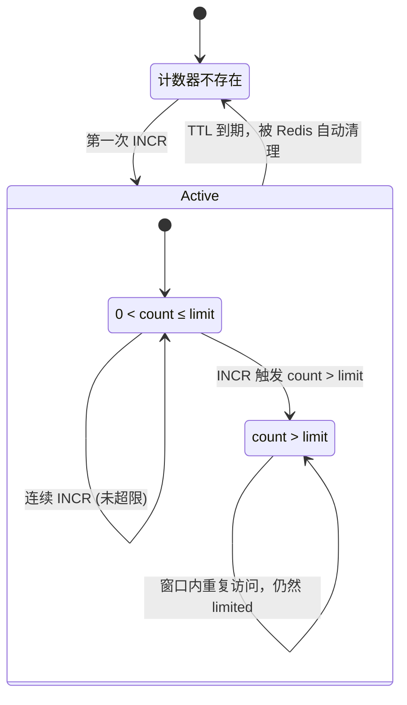

- 每个固定窗口对应一个独立的计数 key，该 key 通过 `windowID`（按窗口长度对齐时间）区分窗口，TTL 主要用于 GC，而不是精确表达窗口边界；
- 进入 `Limited` 状态后，会通过 Redis `TTL` 粗略估算 `retry_after`，提示调用方大致等待多久再尝试，不能保证下一次一定不被限流；
- 本地计数器的语义与 Redis 类似，只是作用域在当前进程内，用作降级和兜底，在 Redis 异常时保障系统安全。

### 2.1.4 写入限流数据流程图（Data Flow Diagram）

```mermaid
flowchart LR
    subgraph Client
        CReq[写请求: /users POST]
    end

    subgraph ConfigCenter[Config Center]
        BaseConfig[基础配置 limit/globalLimit]
        BizConfig[业务配置 bizLimit]
    end

    subgraph Service
        WLNode[WriteRateLimiter]
        LocalCounter[本地计数器\\nlocalRateCheck/strictLocalRateCheck]
        MetricsNode[Metrics\\nwrite_rate_limiter_*]
        TraceNode[Trace\\nspanDetails / RequestContext.Extra]
    end

    subgraph RedisCluster[Redis Cluster]
        GKey[(globalKey\\nratelimit:write:global:<path>:<windowID>)]
        BizKey[(bizKey\\nratelimit:write:{<bizKey>}:<token|IP>:<windowID>)]
        IDKey[(idKey\\nratelimit:write:<token|IP>:<path>:<windowID>)]
        GlobalOverride[(global_limit 覆盖键)]
        BizOverride[(biz_limit 覆盖键)]
    end

    CReq --> WLNode
    BaseConfig --> WLNode
    BizConfig --> WLNode
    WLNode --> LocalCounter
    WLNode --> GlobalOverride
    WLNode --> BizOverride
    GlobalOverride --> WLNode
    BizOverride --> WLNode
    WLNode --> GKey
    WLNode --> BizKey
    WLNode --> IDKey
    GKey --> WLNode
    BizKey --> WLNode
    IDKey --> WLNode
    WLNode --> MetricsNode
    WLNode --> TraceNode
    WLNode -->|通过| Downstream[后续 LagProtect + 业务]
    WLNode -->|429| ClientError[HTTP 429 响应]
```

### 2.1.5 写入限流依赖关系图（Dependency Diagram）

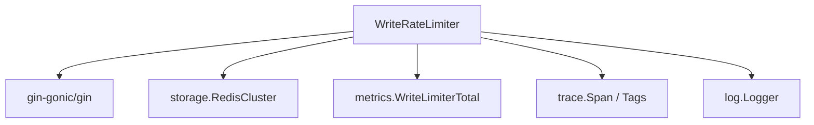

配合 `TrafficHooks` 的装配关系：

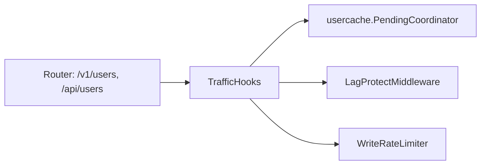

### 2.1.6 写入限流泳道图（Swimlane）

```mermaid
%% 通过多列节点模拟泳道效果
flowchart LR
    subgraph Client Lane
        CL[Client]
    end

    subgraph Router Lane
        RL[Gin Router]
    end

    subgraph WL Lane
        WL1[WriteRateLimiter\\n构造 identifier/BizID]
        WL2[本地计数检查\\nlocalRateCheck]
        WL3[Redis Pipelined\\nINCR + EXPIRE]
        WL4[返回 429 响应\\n或 allowed_degraded_local]
    end

    subgraph Backend Lane
        BL[后端业务\\n(LagProtect/Controller/Service)]
    end

    CL --> RL
    RL --> WL1 --> WL2 --> WL3
    WL3 --> WL4 --> RL
    RL --> CL
    %% 被限流场景下，请求不会流入 Backend Lane；
    %% 当 Redis 异常但本地放行时，请求仍会流入 Backend Lane，
    %% 但在 Metrics 中会标记为 outcome=allowed_degraded_local，便于 SRE 观测降级行为。
```

小结：

- 写入限流专注「请求次数」维度的保护，优先挡住明显的突发写洪峰；
- LagProtect 与 PendingCoordinator 专注「队列/背压」维度，两者互补但不互相替代；
- 主流程图中的 `RateLimit` 节点可直接关联到本节的内部流程与时序，有助于在 429 振荡或限流误伤时快速定位原因。

### 2.1.7 Lab 实验 vs 生产实现对照表

> 本小节用一个三列表，把你在 `limiter-lab` 里实现的「学习版」组件，与生产代码中 `WriteRateLimiter` 的对应关系串在一起，方便来回对照理解。

| 关注点/层次                       | Lab 实验代码（limiter-lab）                                                                                                                                                      | 生产实现（write_limiter.go 片段）                                                                                                                                                                          |
| --------------------------------- | -------------------------------------------------------------------------------------------------------------------------------------------------------------------------------- | ---------------------------------------------------------------------------------------------------------------------------------------------------------------------------------------------------------- |
| 标识粒度本地限流（identifier）    | `FixedWindowLimiter.Allow` + `HTTPMiddleware` 中对单个 key 的窗口计数；`TestHTTPMiddleware_FixedWindow_TooManyRequests`                                                          | `localRateCheck(identifier, limit, window)`：使用 `identifier = "write:" + idPart + ":" + c.FullPath()` 作为 key，在本地内存里做固定窗口计数，如果超限直接返回 429（`block_local`）。                      |
| 路径级本地全局限流（global）      | 在 lab 中可以再创建一个 `FixedWindowLimiter` 作为全局 limiter，在 `NewHTTPMiddleware` 的 `globalLimiter` 分支中按 path 维度做额外一次 `Allow`                                    | `if effectiveGlobal > 0 { globalIdentifier := "write:global:" + c.FullPath(); if !localRateCheck(globalIdentifier, effectiveGlobal, window) { ... } }`：以 `write:global:<path>` 为 key 做路径级本地窗口限流。   |
| 标识粒度 Redis 计数（identifier） | `EvalWriteLimiterScript(store, globalKey, idKey, globalLimit, idLimit, window)` 中 `idLimit > 0` 分支，返回 `{limited, retryAfter, scope="identifier"}`                          | `pipe.Incr(ctx, rateLimitKey)`：使用 Pipeline 批量执行 INCR，随后解析结果 `currentID > limit`，若超限则返回 429 并设置 `scope="identifier"`。                                                              |
| 路径级 Redis 全局计数（global）   | 同一脚本中的 `globalLimit > 0` 分支；测试 `TestEvalWriteLimiterScript_GlobalLimit` 验证「全局优先生效」                                                                          | `pipe.Incr(ctx, globalPathKey)`：Pipeline 中优先检查全局计数 `currentGlobal > effectiveGlobal`，若超限则优先返回 `scope="global"` 及全局兜底文案。                                                         |
| Redis 返回值解析与行为            | Lab 中由 `EvalWriteLimiterScript` 直接返回 `(limited bool, retryAfter int64, scope string)`，中间件 `RedisScriptMiddleware` 根据结果决定 429 / 放行                              | `client.Pipelined(...)` 执行后，依次检查 Global/Biz/ID 的计数结果；任一维度超限即 `AbortWithStatusJSON(429, ...)`，否则 `c.Next()`。                                                                       |
| 动态阈值覆盖（override limit）    | `OverrideProvider` + `OverrideCapable.AllowWithOverride`：按 path 返回动态 limit，在 `NewHTTPMiddleware` 里优先使用覆盖值，再决定是否放行                                        | `GET ratelimit:write:global_limit` → `if gLimit > 0 { limit = gLimit; spanDetails["limit_override_key"] = globalOverrideKey }`：从全局 override key 读取覆盖阈值，直接修改 `limit` 后参与本地/Redis 判定。 |
| HTTP 调用链结构                   | `NewHTTPMiddleware`（本地限流） + `RedisScriptMiddleware`（Redis 脚本层）在 `TestDemo_LocalLimiterAndRedisScript` 中被串成 `localMW(redisMW(handler))`，模拟真实请求经过两层检查 | 整个 `WriteRateLimiter` 闭包就是 Gin 中间件：先跑本地检查（`localRateCheck` / `strictLocalRateCheck`），再跑 Redis Pipeline；未被任何一层挡住时，调用 `c.Next()` 进入后续 `LagProtect` 和业务 Handler。    |
| Metrics & Trace 打点              | Lab 中的 `Metrics` 接口 + `inMemoryMetrics` 只演示「pass / identifier / global」三类打点；`fakeClock` 用于在测试中精确对齐窗口和 TTL                                             | 生产中使用 `metrics.WriteLimiterTotal.WithLabelValues(c.FullPath(), reason).Inc()` 以及 `trace.StartSpan/EndSpan`，并在 `spanDetails` 中记录 `decision/identifier/scope/retry_after` 等调试信息。          |

> 建议阅读/练习路径：
> 1. 先在 `limiter-lab` 里从 FixedWindowLimiter → HTTPMiddleware → RedisLikeStore + EvalWriteLimiterScript 依次跑通所有单测；
> 2. 再对照上表，把 `WriteRateLimiter` 分成「本地窗口层 / Redis 脚本层 / 降级层」三段分别阅读；
> 3. 最后再整体回看第 2.1.1～2.1.6 的图，把脑子里的“实验代码”与“生产代码”一一对应起来。

**本地限流器策略补充说明（localRateCheck / strictLocalRateCheck / lenientLocalRateCheck）**

- 共享实现：写入限流 `WriteRateLimiter` 与登录限流 `LoginRateLimiter` 复用同一组本地计数函数，具体见 [cdmp-mini/internal/pkg/middleware/common/redis_limiter.go](cdmp-mini/internal/pkg/middleware/common/redis_limiter.go)。
- 正常路径：`localRateCheck(identifier, limit, window)` 使用与 Redis 相同的 `limit` 和窗口长度，只在本进程内维护一个固定窗口计数，目标是作为 Redis 的**前置护栏**，优先挡住明显的突发流量，同时避免在多实例场景下因为本地阈值过宽而把过多请求推给 Redis 触发全局超限。
- 超时降级：当 Redis 调用超时时，`handleRedisError` 会走 `strictLocalRateCheck(identifier, limit)` 路径，不再考虑窗口，只看当前累计计数是否超过 `limit`，作为更严格的本地兜底，宁可多挡一些请求也要保护后端。
- 其他错误降级：对于非超时类的 Redis 错误，代码会使用 `lenientLocalRateCheck(identifier, limit)`（内部阈值为 `2*limit`）作为“宽松兜底”，仅在 Redis 已被视为不可靠时使用，优先保证服务可用性；这类降级只在异常分支触发，不影响正常情况下本地与 Redis 之间的阈值一致性。


#### 2.1.8 WriteRateLimiter 闭卷练习 Checklist（limiter-lab）

> 本小节把前面回答中过的练习步骤，整理成一个你可以直接对勾的 Checklist，全部都在 `limiter-lab/practice` 和 `limiter-lab/limiter` 目录下完成，不影响生产代码。

1. 固定窗口算法（基础版）
     - 目标：在内存中实现最简单的固定窗口限流算法，只依赖 `time.Now`、`map[string]int` 和窗口起始时间；
     - 起点文件：`limiter-lab/practice/fixedwindow.go`、`limiter-lab/practice/fixedwindow_test.go`；
     - 验收：
         - 单 key：在一个窗口内前 `limit` 次 `Allow` 返回 true，第 `limit+1` 次开始返回 false；
         - 多 key：不同 key 互不影响；
         - 跨窗口：窗口结束后，同一 key 重新从 0 计数；
         - `go test ./limiter-lab/...` 通过基础测试。

2. Clock / Store 抽象（可控时间维度）
     - 目标：把「当前时间」和「计数存储」抽象为接口，方便在单测中精确控制时间线和多 key 计数；
     - 起点文件：`limiter-lab/limiter/fixed_window.go` 中已有 `Clock`/`Store` 抽象可参考；练习骨架见 `limiter-lab/practice/fixedwindow.go` 末尾的 `Clock`、`Store`、`NewFixedWindowLimiterWithStore`；
     - 验收：
         - 能通过 fakeClock 精确推进时间，在不使用 `time.Sleep` 的情况下覆盖「窗口滚动、计数重置」场景；
         - 使用自定义 Store 时，多 key 计数行为与基础版等价；
         - 所有相关单测稳定通过、无时间抖动问题。

3. HTTPMiddleware（本地限流中间件）
     - 目标：将 `Limiter` 封装为 HTTP 中间件，真实模拟「HTTP 请求被 429 拦截或放行」的行为；
     - 起点文件：`limiter-lab/practice/http_middleware.go`、`limiter-lab/practice/http_middleware_test.go`；
     - 验收：
         - 使用 `httptest` 连续发起多次请求，前 `limit` 次返回 200，第 `limit+1` 次开始返回 429；
         - 统计下游 handler 被调用次数，应恰好等于允许通过的请求数；
         - 限流时不调用下游 handler。

4. RedisLikeStore + EvalWriteLimiterScript（脚本语义）
     - 目标：在 Go 中模拟生产 Lua 脚本的语义，掌握 `globalLimit` / `idLimit` / TTL / scope 的行为；
     - 起点文件：`limiter-lab/practice/redis_like.go`、`limiter-lab/practice/redis_like_test.go`；
     - 验收：
         - `TestEvalWriteLimiterScript_IdentifierLimit`：仅设置 `idLimit` 时，前 N 次 `limited=false`，第 N+1 次开始 `limited=true` 且 `scope="identifier"`，跨窗口后计数重置；
         - `TestEvalWriteLimiterScript_GlobalLimit`：同时设置 `globalLimit` 和 `idLimit` 时，由 `globalLimit` 优先生效，触发限流时 `scope="global"`，`retryAfter` 与全局 key 的 TTL 对齐；
         - 内存版 `RedisLikeStore` 的 `Incr/Expire/TTL` 行为足以支撑上述测试。

5. 本地 limiter + Redis 脚本 Demo 串联
     - 目标：把 FixedWindowLimiter 的 HTTPMiddleware 和 Redis 脚本中间件串在一起，形成一条「本地层 → 脚本层 → handler」的完整链路；
     - 起点文件：`limiter-lab/practice/demo_http_test.go`；
     - 验收：
         - 在 Demo 中让本地 limiter 始终放行（limit 足够大），由 Redis 脚本层实际决定是否返回 429；
         - 通过断言 HTTP 返回码、下游 handler 调用次数以及 Redis 端计数/TTL，验证整条链路在达到 globalLimit 或 idLimit 后按预期限流；
         - 至此，你可以不用看生产实现，独立复现出一条「本地限流 + Redis 限流」链路。

6. 自我验收（闭卷）
     - 在一个干净目录中，仅凭本节图示 + 2.1.7 对照表 + 上述 Checklist：
         - 手写出 `Limiter` 接口、FixedWindowLimiter 结构和 HTTPMiddleware 的签名；
         - 不看已有实现，从零实现一份可通过自测的版本（可以只保留最小功能）；
         - 能用自己的语言完整讲清楚：请求在 `WriteRateLimiter` 中从「标识本地层 → 全局本地层 → Redis 脚本层 → 降级层」的决策路径。

> 勾选版总览表（可打印或复制到自己的笔记中打钩）：

| 步骤 | 练习项                                                | 自评状态（√/空） |
| ---- | ----------------------------------------------------- | ---------------- |
| 1    | 固定窗口算法（基础版）                                |                  |
| 2    | Clock/Store 抽象（使用 fakeClock 控制时间）           |                  |
| 3    | HTTPMiddleware 本地限流（200/429 与下游调用次数正确） |                  |
| 4    | RedisLikeStore + EvalWriteLimiterScript 脚本语义      |                  |
| 5    | 本地 limiter + Redis 脚本 Demo 串联                   |                  |
| 6    | 闭卷从零实现 + 口头讲清 WriteRateLimiter 决策路径     |                  |


---

## 2.2 Create Service Pipeline

在进入流水线之前，`UserService.Create` 会通过 `decideOperationMode` 判定执行模式：若为 `OperationModeQueue`，会先检查 Redis 队列是否处于降级/不可用状态，健康时才调用 `operationPipeline.Submit` 入队并由后台 Worker 异步执行；若为 `OperationModeSync` 则直接落入同步 `createpipeline.Pipeline`。`UserService.Create` 通过 `createpipeline.Pipeline` 串联一组幂等钩子，每个阶段都记录 trace / metrics，并在失败时返回携带业务码的错误。流水线的关键步骤如下：

| 顺序 | 钩子                       | 说明                                                                                                                                                                                                                                                                                                                                                                          |
| ---- | -------------------------- | ----------------------------------------------------------------------------------------------------------------------------------------------------------------------------------------------------------------------------------------------------------------------------------------------------------------------------------------------------------------------------- |
| 1    | `createBeginHook`          | 建立根 Span，向上下文写入创建态标识，准备结束回调以统一收敛状态码。                                                                                                                                                                                                                                                                                                           |
| 2    | `normalizeUserForCreate`   | 归一化邮箱、手机号，确保后续缓存键一致。                                                                                                                                                                                                                                                                                                                                      |
| 3    | `prepareUserForCreate`     | 加密密码、预热联系方式缓存，记录耗时指标。                                                                                                                                                                                                                                                                                                                                    |
| 4    | `ensureUserUnique`         | 统一执行用户名/联系方式唯一性校验，详见下节。                                                                                                                                                                                                                                                                                                                                 |
| 5    | `resolveUserExistence`     | 当预检未覆盖用户名时补充库查，并将结果写入 trace tag。                                                                                                                                                                                                                                                                                                                        |
| 6    | `handleUserExisting`       | 若已存在冲突实体，按照业务码返回 `ErrUserAlreadyExist`。                                                                                                                                                                                                                                                                                                                      |
| 7    | `markUserPendingForCreate` | 与 `PendingCoordinator` 互动写入租约：正常态下使用 Redis backend；当 `shouldDegradeForError` 判定可降级错误时，调用 `markCreateDegraded` 并上报 `PendingLeaseEvents`（`acquire_skip_degraded` / `acquire_degraded`），返回空租约继续后续步骤；当全局 Redis 降级激活时，`PendingCoordinator` 会通过 `DegradeActive` 自动切换到本地内存 backend，而不是在上层直接跳过 Pending。 |
| 8    | `afterUserPending`         | 为 trace 增加租约相关标签，便于串联后续链路。                                                                                                                                                                                                                                                                                                                                 |
| 9    | `SendCreateMessage`        | 发送 Kafka 事件，失败时打点并返回 `ErrKafkaFailed`。                                                                                                                                                                                                                                                                                                                          |

### 2.2.1 业务指标总览（SRE 指南）

| 业务点            | 指标英文名                                                         | 指标中文名           | 业务含义 / SRE 使用指南                                                                                                                                       |
| ----------------- | ------------------------------------------------------------------ | -------------------- | ------------------------------------------------------------------------------------------------------------------------------------------------------------- |
| 请求入口 `Create` | `user_create_requests_total{mode,account_type,outcome}`            | 用户创建请求总数     | 统计同步 / 异步（mode）及账号类型的成功 / 失败次数；SRE 用于区分模式故障（队列 vs 同步）与特定账号类型异常，建议结合 `outcome` 中的业务错误类型设置分组告警。 |
| 全链路步骤        | `user_create_step_duration_seconds{step,field,account_type}`       | 用户创建步骤耗时分布 | 各子步骤耗时直方图，默认阈值 200 ms；监控 p95/p99 变化识别慢查询、Redis、Kafka 尾延迟，按 `account_type` 精细化分析特俗用户。                                 |
| 全链路步骤        | `user_create_step_total{step,field,account_type,outcome}`          | 用户创建步骤执行次数 | 记录每个步骤的成功 / 失败次数，定位是哪一步骤抛出 `validation_error`、`duplicate` 等业务错误；SRE 可按 outcome 建立 TopN 面板。                               |
| 慢步骤            | `user_create_slow_steps_total{step,field,account_type}`            | 用户创建慢步骤计数   | 步骤耗时超过 200 ms 时自增，适合做告警基线；当该计数快速增长时优先排查对应步骤的耗时直方图。                                                                  |
| 占位 & 降级       | `user_contact_placeholder_set_duration_seconds{step,field,status}` | 联系方式占位耗时分布 | 记录 Redis SetNX / 刷新耗时，`status=slow` 表示超过 20 ms；与 Redis 慢查询告警联动，定位缓存热点或网络问题。                                                  |
| 占位 & 降级       | `user_contact_placeholder_events_total{step,field,result}`         | 联系方式占位事件计数 | 标记占位命中 / 降级 / miss 等路径；SRE 可观察 `result=degraded`、`result=refresh` 等标签判断是否频繁退化。                                                    |
| 降级管理          | `user_create_degrade_total{reason,account_type}`                   | 用户创建降级次数     | 聚合记录降级原因（Redis 占位失败、预检超时等）；当某个 reason 持续升高时，可触发自动脚本拉起降级保护或通知人工干预。                                          |
| Kafka 出口        | `user_create_message_total{account_type,result}`                   | 用户创建消息发送结果 | 统计 Kafka 发送成功 / 失败；SRE 用于区分账号类型的消息发送质量，`result` 与 `GetBusinessErrorType` 一致，可快速定位网络、超时、认证等异常。                   |

#### 2.2.1.1 组件维度指标：写入限流（WriteRateLimiter）

**组件归属**：模块 1 / 组件 1.1（路由层保护：write-limit & lagProtect）中的 WriteRateLimiter，对应代码 [internal/pkg/middleware/common/write_limiter.go](../cdmp-mini/internal/pkg/middleware/common/write_limiter.go)。

**核心指标**：

1. `write_rate_limiter_total{path,reason}`  —— 写入限流拒绝计数（按原因）
- 计算口径：
    - 仅统计被 WriteRateLimiter 拒绝（返回 429）的请求；
    - `path`：Gin 路由路径（`c.FullPath()`），如 `/v1/users`；
    - `reason`：拒绝原因枚举：
        - `local_rate`：标识级本地限流触发（per-identifier window 本地计数超限）；
        - `local_biz`：Biz 级本地限流触发；
        - `local_global`：全局路径级本地限流触发；
        - `redis_limit`：标识级 Redis 限流触发；
        - `redis_limit_biz`：Biz 级 Redis 限流触发；
        - `redis_limit_global`：全局路径级 Redis 限流触发；
        - `redis_timeout`：Redis 客户端不可用或 pipeline 失败后，严格本地限流仍拒绝（降级失败）。
- 业务含义：
    - 从「被拒绝的角度」观察写入限流是否在工作，以及主要是哪一层在挡流量（标识/Biz/全局/Redis 异常）；
    - `redis_timeout` 持续上升时通常意味着 Redis 或网络存在稳定性问题，需要 SRE 优先排查。
- 阈值建议：
    - 单接口拒绝率：
        - `rate(write_rate_limiter_total{path="/v1/users"}[5m]) / rate(write_rate_limiter_requests_total{path="/v1/users"}[5m])`；
        - 正常期建议 < 1%，短时压测或防护期可临时放宽到 5%～10%；
    - `reason="redis_timeout"`：
        - 任意 path 上 5 分钟内出现连续 > 10 次可以直接告警，定位 Redis 链路。

2. `write_rate_limiter_requests_total{path,outcome,auth_type,biz_key}` —— 写入限流总请求计数（含成功/失败、用户类型、Biz 维度）
- 计算口径：
    - 所有经过 WriteRateLimiter 的请求都会自增一次（无论是否被限流）；
    - 标签含义：
        - `path`：Gin 路由路径；
        - `outcome`：决策结果
            - `allowed`：通过限流（包括普通通过与未开启限流）；
            - `allowed_degraded_local`：Redis 不可用/超时，但本地严格限流仍允许通过（降级放行）；
            - `blocked_local_rate`：标识级本地限流拒绝；
            - `blocked_local_biz`：Biz 级本地限流拒绝；
            - `blocked_local_global`：全局本地限流拒绝；
            - `blocked_redis_unavailable`：Redis 客户端为 nil，降级后仍被本地限流拒绝；
            - `blocked_redis_timeout`：Redis pipeline 出错，降级后仍被本地限流拒绝；
            - `blocked_redis_limit` / `blocked_redis_limit_biz` / `blocked_redis_limit_global`：对应三层 Redis 限流拒绝；
        - `auth_type`：按鉴权类型粗分
            - `authenticated`：带 `Authorization` 头（Bearer Token 等）；
            - `anonymous`：未带鉴权头，或头部为空；
        - `biz_key`：来自 `bizid.ResolveBizByRoute` 的业务键；若当前路由未绑定 Biz 或 Biz 已废弃，则为空串。
- 业务含义 / SRE 用法：
    - **总量 & 成功率**：
        - 成功量（含降级放行）：`sum by(path) (write_rate_limiter_requests_total{outcome!~"blocked_.*"})`；
        - 总请求量：`sum by(path) (write_rate_limiter_requests_total)`；
        - 限流拒绝率：`sum by(path) (write_rate_limiter_requests_total{outcome=~"blocked_.*"}) / sum by(path) (write_rate_limiter_requests_total)`；
    - **匿名 vs 登录用户区分**：
        - 匿名用户：`auth_type="anonymous"`，适合监控外部攻击/异常流量是否被限流挡住；
        - 已鉴权用户：`auth_type="authenticated"`，用于观察真实业务用户是否因限流受到明显影响；
    - **Biz 维度拆分成功/失败**：
        - 针对某个业务（如 `biz_key="user_create_high_priority"`），可分别观察：
            - 成功：`write_rate_limiter_requests_total{biz_key="user_create_high_priority", outcome="allowed"}`；
            - 被限流：`write_rate_limiter_requests_total{biz_key="user_create_high_priority", outcome=~"blocked_.*"}`；
        - 结合 `user_create_requests_total{mode,account_type,outcome}`，可以判断是路由级限流在挡高优业务，还是后续 Create 流水线本身在失败。
    - **降级观测**：
        - `outcome="allowed_degraded_local"` 持续升高，说明 Redis 频繁出错但本地限流在兜底，建议与 Redis 错误指标、PendingCoordinator 降级率一起查看。
- 阈值建议：
    - 业务侧（按 biz_key）：
        - 对关键 Biz（如核心租户、重要业务线），`blocked_*` 占比建议 < 1%；
        - 若单个 Biz 的 `blocked_*` 占比稳定 > 3%，需要业务方确认限流阈值是否合理（可通过 Redis 覆盖 key 快速下调/上调），并在看板中对 `limit_config` vs `limit_effective` 做对比；
    - 技术侧（匿名流量）：
        - `auth_type="anonymous"` 的 `blocked_local_rate` / `blocked_redis_limit*` 占比较高通常是预期的（防攻击/刷子）；
        - 当匿名流量的限流拒绝率突然从低位飙升时，应结合 HTTP 请求总量和 IP 分布检查是否存在异常流量。

#### 2.2.1.2 组件维度指标：PendingCoordinator（租约 & 背压）

**组件归属**：模块 3 / 组件 3.1（PendingCoordinator 核心），对应代码 `internal/pkg/usercache/pending_state_machine.go` 及其调用点（`markUserPendingForCreate` 等）。

**核心指标（租约生命周期 & 降级）**：

1. `pending_lease_events_total{component,event}` —— 租约生命周期事件计数
- 计算口径：
    - 在 Acquire/Release/校准等关键路径上，对每个租约事件打点；
    - `component`：调用方组件名，Create API 场景通常使用 `user-service` 或相近标识；
    - `event`：如 `acquire_success` / `acquire_conflict` / `acquire_backpressure` / `release_success` / `calibrate_start` / `calibrate_complete` 等。
- 业务含义 / SRE 用法：
    - 观察租约创建/释放是否匹配：`acquire_success` 与 `release_success` 的长期比例应接近 1；
    - `acquire_conflict` / `acquire_backpressure` 持续升高，表示同一实体上并发写入过多，需结合队列与限流一起排查。

2. `pending_lease_fallback_total{component,operation,reason}` —— 租约降级/回退计数
- 计算口径：
    - 当 PendingCoordinator 因 Redis 降级或错误退化为内存 backend、或跳过租约/背压逻辑时打点；
    - `operation`：`acquire` / `release` / `sample` 等；
    - `reason`：`redis_degraded` / `redis_error` / `config_disabled` 等。
- 业务含义 / SRE 用法：
    - 衡量「租约体系自身的可用性」：若 `redis_degraded`、`redis_error` 类 reason 稳定升高，即使业务暂未报错，也说明 Pending 在频繁走 fallback，应作为稳定性隐患关注；
    - 建议在看板上将 `pending_lease_fallback_total` 与 `isRedisDegradeActive`、Redis 错误指标放在同一行联动观察。

3. `pending_lease_hold_duration_seconds{component,result}` —— 租约持有时长
- 计算口径：
    - 从 Acquire 成功到 Release 的时间差；
    - `result`：`success` / `timeout` / `forced_release` 等。
- 业务含义 / SRE 用法：
    - 观测「单个请求占用租约的时间」是否异常拉长，避免出现长时间持有导致整体背压误判；
    - 建议关注 p95/p99，超过几十秒需排查下游处理逻辑和补偿流程是否卡滞。

4. `pending_coordinator_health{component,backend}` —— PendingCoordinator backend 健康度
- 计算口径：
    - 定期心跳检测 Redis backend / 内存 backend，将健康状态写入 Gauge；
    - `backend`：`redis` / `memory` 等。
- 业务含义 / SRE 用法：
    - 可直接用于看板上的健康灯：`pending_coordinator_health{backend="redis"} == 1` 为健康；
    - 若 Redis backend 长期为 0，而 memory 为 1，说明系统长期运行在退化模式，需要评估风险和恢复计划。

**核心指标（背压采样 & 延迟）**：

5. `pending_backpressure_delay_seconds{component,level}` / `pending_backpressure_delay_trigger_rate{component,level}`
- 计算口径：
    - 每次根据队列深度/租约数量计算出的背压等级（如 `normal` / `warning` / `critical`）决定是否注入 pre-acquire 延迟；
    - Histogram 记录实际注入的延迟时长，Counter 记录触发次数。
- 业务含义 / SRE 用法：
    - 反映「背压机制实际生效的程度」：
        - 正常情况下，`level="normal"` 的触发为 0，`warning/critical` 仅在高峰期短暂出现；
        - 若 `warning` 或 `critical` 持续高频触发，说明 Pending 队列真实已经接近容量上限，应考虑加机器或提高限流强度。

6. `pending_backpressure_deadline_decisions_total{component,level,action}`
- 计算口径：
    - 当请求剩余超时时间不足以执行完整延迟时，对延迟进行截断或跳过；
    - `action`：`truncate` / `skip` 等。
- 业务含义 / SRE 用法：
    - 衡量「背压与接口超时时间之间的张力」：若大量请求的延迟被 `truncate/skip`，说明当前超时配置过紧或背压过于频繁；
    - 建议结合 `HTTP` 耗时直方图一同调整接口超时/背压阈值。

#### 2.2.1.3 组件维度指标：OperationMode（模式决策器）

**组件归属**：模块 4 / 组件 4.1 + 模块 5 / 组件 5.1 中的 OperationMode 决策逻辑，对应 `operation_mode_controller` 及其辅助函数。

**核心指标**：

1. `operation_mode_decisions_total{component,kind,mode}` —— 模式决策计数
- 计算口径：
    - 每次调用 `decideOperationMode` 时打点；
    - `component`：调用组件（如 `user-service`）；
    - `kind`：操作类型（如 `user.create` / `user.update` / `user.delete` / `user.batch_update`）；
    - `mode`：最终决策结果（`sync` / `queue` / `rollout`），含灰度采样之后的实际模式。
- 业务含义 / SRE 用法：
    - 观察「不同操作类型在三种模式下的流量分布」：
        - 正常期：大多数核心写操作应在设计期就约定好默认模式（例如 `sync` 或 `queue`）；
        - 灰度期：`rollout` 应缓慢爬升（10%→30%→50%），并在稳定后切为 `queue`；
    - 可做一个简单环形图：`sum by(mode) (operation_mode_decisions_total{kind="user.create"})`，辅助判断当前系统运行模式是否符合预期。

2. `operation_mode_current{component,mode}` —— 当前模式指示
- 计算口径：
    - 控制面在更新 OperationMode 配置（例如通过管理接口）时更新 Gauge；
    - `mode`：`sync` / `queue` / `rollout`。
- 业务含义 / SRE 用法：
    - 在看板上作为当前模式指示灯，结合 `operation_mode_decisions_total` 判断是否已经完成模式切换；
    - 可与自动化脚本联动：根据错误率/延迟阈值自动调整 RolloutPercent 或 Mode，并通过此 Gauge 反馈当前运行状态。

3. `operation_mode_rollout_percent{component}` —— 当前灰度百分比
- 计算口径：
    - 控制器在装载配置时，将 RolloutPercent 写入 Gauge；
    - 无灰度时为 0 或直接缺省。
- 业务含义 / SRE 用法：
    - 辅助理解 `mode="rollout"` 时实际有多少比例流量落在队列；
    - 建议在灰度放量的 Runbook 中明确：对应 10%/30%/50%/100% 时该 Gauge 应该是多少，方便值班同学核对。

#### 2.2.1.4 组件维度指标：OperationPipeline（异步队列 & Worker）

**组件归属**：模块 4 / 组件 4.1（操作队列与状态存储）与模块 5 / 组件 5.1（Worker 与执行器），对应 `operation_pipeline` 及其 Worker/补偿逻辑。

**核心指标（队列水位）**：

1. `operation_queue_ready_depth{resource}` / `operation_queue_scheduled_depth{resource}`
- 计算口径：
    - `ready_depth`：当前可立即消费的就绪队列长度；
    - `scheduled_depth`：已被安排在未来重试时间点的任务数；
    - `resource`：队列资源名（如 `user.create`、`user.update`）。
- 业务含义 / SRE 用法：
    - 观测「异步队列是否发生积压」：
        - 正常期：ready_depth 应在一个较小且波动的范围内；
        - 积压期：ready_depth 持续上升且 scheduled_depth 也缓慢累积，说明下游 Worker 处理不过来；
    - 阈值建议：
        - 为关键队列设置一个经验上限（如 `ready_depth > 10k` 持续 5 分钟告警），结合 Worker QPS 与业务峰值评估。

2. `operation_queue_inflight_total{resource}` / `operation_queue_fallback_active{resource}`
- 计算口径：
    - `inflight_total`：当前处于执行中的 Operation 数量；
    - `fallback_active`：是否启用了内存 fallback 队列（1=启用，0=未启用）。
- 业务含义 / SRE 用法：
    - `inflight_total` 能帮助评估 Worker 实际并发度是否达标；
    - `fallback_active` 为重要的风险指标：一旦为 1，说明 Redis 队列不可用，系统被迫使用内存队列，仅适合作为短期兜底，应尽快恢复 Redis。

**核心指标（Worker & 补偿）**：

3. `operation_worker_iterations_total{resource,outcome}` / `operation_worker_iteration_seconds{resource,outcome}`
- 计算口径：
    - 每次 Worker 循环迭代（一次拉取+处理）都会打点；
    - `outcome`：`success` / `empty` / `error` 等。
- 业务含义 / SRE 用法：
    - 观察 Worker 是否在持续消费：`empty` 过高表示队列空转，可适当收缩 Worker 数量；
    - `error` 占比升高需结合业务错误类型与补偿情况排查；
    - 耗时直方图可辅助排查单次迭代是否被某些慢操作拖长（如状态存储或下游服务）。

4. `operation_compensation_total{resource,outcome}` / `operation_compensation_duration_seconds{resource,outcome}`
- 计算口径：
    - 每次触发补偿逻辑（如重放、回滚）时打点；
    - `outcome`：`success` / `failed` / `skipped` 等。
- 业务含义 / SRE 用法：
    - 衡量「异步失败恢复机制是否健康」：
        - 正常期：补偿应较为罕见，且 `success` 占绝大多数；
        - 若补偿频率突增或 `failed` 占比上升，说明下游错误持续存在且自动恢复失败，需要人工介入；
    - 耗时指标帮助评估补偿对资源的消耗，避免补偿本身拖垮系统。

**关键 SRE 指标公式与阈值建议**

- **预检执行率**：`preflight_query / (preflight_query + preflight_query_skip)`。建议配置 >80% 持续 5 分钟告警，通常意味着缓存预热失效、强一致性流量暴涨或新节点尚未预热。
- **预检超时率**：`rate(user_create_step_total{step="preflight_query",outcome="timeout"}[5m]) / rate(user_create_step_total{step="preflight_query"}[5m])`。若超过 5%，需同步检查 `database_query_duration_seconds` 与数据库慢日志。
- **占位慢操作率**：`rate(user_contact_placeholder_set_duration_seconds_count{status="slow"}[5m]) / rate(user_contact_placeholder_set_duration_seconds_count[5m])`。当超过 2% 时重点排查 Redis 网络、热点分片和 CPU 利用率。
- **降级触发率**：`rate(user_create_degrade_total[5m]) / rate(user_create_requests_total[5m])`。超过 1% 即提醒关注。结合 `reason` 标签判断是否集中于 `redis_cache_error`、`preflight_timeout`、`placeholder_error` 等异常路径。
- **Kafka 失败率**：`rate(user_create_message_total{result!="success"}[5m]) / rate(user_create_message_total[5m])`。若高于 0.5%，建议触发自动降级或启用 WAL 重放，并排查网络链路。

> 标签说明：新增指标统一携带 `account_type`（来源于用户 Extend / 管理员标识），请在 Grafana 透视表中保留该维度，以便区分管理员 / 普通用户、租户等业务线；`outcome`、`result` 使用 `metrics.GetBusinessErrorType` 的枚举值，便于与其他业务指标对齐。

### 2.2.2 Redis 降级与队列降级策略

本小节总结 Create API 在 Redis 降级场景下的两类行为：同步 Pending 协调与异步 Operation 队列入队。

- **统一的 Redis 降级视图**：
    - `UserService` 维护全局 Redis 降级标志（如占位/唯一性链路的错误与健康检查结果），对外暴露 `isRedisDegradeActive`；
    - `PendingCoordinatorConfig.DegradeActive` 在构造时由 `UserService` 注入，同一视图同时被 Pending、lagProtect 采样等路径复用。
- **PendingCoordinator 内部 fallback（同步路径）**：
    - 正常态：`PendingCoordinator` 使用 Redis backend 执行 `Acquire/Release/Sample`，提供强占位与背压保护；
    - 全局降级态：`DegradeActive(ctx)==true` 时，`PendingCoordinator` 自动退化为本地内存 backend，继续维护租约/队列深度，只是丢失跨实例的一致性；
    - 上层 `markUserPendingForCreate` 不再因全局降级直接跳过 Pending，始终通过统一的 Acquire 接口交互，只在 `shouldDegradeForError` 判定的可降级错误下放弃依赖租约结果。
- **OperationPipeline 队列降级（异步路径）**：
    - Create/Update/Delete/Batch 等异步入口在调用 `operationPipeline.Submit` 之前，会先检查同一份 Redis 降级视图；
    - 若队列依赖的 Redis 处于降级/不可用状态，则直接返回 `ErrServerBusy`（配合明确的“创建/更新/删除/批量更新队列暂不可用，请稍后重试”文案），**拒绝入队**，不再悄然切换内存队列；
    - 只有在队列健康时才真正执行 Submit+入队，随后由后台 Worker 或 inline 预跑通过 `ProcessOnce` 消费；
    - 这样设计的目标是：
        - 同步路径通过 Pending 内存 fallback **优先保证接口可用性与背压能力**；
        - 异步路径在队列不可用时**尽早向调用方暴露错误**，依赖调用方的幂等与重试保证“不丢业务”，而不是在服务端维护一套额外的隐形队列语义。

结合前文主流程图：
- Pending 分支在 Redis 降级时会自动退化到内存 backend，因此依旧会经过 `Backpressure → Acquire → AfterPending` 等节点，只是占位落在本地内存；
- 队列分支在 `QueueDegrade` 处判定队列是否可用，降级时直接走 `Fail`，正常时才进入 `Queue → QueueReturn / AsyncProcess`，与当前代码中的前置降级检查（create/update/delete/batch 统一逻辑）一致。

**Step 标签取值（与代码一致）：**

- `createBeginHook` 阶段：`encrypt_password`
- 唯一性校验：`ensure_contacts_unique`
- 用户存在兜底：`check_user_exist`
- Redis 占位：`mark_pending_create`
- Redis 唯一性保障：`redis_placeholder_setnx`、`redis_placeholder_get`、`redis_placeholder_refresh`
- 降级路径：`ensure_contact_unique_degraded_cache`、`ensure_contact_unique_degraded_lookup`
- 限流与预检：`preflight_limiter_wait`、`preflight_limiter_release`、`preflight_query`
- Kafka 发送：`kafka_send_create_user`
- 其他场景（占位刷新、预检跳过等）：`preflight_query_skip` 等，详见 `recordUserCreateStep` 调用处。

**其他标签取值速查（按代码定义）：**

- `field`：`password`、`all`、`username`、`redis`、`kafka`、`limiter`、`database`，以及联系方式字段 `email` / `phone`（由占位流程生成）。
- `mode`：`sync` / `queue` / `rollout`（若未识别将回落为 `queue`）。
- `account_type`：优先取 `Extend.accountType` 的小写值；若缺失则可能为 `admin`（IsAdmin=1）、`inactive`（Status<=0）、`standard`（默认活跃）、`unknown`（无法推断）。
- `outcome`、`result`：沿用 `metrics.GetBusinessErrorType` 的枚举值，常见有 `success`、`business_error`、`validation_error`、`timeout`、`database_error`、`network_error`、`permission_error`、`serialization_error`、`not_found`、`duplicate`、`unknown_error`。
- `reason`（`user_create_degrade_total`）：当前实现会写入 `redis_cache_error`、`redis_placeholder_error`、`preflight_timeout` 等原因字符串，新增原因可直接扩展。
- `status`（`user_contact_placeholder_set_duration_seconds`）：`success` / `slow` / `error`，其中 `slow` 表示 SetNX/刷新耗时超过 20 ms。

### 联系方式缓存预热策略

- **启动前置**：`GenericAPIServer.NewGenericAPIServer` 在初始化 `UserService` 后会调用 `runContactWarmup()`，内部通过 `WarmupContactCacheBlocking` 阻塞式拉齐 Redis 中的邮箱 / 手机号唯一性缓存。正常环境下预热失败会直接阻断启动；仅在 `FastDebugStartup` 模式下才会记录告警并异步预热，保证本地调试的启动速度。
- **长期一致性**：同一个入口在预热完毕后还会调用 `StartContactWarmupLoop()`，默认每 6 小时（`server.contact-warmup-refresh-interval` 可调，设为 0 可关闭）执行一次全量扫描，复用相同的写入逻辑，保证缓存与数据库长期保持一致。
- **运行时兜底**：`ensureContactCacheReady` 仍会作为安全网存在，处理启动预热被跳过、后台刷新失败或实例在运行中扩容的新节点，并借助 `contactWarmupNextRetry` 防止雪崩式重试。

### ensureContactCacheReady 阶段细节

该钩子在 `ensureUserUnique` 之前执行，用于确认联系方式唯一性缓存已经处于热状态。启动阶段的 `WarmupContactCacheBlocking` 会优先完成预热，但该钩子仍负责在运行期兜底、降级和记录状态。完整流程如下：

1. **就绪快速路径**：读取 `contactCacheReady` 原子标记；若已为真立即返回，整个阶段耗时接近 0。
2. **配置与依赖校验**：当关闭 `EnableContactWarmup`、缺少 Store/Redis 或检测到降级标记时，直接跳过预热但记录日志，避免无意义的重试。
[注释]：降级标记由 `markCreateDegraded` 写入，表示 Redis 故障或高延迟，预热阶段不应继续尝试访问 Redis。
降级的本质：已放弃 “高性能”，优先保证 “可用性”

3. **重试退避窗口**：比较 `contactWarmupNextRetry` 时间戳；若仍在冷却期，返回并等待后续请求触发，下游将按降级策略处理唯一性校验。
[注释]：退避窗口通过 `contactWarmupNextRetry` 控制，避免高频率重试 Redis 导致雪崩。
下游降级策略的意义
退避窗口的核心是「延迟重试」，而非「终止业务」，因此下游必须有兜底逻辑；
唯一性校验的降级需平衡可用性与准确性：核心场景（如支付联系人校验）：降级为「查数据库」（保证准确性，牺牲性能）；非核心场景（如普通消息联系人校验）：降级为「放行 / 返回默认值」（保证可用性，牺牲部分准确性）。
4. **互斥启动预热**：通过 `contactWarmupMu`、`contactWarming` 和新增的 `contactWarmupWaitCh` 双重检查，只允许一个 goroutine 真正进入 `warmContactCache()` 执行批量扫描，其余阻塞调用会等待通道关闭后复用结果。
5. **结果写回**：预热成功则设置 `contactCacheReady=true` 并清除重试时间；失败时写入下一次重试时间、保持降级标记，并将原因记录在结构化日志与指标中（`completeContactWarmup` 统一处理）。

预热阶段的状态会被后续的 `ensureUserUnique` 消费：若缓存仍未就绪或处于降级窗口，该阶段会自动走存储兜底分支，同时把降级原因透出到 trace 与 metrics 中，便于结合运维监控快速定位问题。

### EnsureUnique 阶段细节

`ensureUserUnique` 负责兜底所有唯一性校验，流程可以拆解为以下数步：

1. **限流与熔断**：若配置了 `preflightLimiter`，先阻塞等待许可，超时则直接返回 `ErrDatabaseTimeout`。无论成败都会通过 `recordUserCreateStep` 打点。 
2. **缓存预热与归一化**：调用 `ensureContactCacheReady`、`normalizeUserContacts`，确保邮箱/手机号键经过统一处理，并在必要时补齐降级占位。
3. **数据库预检（可选）**：根据 `shouldRunPreflight` 判断是否访问存储层执行 `PreflightConflicts`。该步骤支持按配置重试、记录耗时，并在失败时视错误类型决定是否降级：
    - 可降级错误（超时、Redis 故障）会触发 `markCreateDegraded`，向 Redis 写入占位符并继续流程；
    - 不可降级错误直接向调用方抛出。成功命中时将冲突用户写入 `preflight` map，并标记 `UsernameChecked`。
4. **按字段逐一校验**：分别对邮箱、手机执行 `ensureContactUnique`：
    - 基于 `unique.NewChecker` 组合 Redis 缓存、占位符、数据库兜底与重试策略；
    - 命中缓存或预检冲突时快速返回；
    - 查库命中返回携带 `ErrValidation` 的错误（提示具体字段）；
    - 当处于降级模式或 Redis 不可用时自动走 `ensureContactUniqueDegraded`，依赖本地缓存与数据库唯一索引保证一致性。
5. **指标与日志对齐**：整个阶段统一记录 `ensure_contact_unique`、`preflight_*` 等步骤指标，所有降级、占位写入都会通过 `PendingLeaseEvents`/结构化日志可视化，最终返回冲突映射与用户名校验标记。

综上该阶段兼顾“尽量早失败”和“故障可降级”两类诉求，为后续 Pending 与 Kafka 操作提供干净的前置条件。

#### EnsureUnique 主流程图

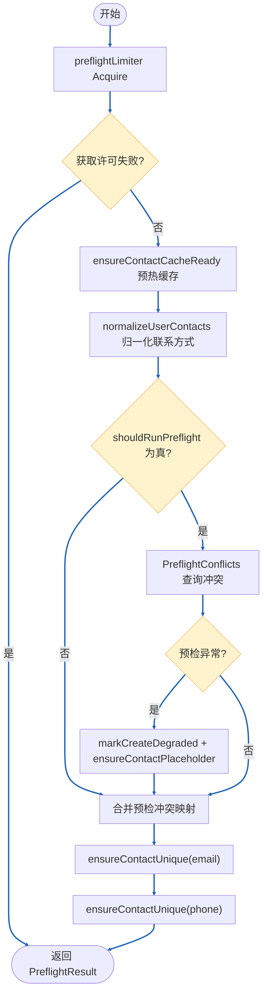
[ 注释 ]：
预检不会对每一次请求都打库。`shouldRunPreflight`（`user_service.go` 1537 行起）只有在**强一致性标记命中**、**用户字段不全空**且**缓存尚未预热/Redis 客户端不可用**时才会返回 true。生产长跑情况下 ① Redis 正常 ② `contactCacheReady` 已为 true 时，`runPreflight` 是 false，代码走 `preflight_query_skip`，不会触发 `store.PreflightConflicts`。当实例进入 Redis 降级模式（`isRedisDegradeActive=true`）时会显式跳过预检，直接依赖后续的降级路径，避免在 Redis 异常期间用大量数据库预检把主库压垮。 • “命中率 5%~10%”通常发生在两类场景：服务刚升起/缓存还未热好（预热前必须跑预检防止脏写），或强一致性请求持续注入（如强制刷新、删除场景）。 • 真正的唯一性校验逻辑在 `ensureContactUnique`（1968 行起）中，通过 `unique.NewChecker` 先与 Redis 交互： ◦ 读取/写入缓存占位符（SetNX）确保同一联系方式只有一个请求持有； ◦ 缓存命中直接返回，跳过查库； ◦ 在缓存缺失、降级模式或强一致请求下才调用 `GetByEmail`、`GetByPhone`，确保最终一致性。
这就是“先查 Redis，必要时再查库”的落地实现。   • Redis 的意义在于： 1. 高并发下为每个邮箱/手机号提供租约，占住后续请求避免并发写冲突； 2. 作为热点缓存，大多数查询在 Redis 命中，无需访问数据库； 3. 在降级或缓存未就绪时，再退回数据库 + 本地缓存，保证一致性。   • 如果实际监控看到预检占比一直偏高，建议排查 contactCacheReady 是否为 true、是否处于降级（user_create_degrade_total、ensure_contact_*_degraded_* 指标）、或是否频繁触发强一致调用；根因在这些条件，而不是流程本身必须查库。
#### EnsureUnique 数据流程图

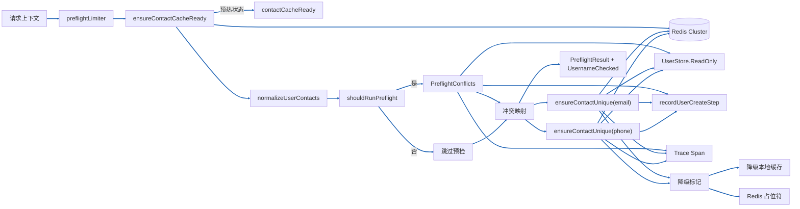

#### EnsureUnique 状态机

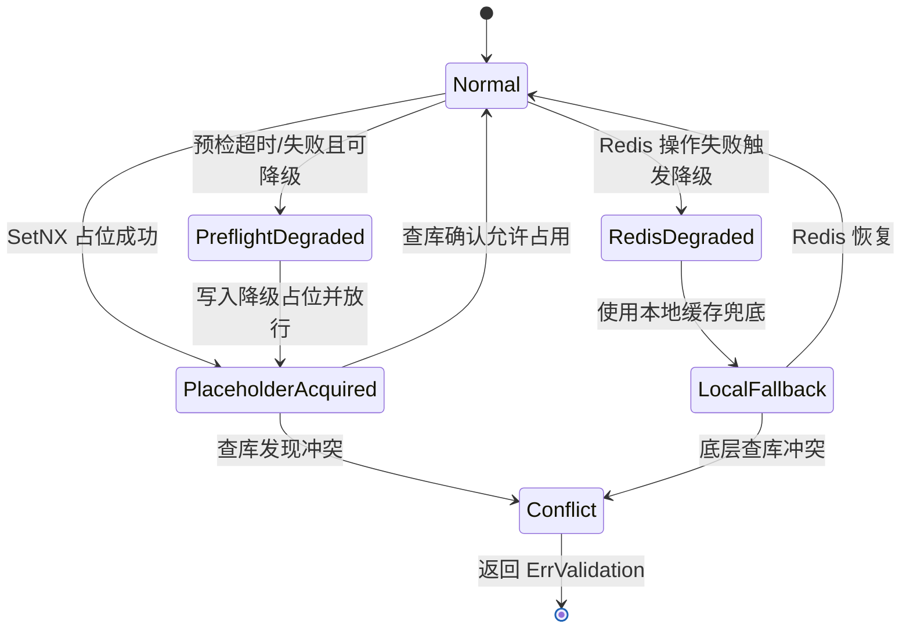

### Kafka 生产与消费链路

- `SendCreateMessage` 通过 `producer.MessageProducer` 将创建事件转换为标准化的 Kafka 消息。调用会记录 trace、metrics，并在失败时立即返回 `ErrKafkaFailed` 以便调用方执行幂等重试。
- Kafka 集群承担解耦与缓冲职责：API 层保证同步流程在消息成功投递后即可返回，后续延伸逻辑通过 Topic 进行松耦合扩展。
- `Kafka Consumer`（后台服务）订阅同一 Topic，负责将用户实体落库、刷新缓存以及触发后续自动化流程；消费失败时依赖 Kafka 重试与业务补偿机制确保最终一致性。
- 生产端与消费端的指标、日志统一打点，方便通过 Prometheus 与集中日志快速定位消息积压或处理异常。

---

## 2.3 联系方式缓存预热机制

`ensureContactCacheReady` 不在进程启动时常驻运行，而是在请求路径上按需触发：每次进入创建流程都会先调用该函数，由它判断是否需要异步预热邮箱/手机号唯一性缓存。

- 首先检查 `contactCacheReady` 原子标记；若缓存已完成预热，直接返回。
- 当配置关闭 `EnableContactWarmup` 时，会将 `contactCacheReady` 置为 `true` 并退出，相当于跳过预热。
- 若底层依赖（`Store`、`Redis`）未就绪，同样会立即返回，避免无效重试。
- `contactWarmupNextRetry`（`atomic.Int64`）记录上次失败后的下一次重试时间；在窗口未到时新请求只会提前返回，防止频繁拉起后台任务。
- 通过 `contactWarmupMu` 和 `contactWarming` 实现双重检查锁：再次确认状态后仅允许一个 goroutine 真正启动预热。
- 真正的预热逻辑在单独的 goroutine 内执行 `warmContactCache()`；成功时写回 `contactCacheReady=true` 并清除重试时间，失败时记录 `Warn` 日志并把 `contactWarmupNextRetry` 推迟 30 秒，同时复位 `contactWarming` 状态。

该机制保证在高并发场景下仍能以最少的后台任务完成缓存预热，同时对失败场景提供退避与状态复位能力。

## 2.4 Redis 降级策略（2025-12 更新）

- **触发条件**：`shouldDegradeForError` 会识别 Redis/数据库超时、上下文取消以及包含超时关键词的错误；另外在联系方式唯一性检测中发生哨兵占位失败时也会调用 `markCreateDegraded`。
- **请求级降级**：`markCreateDegraded` 将降级标记写入请求上下文（`userctx.MarkCreateDegraded`），首次触发会输出告警日志与 trace 标签 `create_degraded=true`，确保同一链路后续步骤知晓降级状态。
- **全局降级开关**：当降级原因属于占位或缓存失败（`redisDegradeReasonPlaceholder` / `redisDegradeReasonCache`）时，`enableRedisDegrade` 会拉起全局标志，使得后续请求在 `markUserPendingCreate` 中直接跳过 Redis 租约尝试。
- **指标补充**：降级路径会通过 `metrics.PendingLeaseEvents` 追加事件，其中 `acquire_degraded` 表示因错误进入降级流程，`acquire_skip_degraded` 表示因为全局降级开关而跳过租约。
- **恢复逻辑**：后台监控协程 `startContactDegradeMonitor` 会周期性探测 Redis 健康度；一旦恢复即调用 `disableRedisDegrade` 清理临时缓存并重置降级状态。
- **业务影响**：降级模式仍允许创建请求继续执行，但更多依赖数据库幂等校验和本地缓存兜底；需要关注 Redis 恢复后及时回切以避免长时间缺失租约保护。

---

## 2.5 SRE 运营建议：背压 vs 降级 vs Redis 抖动

这一小节从 SRE 视角，给出如何区分“背压”“降级”“Redis 抖动”，以及在不同场景下应采取的操作建议。

**一、如何快速区分三种情况？**

- 背压（Queue/Lease 已接近或达到容量上限）
    - 典型现象：
        - `PendingLeaseEvents{event="pre_acquire_backpressure"}`、`"expired_conflict"`、`"pre_acquire_delay"` 明显上升；
        - 业务错误码侧：`ErrServerBusy`，文案为“用户创建排队中/正在创建，请稍后再试”；
        - trace tag 中反复出现 `pending_backpressure_level`、`pending_queue_depth`；
    - 关键结论：
        - 这是业务侧“主动限流”，系统本身健康，但队列已接近极限；
        - 继续提速会放大排队时延甚至打挂下游。

- 降级（明确进入 degrade 模式，但仍允许创建继续）
    - 典型现象：
        - `user_create_degrade_total{reason=...}` 明显上升；
        - `PendingLeaseEvents{event="acquire_degraded"}` / `"acquire_skip_degraded"` 增加；
        - trace 中可看到 `create_degraded=true`、`pending_marker_degraded_skip=true` 等标签；
    - 关键结论：
        - 系统已经“牺牲 Redis 占位保护”，改为依赖数据库幂等 / 本地缓存兜底；
        - 属于“质量下降但可用”，长期维持在高降级率是有风险的。

- Redis 抖动（网络/实例短暂异常，被视为可重试错误）
    - 典型现象：
        - Redis 监控（连接数、错误率、慢查询）在短时间内有尖峰；
        - Create 链路中 `PendingLeaseEvents{event="acquire_degraded"}` 出现短暂小波峰；
        - trace/log 里有 `connection reset/refused`、`timeout`、`broken pipe` 等错误，但持续时间有限；
    - 关键结论：
        - 代码层面：这些错误会被 `isRetryableError` + `shouldDegradeForError` 识别为“可重试/短暂性”，当前请求会被标记为降级，但不会整体失败；
        - 若抖动时间很短，可以视为瞬时故障，无需立刻人为干预，但要关注是否频繁复发。

**二、不同场景下的 SRE 处理建议**

- 背压持续升高（排队严重）
    - 观察指标：
        - `PendingLeaseEvents{event~"pre_acquire_backpressure|pre_acquire_delay"}`；
        - API 错误率中 `ErrServerBusy` 占比；
        - 队列长度 / Kafka lag；
    - 推荐动作：
        - 短期：
            - 通过配置中心 / 管控接口调低 `RolloutPercent` 或将 `Mode` 从 `queue/rollout` 切回 `sync`，减少入队；
            - 适当调高写入限流阈值的敏感度，让更多请求在路由层被 429 拒绝，而不是全部压到 Pending 队列；
        - 中长期：
            - 扩容消费端（OperationPipeline Workers、Kafka Consumer）、优化消费逻辑；
            - 重新评估队列容量和延迟 SLO，必要时拆分 Topic / 队列。

- 降级比例升高（频繁 skip 占位）
    - 观察指标：
        - `user_create_degrade_total / user_create_requests_total`；
        - `PendingLeaseEvents{event~"acquire_degraded|acquire_skip_degraded"}`；
    - 推荐动作：
        - 先区分原因：
            - 若 reason 多为 `redis_cache_error/redis_placeholder_error`：优先排查 Redis 集群健康（连接池、CPU、慢查询、网络 RTT）；
            - 若 reason 多为 `preflight_timeout`：关注数据库健康与预检查询（索引、慢 SQL）。
        - 在 Redis/DB 恢复后：
            - 确认 `create_degraded` 标签和降级事件开始回落；
            - 如长时间维持高降级率，需要评估是否临时调低写入 QPS（限流）或暂时将 Mode 改回 `sync`，避免在“无租约保护”的情况下继续高并发写入。

- 短期 Redis 抖动（偶发，但在恢复）
    - 观察指标：
        - Redis 客户端错误峰值与 Create 降级事件是否同步尖峰；
        - 故障窗口外，指标是否很快恢复到基线；
    - 推荐动作：
        - 若只是单次短尖峰（例如几秒～几十秒）：
            - 可以主要依赖现有降级机制（本次请求自动降级、主流程继续），不必立刻大范围切换 Mode；
            - 重点事后复盘：具体是哪台实例/哪条命令产生抖动，是否与发布/网络变更相关。
        - 若尖峰反复出现：
            - 视为“慢性不稳定”，建议：
                - 提前将关键写路径的 `Mode` 从 `queue/rollout` 回调到 `sync` 或低 `RolloutPercent`；
                - 结合 Redis 运维（分片迁移、主从切换、连接池上限）做专项治理。

**三、告警与阈值建议（补充视角）**

- 背压告警：
    - 条件示例：`rate(PendingLeaseEvents{event="pre_acquire_backpressure"}[5m]) / rate(user_create_requests_total[5m]) > 0.02`；
    - 动作建议：提示“请检查队列消费能力/Mode 配置，必要时调低队列放量或扩容消费者”。

- 降级告警：
    - 条件示例：`rate(user_create_degrade_total[5m]) / rate(user_create_requests_total[5m]) > 0.01` 持续 10 分钟；
    - 动作建议：提示“写路径正在频繁降级，请检查 Redis/DB 健康与最近发布，注意当前写请求可能缺少 Redis 租约保护”。

- Redis 抖动早期预警：
    - 条件示例：Create 链路的 `acquire_degraded` 在短时间内多次成尖峰（例如 1 小时内出现 3 次明显高峰），但整体错误率仍低；
    - 动作建议：将该告警分级为 “warning”，用于驱动容量/网络侧排查，而不是立刻触发流量切换。

通过上述区分与建议，SRE 可以在面对“队列打满”“Redis 抖动”“频繁降级”时，快速判断问题性质，选择合适的杠杆（Mode/限流/扩容/排障），而不是简单地“一律加机器”或“一律降级”，从而在可用性与成本之间取得更稳健的平衡。

---

## 3. 时序图（Sequence Diagram）

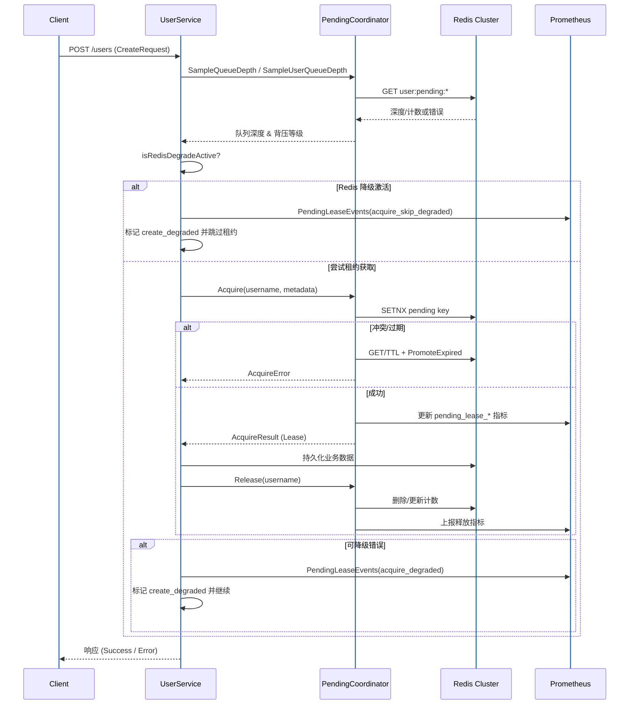

---

## 4. 状态图（State Diagram）

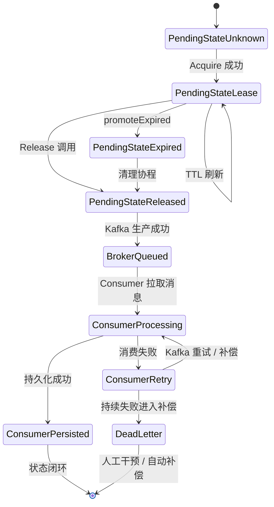

- `PendingStateUnknown`：租约键不存在或首次创建。
- `PendingStateLease`：持有租约，快照记录 owner、队列深度。
- `PendingStateExpired`：超出 TTL，等待清理或重试抢占。
- `PendingStateReleased`：释放后短暂保留用于审计，同时等待 Kafka 生产确认。
- `BrokerQueued`：消息已进入 Kafka，等待消费侧拉取。
- `ConsumerProcessing`：消费服务正在处理创建事件。
- `ConsumerRetry`：消费失败进入 Kafka 重试或业务补偿。
- `ConsumerPersisted`：消费侧持久化成功，链路闭环。
- `DeadLetter`：持续失败进入补偿队列，需人工或自动治理。

---

## 5. 数据流程图（Data Flow Diagram）

```mermaid
%%{init: {'themeVariables': {'lineColor': '#1E63B5', 'flowchartLinkColor': '#1E63B5', 'lineWidth': 3, 'fontSize': '24px'}}}%%
graph TD
    Client[客户端请求] --> Req[HTTP 请求
(CreateRequest)]
    Req --> API[UserService]
    API -->|构造| Meta[LeaseMetadata]
    API -->|调用| PC[PendingCoordinator]
    PC -->|读写| Redis[(Redis 集群)]
    Redis --> Snapshot[JSON Snapshot]
    Snapshot -->|解析| State[PendingState]
    State -->|决策| Response[租约结果]
    Response --> API
    API -->|写入| DB[(业务 DB / 下游服务)]
    API -->|返回| Client
    PC --> Metrics[(Prometheus)]
    PC --> Log[结构化日志]

    classDef default font-size:24px;
    linkStyle default stroke:#1E63B5,stroke-width:3px
```

- 数据源：客户端输入、Redis 中的租约快照、业务数据库。
- 处理：Snapshot → State → AcquireResult → ReleaseSnapshot。
- 存储：Redis 保留租约状态，指标系统存储可观测数据。

---

## 6. 依赖关系图（Dependency Graph）

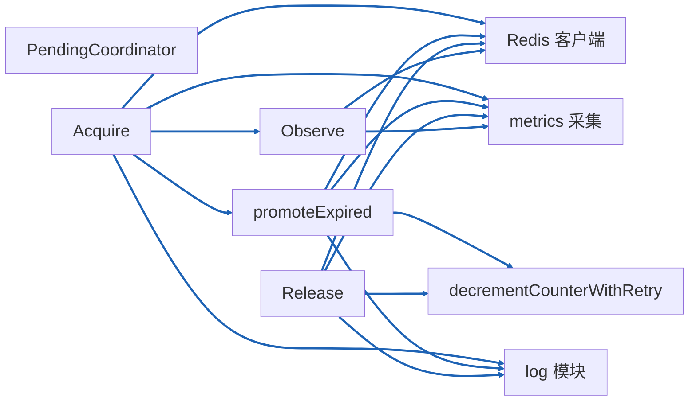

- **强依赖**：Redis、metrics、日志模块异常都会影响租约一致性（建议降级策略）。
- **关键路径**：`Acquire`→`Observe`→`promoteExpired`→`Release`，共享计数器与快照操作。

---

## 7. 可选图示（高并发泳道）

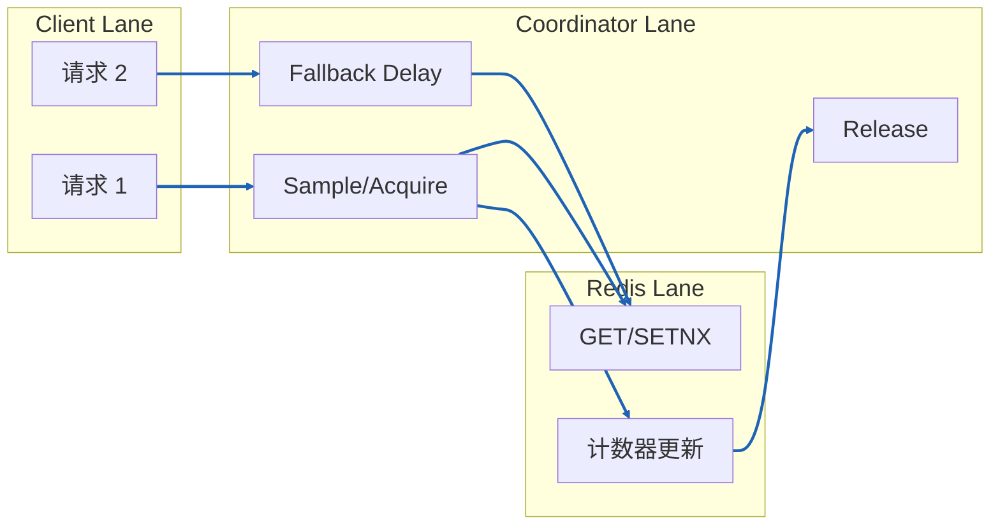

- 展示不同请求在协调器与 Redis 间的并行执行，突出延迟与争抢窗口。

---

## 8. 关键风险与优化建议

1. **Redis 依赖较重**：已补充 `pending_lease_*` Redis 操作指标（GET/SETNX/TTL/计数器），结合哨兵或 Proxy 监控可快速锁定热点命令的延迟与失败率。
2. **计数器漂移观测**：新增 `pending_lease_calibration_duration_seconds` 直方图与取消事件，配合 `calibration_*` 计数可量化后台校准的耗时、失败与恢复情况。
3. **背压策略调优**：`PendingCoordinator.UpdateBackpressureProfile` 支持热更新延迟曲线，可通过聚合配置中心或运维指令动态调整桶阈值与延迟梯度。
4. **日志/指标一致性**：统一使用 `PendingLeaseEvents` 记录背压曲线变更、校准重试等关键事件，与 Trace Tag 共享相同枚举，辅助排障。
5. **配置热更新**：保留 `UpdateCalibration` + `Stop()` 优雅退出流程，结合新的背压曲线热更新接口，实现租约与背压配置的在线调整。

---

> 文档初稿完成时间：2025-11-28。后续如业务流程调整，请同步更新流程图与依赖描述。

## 9. OperationPipeline 设计（异步操作队列）

本节从通用异步操作队列的角度，梳理 `internal/common/service/operation` 下的 OperationPipeline 设计，并与前文的 Create API 流程、Redis/队列降级策略对齐。

### 9.1 设计目标

- **统一异步模型**：为 Create/Update/Delete/Batch 等操作提供一致的「提交 → 排队 → Worker 执行 → 状态存储」模型，避免各业务自造轮子。
- **入口与执行解耦**：HTTP 入口只负责构建 OperationEnvelope + 调用 `Submit`，快速返回；真实执行逻辑下沉到 Worker（`ProcessOnce`），便于扩缩容与灰度。
- **状态可观测**：通过 `RequestStateStore` 持久化操作状态（Queued/Executing/Completed/Failed/Compensating/Compensated），支撑管理端查询与补偿决策。
- **可控重试与补偿**：Pipeline 内建最大重试次数、指数退避以及补偿调度逻辑，Executor 只需返回 `OperationResult` 即可驱动行为。

### 9.2 核心组件

- **Pipeline**：
    - 字段：`queue QueueCoordinator`、`state RequestStateStore`、`exec OperationExecutor`；
    - 对外方法：`Submit(ctx, *OperationEnvelope)`、`ProcessOnce(ctx)`。
- **QueueCoordinator（队列协调器）**：
    - 典型方法：`Enqueue/Dequeue/Requeue/Ack`；
    - 典型实现：基于 Redis 的队列/有序集合，负责存取队列项及延迟重排。
- **RequestStateStore（请求状态存储）**：
    - 职责：`Upsert` 初始状态、`Advance` 状态流转、`RecordFailure` 记录失败原因；
    - 状态：`StateQueued`、`StateExecuting`、`StateCompleted`、`StateFailed`、`StateCompensating`、`StateCompensated` 等。
- **OperationExecutor（业务执行器）**：
    - 方法：`Prepare/Execute/Compensate`；
    - 在用户服务中由具体的 Executor 实现，通常在 Execute/Compensate 内部调用同一套 `createPipeline` 或相应业务流水线，保证同步/异步语义一致。
- **Envelope / QueueItem / OperationResult**：
    - `OperationEnvelope`：携带操作 ID、Kind、Resource、TraceID、Headers、Payload、SubmittedAt 等；
    - `QueueItem`：封装 Envelope + Attempts + AvailableAt；
    - `OperationResult`：描述本次执行的 State、Error、Fatal、RetryAfter、TriggerCompensation、Attempt 等。

### 9.3 提交流程（Submit）

1. **构造 Envelope**：入口层（如 `UserService.Create/Update/Delete/Batch`）构建 `OperationEnvelope`：
     - 若 ID 为空，由 `idutil.GetUUID36` 生成；`SubmittedAt` 为空则取当前时间；Headers 为空则初始化 map；
     - Headers 中通常会带上 `requestID`、TraceID、账号信息等，用于后续链路追踪。
2. **持久化排队状态**：`Pipeline.Submit` 先调用 `state.Upsert(ctx, env, StateQueued)`：
     - 将操作以 `Queued` 状态写入 `RequestStateStore`；
     - 若 Upsert 失败（例如状态存储不可用），直接返回错误，**不会**继续入队，由调用方按幂等策略重试。
3. **写入队列**：Upsert 成功后调用 `queue.Enqueue(ctx, env)`：
     - 将 Envelope 包装为队列项写入队列后端；
     - 若 Enqueue 失败，同样返回错误，由调用方重试；状态存储中已存在的 `Queued` 记录可被后续重试复用。
4. **返回 ticket**：成功时返回 `QueueTicket`，调用方可选地把 operationID 透出给客户端用于后续查询。

#### 9.3.1 OperationPipeline 总览图

下面的简化流程图概括了典型的一次异步操作从提交到消费完成的关键节点：

```mermaid
%%{init: {'themeVariables': {'lineColor': '#1E63B5', 'flowchartLinkColor': '#1E63B5', 'lineWidth': 3, 'fontSize': '24px'}}}%%
flowchart LR
    Client[入口服务\n(UserService.*)] --> Submit[Pipeline.Submit]
    Submit --> StateUpsert[RequestStateStore.Upsert\n(StateQueued)]
    StateUpsert --> QueueEnqueue[QueueCoordinator.Enqueue]
    QueueEnqueue --> Worker[Worker / inline 预跑\nPipeline.ProcessOnce]
    Worker --> StateAdvance[RequestStateStore.Advance\n(Executing→Completed/Failed/...)]

    classDef default font-size:24px;
    linkStyle default stroke:#1E63B5,stroke-width:3px
```

关键点：
- 只有当 `Upsert` 与 `Enqueue` 都成功时，操作才真正进入异步队列；任一环节报错都会直接返回给调用方，由其基于幂等重试兜底；
- Worker 通过 `ProcessOnce` 消费队列项，并在执行或补偿完成后通过 `Advance` 更新最终状态；
- 上层可以通过 operationID 查询 `RequestStateStore` 获取当前状态，实现与客户端的异步状态对齐。

### 9.4 消费流程（ProcessOnce）

1. **从队列取出任务**：Worker 或 inline 预跑调用 `ProcessOnce(ctx)`：
     - 通过 `queue.Dequeue(ctx)` 获取一个 `QueueItem`；队列空或暂时性错误会直接返回 error，由上层决定是否继续循环。
2. **区分执行/补偿阶段**：根据 Envelope 头部 `operation-phase` 决定走执行还是补偿分支：
     - 默认 `execute`；补偿由 `scheduleCompensation` 创建带 `phaseCompensate` 的克隆 Envelope 并 Requeue。
3. **执行阶段（processExecution）**：
     - `advanceToExecuting`：将状态从 `Queued` 迁移到 `Executing`（冲突时允许 `Failed → Executing`），失败则 Ack 队列并返回；
     - `exec.Prepare`：准备幂等键、依赖注入等，失败时记录 failure 并返回错误；
     - `exec.Execute`：执行业务；根据 `OperationResult` 决定：
         - 成功：`Completed` → `state.Advance(Executing→Completed)` + `queue.Ack`；
         - 失败：进入 `handleExecutionResult`，根据 Fatal/最大重试次数/RetryAfter 决定「标记失败 + 可选补偿」还是「回到队列等待重试」。
4. **补偿阶段（processCompensation）**：
     - 调用 `exec.Compensate` 执行补偿；
     - 成功：`state.Advance(Compensating→Compensated)` + Ack；
     - 重试：根据 Fatal/RetryAfter 决定是 `Compensating→Failed` + Ack，还是 Requeue 延迟重试。

#### 9.4.1 OperationPipeline 状态机

```mermaid
%%{init: {'themeVariables': {'lineColor': '#1E63B5', 'lineWidth': 3, 'fontSize': '24px'}}}%%
stateDiagram-v2
    [*] --> Queued
    Queued --> Executing: ProcessOnce / advanceToExecuting
    Executing --> Completed: Execute 成功
    Executing --> Failed: Fatal 错误 / 超过最大重试次数
    Executing --> Queued: 可重试错误 / Requeue
    Failed --> Compensating: TriggerCompensation=true
    Compensating --> Compensated: Compensate 成功
    Compensating --> Failed: Fatal 错误 / 超过最大重试次数
    Compensating --> Compensating: 可重试错误 / Requeue
    Completed --> [*]
    Compensated --> [*]
```

- `Queued`：`Submit` 完成 `Upsert(StateQueued)` 且成功 `Enqueue` 后进入；
- `Executing`：Worker 在 `ProcessOnce` 中通过 `advanceToExecuting` 将状态从 `Queued`（或异常情况下 `Failed`）迁移到执行中；
- `Completed` / `Failed`：`Execute` 完成后，根据 `OperationResult` 判定是否成功或失败并写回状态；
- `Compensating` / `Compensated`：当 `TriggerCompensation=true` 时，从 `Failed` 进入补偿流程，补偿成功后进入 `Compensated`，失败则按重试/终止规则回到 `Failed`；
- `Queued` 与 `Executing/Compensating` 之间通过 `Requeue` 形成重试闭环，最大重试次数与退避策略由 Pipeline 配置控制。

### 9.5 队列降级语义：降级 = 拒绝入队、依赖调用方重试

结合前文 2.2.2 中的 Redis/队列降级策略，本项目中对 OperationPipeline 采用如下统一约定：

- **库层不做「自动切换内存队列」**：
    - `operation.Pipeline` 只负责调用 `QueueCoordinator.Enqueue/Dequeue/Requeue/Ack`，不内建「Redis 不可用时切到内存队列」的隐式行为；
    - 是否降级由上层根据统一的 Redis 健康视图（如 `isRedisDegradeActive`）在调用 `Submit` 之前决定。
- **调用方约定：队列降级 = 拒绝入队**：
    - 在 Create/Update/Delete/Batch 等异步入口，已在 `operationPipeline.Submit` 之前增加了「队列降级 / Redis 队列不可用?」判定：
        - 降级/不可用 → 不调用 `Submit`，直接返回 `ErrServerBusy`，配合“创建/更新/删除/批量更新队列暂不可用，请稍后重试”等文案；
        - 队列健康 → 正常调用 `Submit`，后续由 Worker 或 inline 预跑通过 `ProcessOnce` 执行。
    - 这样可以保证：
        - 队列不可用时，上游立刻拿到明确错误码，结合幂等键进行退避重试；
        - 不会在服务端悄悄维护一套仅存在于本地内存的隐形队列，降低数据丢失和排障复杂度。
- **Submit 失败与降级语义保持一致**：
    - 若 `state.Upsert` 或 `queue.Enqueue` 返回错误，`Submit` 直接向上返回该错误，而不是尝试自动降级；
    - 上层只需遵守：**只要 Submit 返回错误，就视为本次未成功入队，需要按幂等策略重试或显式失败**。

### 9.6 与 Create API 的关系小结

- `decideOperationMode` 判定为异步（queue/rollout 命中）且队列健康时：
    - Create/Update/Delete/Batch 会构造 Envelope → 调用 `operationPipeline.Submit` 入队；
    - 可选地在当前请求中执行一次 `ProcessOnce` 作为 inline 预跑，其余工作由后台 Worker 完成。
- 队列降级或 Redis 队列不可用时：
    - 在 `QueueDegrade` 判定节点直接返回 `ErrServerBusy`，不触发 Submit，不写入任何内存队列；
    - 保证异步路径的行为简单且可预期，把「不丢业务」的责任交给上游的幂等与重试策略。
- 与 PendingCoordinator 的分工：
    - 同步路径（Pending）在 Redis 降级时通过 `DegradeActive` 自动 fallback 到内存 backend，优先保证接口可用与背压能力；
    - 异步路径（OperationPipeline）在队列降级时宁可显式失败，也不在服务端隐式缓存任务，以换取更清晰的语义和更易排查的行为。
