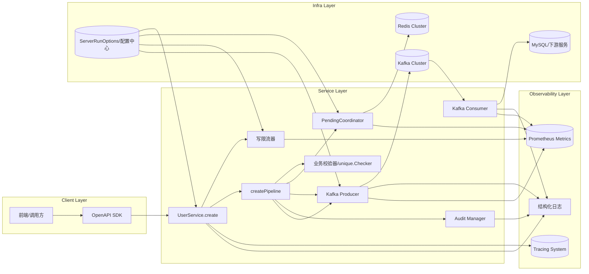
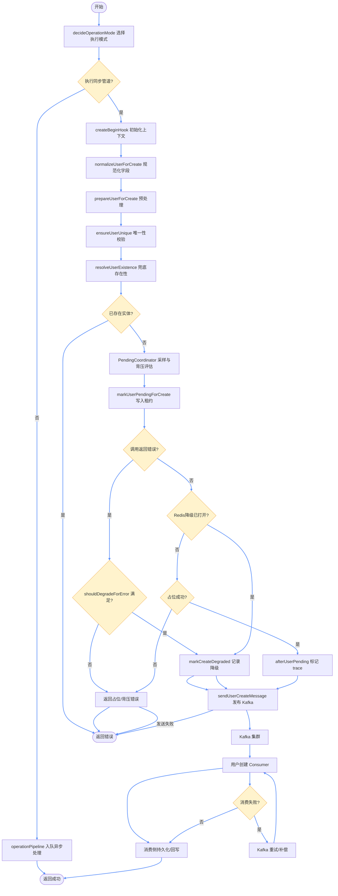
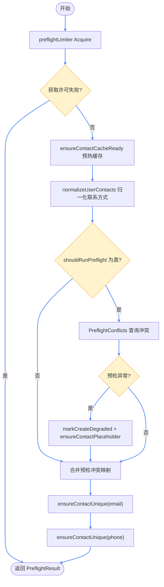
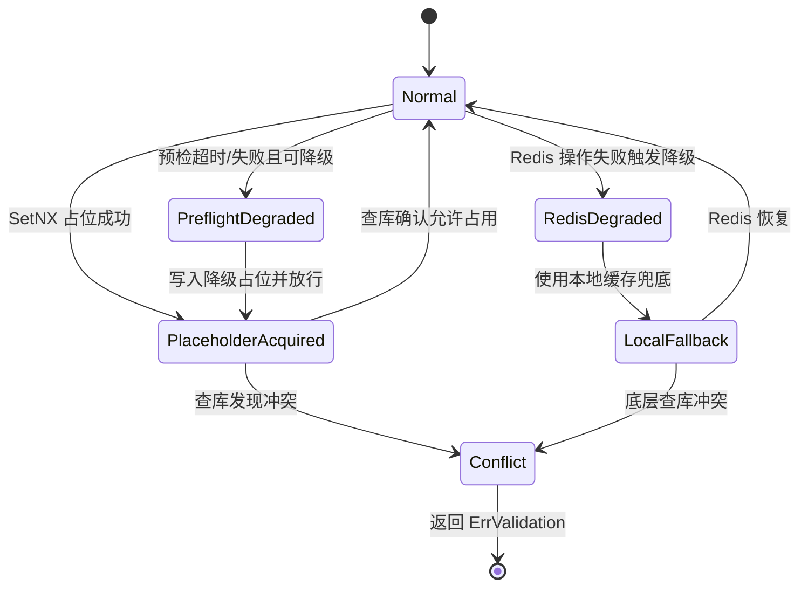
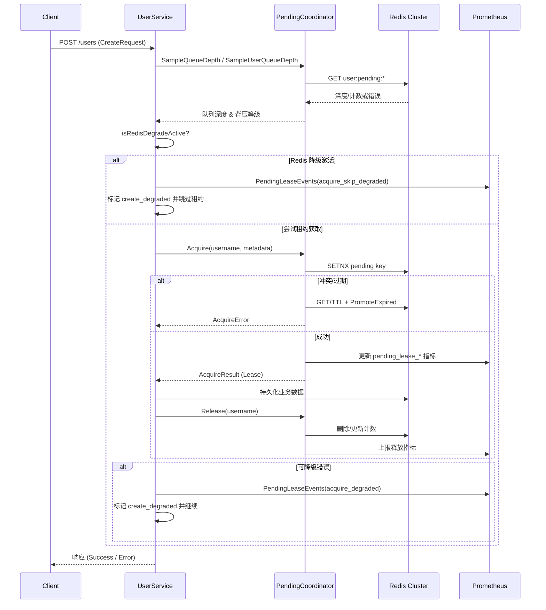
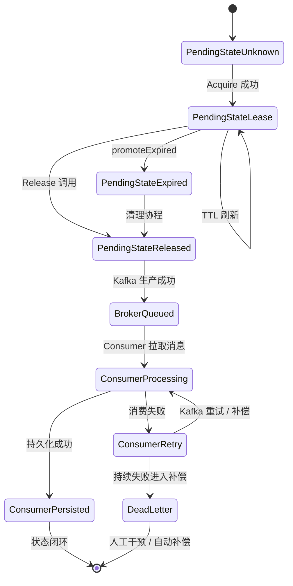
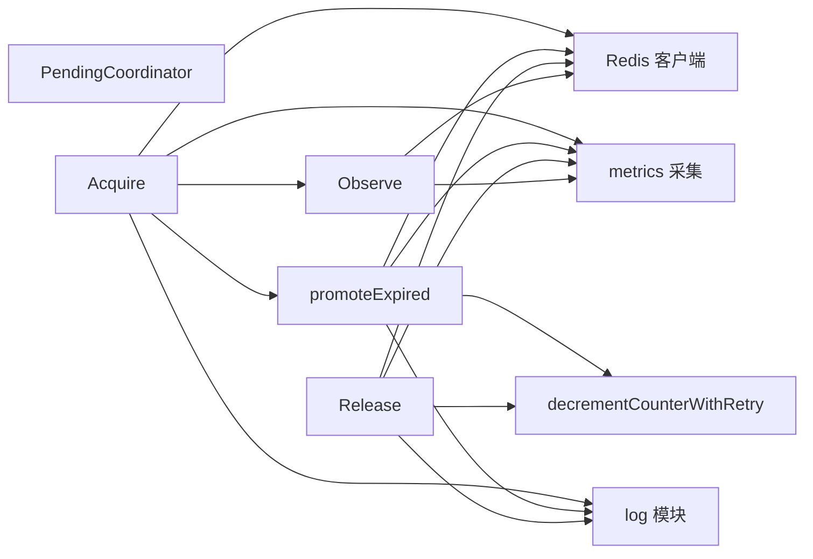
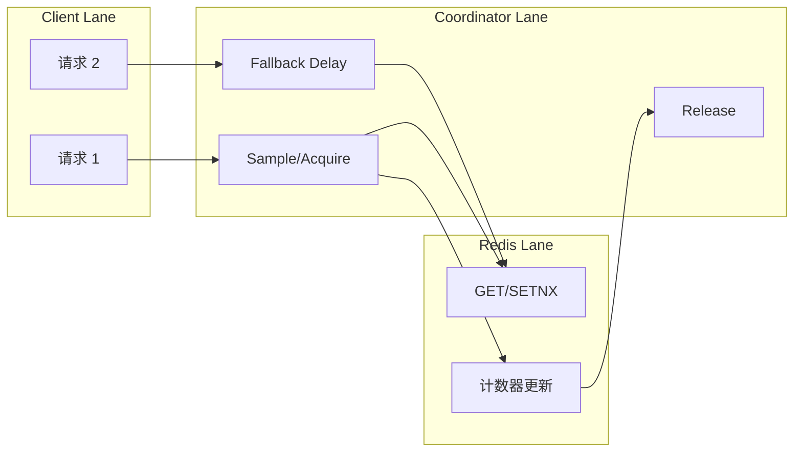

# Create API 全链路分析

本文聚合创建用户（Create API）在 *cdmp-mini* 中的全生命周期执行路径，覆盖架构视角、执行流程、组件交互、状态演进、数据流与依赖关系，便于排查高并发、背压与一致性相关问题。

---

## 1. 架构图（Architecture Diagram）



- **客户端层**：外部请求经统一 SDK 或网关进入。
- **服务层**：`UserService.create` 先走全局写限流，再交由 `createPipeline` 串联业务校验、待审批协调器、审计与 Kafka 生产消费链路，`Kafka Consumer` 负责异步持久化与下游扩展。
- **可观测性层**：审计、生产者与核心流程均输出统一的结构化日志、指标与 Trace 便于诊断。
- **基础设施层**：Redis 负责租约与缓存，DB 持久化业务数据，`ServerRunOptions` 提供限流、背压、校验等动态配置。

---

## 2. 主流程图（Flow Chart）



要点：
- `decideOperationMode` 在请求入口判定同步/异步执行路径；默认值来自运行时配置，若选择异步会直接入队 `operationPipeline`。
- `createBeginHook` 建立 trace、降级标记与通用上下文，串联后续步骤的观测维度。
- `prepareUserForCreate` 完成密码加密及联系方式缓存预热，为唯一性检查提前构建热路径。
- `ensureUserUnique` 与 `PendingCoordinator` 串联：先进行全量预检与限流，再按租约背压策略决定是否进入写入阶段，过程中可能触发降级。
- `markUserPendingForCreate` 在 Redis 正常时写入租约；当 `shouldDegradeForError` 或全局 Redis 降级触发时，直接走降级分支并记录 `PendingLeaseEvents` 指标。
- `sendUserCreateMessage` 将用户实体推送至 Kafka，消费者异步完成持久化与下游派发，是创建 API 得以快速返回的关键。*** End Patch

---

## 2.1 Create Service Pipeline

在进入流水线之前，`UserService.Create` 会通过 `decideOperationMode` 判定执行模式：若为 `OperationModeQueue` 则直接入队异步执行；仅当判定为 `OperationModeSync` 时才会落入同步 `createpipeline.Pipeline`。`UserService.Create` 通过 `createpipeline.Pipeline` 串联一组幂等钩子，每个阶段都记录 trace / metrics，并在失败时返回携带业务码的错误。流水线的关键步骤如下：

| 顺序 | 钩子 | 说明 |
| --- | --- | --- |
| 1 | `createBeginHook` | 建立根 Span，向上下文写入创建态标识，准备结束回调以统一收敛状态码。 |
| 2 | `normalizeUserForCreate` | 归一化邮箱、手机号，确保后续缓存键一致。 |
| 3 | `prepareUserForCreate` | 加密密码、预热联系方式缓存，记录耗时指标。 |
| 4 | `ensureUserUnique` | 统一执行用户名/联系方式唯一性校验，详见下节。 |
| 5 | `resolveUserExistence` | 当预检未覆盖用户名时补充库查，并将结果写入 trace tag。 |
| 6 | `handleUserExisting` | 若已存在冲突实体，按照业务码返回 `ErrUserAlreadyExist`。 |
| 7 | `markUserPendingForCreate` | 与 `PendingCoordinator` 互动写入租约；若 Redis 降级激活或 `shouldDegradeForError` 判定可降级错误，则跳过 SetNX，调用 `markCreateDegraded` 并上报 `PendingLeaseEvents`（`acquire_skip_degraded` / `acquire_degraded`）。 |
| 8 | `afterUserPending` | 为 trace 增加租约相关标签，便于串联后续链路。 |
| 9 | `sendUserCreateMessage` | 发送 Kafka 事件，失败时打点并返回 `ErrKafkaFailed`。 |

### EnsureUnique 阶段细节

`ensureUserUnique` 负责兜底所有唯一性校验，流程可以拆解为以下数步：

1. **限流与熔断**：若配置了 `preflightLimiter`，先阻塞等待许可，超时则直接返回 `ErrDatabaseTimeout`。无论成败都会通过 `recordUserCreateStep` 打点。 
2. **缓存预热与归一化**：调用 `ensureContactCacheReady`、`normalizeUserContacts`，确保邮箱/手机号键经过统一处理，并在必要时补齐降级占位。
3. **数据库预检（可选）**：根据 `shouldRunPreflight` 判断是否访问存储层执行 `PreflightConflicts`。该步骤支持按配置重试、记录耗时，并在失败时视错误类型决定是否降级：
    - 可降级错误（超时、Redis 故障）会触发 `markCreateDegraded`，向 Redis 写入占位符并继续流程；
    - 不可降级错误直接向调用方抛出。成功命中时将冲突用户写入 `preflight` map，并标记 `UsernameChecked`。
4. **按字段逐一校验**：分别对邮箱、手机执行 `ensureContactUnique`：
    - 基于 `unique.NewChecker` 组合 Redis 缓存、占位符、数据库兜底与重试策略；
    - 命中缓存或预检冲突时快速返回；
    - 查库命中返回携带 `ErrValidation` 的错误（提示具体字段）；
    - 当处于降级模式或 Redis 不可用时自动走 `ensureContactUniqueDegraded`，依赖本地缓存与数据库唯一索引保证一致性。
5. **指标与日志对齐**：整个阶段统一记录 `ensure_contact_unique`、`preflight_*` 等步骤指标，所有降级、占位写入都会通过 `PendingLeaseEvents`/结构化日志可视化，最终返回冲突映射与用户名校验标记。

综上该阶段兼顾“尽量早失败”和“故障可降级”两类诉求，为后续 Pending 与 Kafka 操作提供干净的前置条件。

#### EnsureUnique 主流程图



#### EnsureUnique 数据流程图

```mermaid
graph LR
    Ctx[请求上下文] --> Limiter[preflightLimiter]
    Limiter --> WarmupStep[ensureContactCacheReady]
    WarmupStep --> Redis[(Redis Cluster)]
    WarmupStep --> LocalCache[降级本地缓存]
    WarmupStep -->|预热状态| StateFlag[contactCacheReady]
    WarmupStep --> NormalizeStep[normalizeUserContacts]
    NormalizeStep --> PreflightDecision[shouldRunPreflight]
    PreflightDecision -->|是| Preflight[PreflightConflicts]
    Preflight --> UserStore[UserStore.ReadOnly]
    Preflight --> Metrics[recordUserCreateStep]
    Preflight --> Trace[Trace Span]
    PreflightDecision -->|否| SkipPreflight[跳过预检]
    Preflight --> Conflicts[冲突映射]
    SkipPreflight --> Conflicts
    Conflicts --> EmailUnique[ensureContactUnique(email)]
    Conflicts --> PhoneUnique[ensureContactUnique(phone)]
    EmailUnique --> Redis
    PhoneUnique --> Redis
    EmailUnique --> UserStore
    PhoneUnique --> UserStore
    EmailUnique --> Metrics
    PhoneUnique --> Metrics
    EmailUnique --> Trace
    PhoneUnique --> Trace
    EmailUnique --> DegradeFlag[降级标记]
    PhoneUnique --> DegradeFlag
    DegradeFlag --> LocalCache
    DegradeFlag --> Placeholder[Redis 占位符]
    Conflicts --> Result[PreflightResult+UsernameChecked]
```

#### EnsureUnique 状态机



### Kafka 生产与消费链路

- `sendUserCreateMessage` 通过 `producer.MessageProducer` 将创建事件转换为标准化的 Kafka 消息。调用会记录 trace、metrics，并在失败时立即返回 `ErrKafkaFailed` 以便调用方执行幂等重试。
- Kafka 集群承担解耦与缓冲职责：API 层保证同步流程在消息成功投递后即可返回，后续延伸逻辑通过 Topic 进行松耦合扩展。
- `Kafka Consumer`（后台服务）订阅同一 Topic，负责将用户实体落库、刷新缓存以及触发后续自动化流程；消费失败时依赖 Kafka 重试与业务补偿机制确保最终一致性。
- 生产端与消费端的指标、日志统一打点，方便通过 Prometheus 与集中日志快速定位消息积压或处理异常。

---

## 2.2 联系方式缓存预热机制

`ensureContactCacheReady` 不在进程启动时常驻运行，而是在请求路径上按需触发：每次进入创建流程都会先调用该函数，由它判断是否需要异步预热邮箱/手机号唯一性缓存。

- 首先检查 `contactCacheReady` 原子标记；若缓存已完成预热，直接返回。
- 当配置关闭 `EnableContactWarmup` 时，会将 `contactCacheReady` 置为 `true` 并退出，相当于跳过预热。
- 若底层依赖（`Store`、`Redis`）未就绪，同样会立即返回，避免无效重试。
- `contactWarmupNextRetry`（`atomic.Int64`）记录上次失败后的下一次重试时间；在窗口未到时新请求只会提前返回，防止频繁拉起后台任务。
- 通过 `contactWarmupMu` 和 `contactWarming` 实现双重检查锁：再次确认状态后仅允许一个 goroutine 真正启动预热。
- 真正的预热逻辑在单独的 goroutine 内执行 `warmContactCache()`；成功时写回 `contactCacheReady=true` 并清除重试时间，失败时记录 `Warn` 日志并把 `contactWarmupNextRetry` 推迟 30 秒，同时复位 `contactWarming` 状态。

该机制保证在高并发场景下仍能以最少的后台任务完成缓存预热，同时对失败场景提供退避与状态复位能力。

## 2.3 Redis 降级策略（2025-12 更新）

- **触发条件**：`shouldDegradeForError` 会识别 Redis/数据库超时、上下文取消以及包含超时关键词的错误；另外在联系方式唯一性检测中发生哨兵占位失败时也会调用 `markCreateDegraded`。
- **请求级降级**：`markCreateDegraded` 将降级标记写入请求上下文（`userctx.MarkCreateDegraded`），首次触发会输出告警日志与 trace 标签 `create_degraded=true`，确保同一链路后续步骤知晓降级状态。
- **全局降级开关**：当降级原因属于占位或缓存失败（`redisDegradeReasonPlaceholder` / `redisDegradeReasonCache`）时，`enableRedisDegrade` 会拉起全局标志，使得后续请求在 `markUserPendingCreate` 中直接跳过 Redis 租约尝试。
- **指标补充**：降级路径会通过 `metrics.PendingLeaseEvents` 追加事件，其中 `acquire_degraded` 表示因错误进入降级流程，`acquire_skip_degraded` 表示因为全局降级开关而跳过租约。
- **恢复逻辑**：后台监控协程 `startContactDegradeMonitor` 会周期性探测 Redis 健康度；一旦恢复即调用 `disableRedisDegrade` 清理临时缓存并重置降级状态。
- **业务影响**：降级模式仍允许创建请求继续执行，但更多依赖数据库幂等校验和本地缓存兜底；需要关注 Redis 恢复后及时回切以避免长时间缺失租约保护。

---

## 3. 时序图（Sequence Diagram）



---

## 4. 状态图（State Diagram）



- `PendingStateUnknown`：租约键不存在或首次创建。
- `PendingStateLease`：持有租约，快照记录 owner、队列深度。
- `PendingStateExpired`：超出 TTL，等待清理或重试抢占。
- `PendingStateReleased`：释放后短暂保留用于审计，同时等待 Kafka 生产确认。
- `BrokerQueued`：消息已进入 Kafka，等待消费侧拉取。
- `ConsumerProcessing`：消费服务正在处理创建事件。
- `ConsumerRetry`：消费失败进入 Kafka 重试或业务补偿。
- `ConsumerPersisted`：消费侧持久化成功，链路闭环。
- `DeadLetter`：持续失败进入补偿队列，需人工或自动治理。

---

## 5. 数据流程图（Data Flow Diagram）

```mermaid
graph TD
    Client[客户端请求] --> Req[HTTP 请求
(CreateRequest)]
    Req --> API[UserService]
    API -->|构造| Meta[LeaseMetadata]
    API -->|调用| PC[PendingCoordinator]
    PC -->|读写| Redis[(Redis 集群)]
    Redis --> Snapshot[JSON Snapshot]
    Snapshot -->|解析| State[PendingState]
    State -->|决策| Response[租约结果]
    Response --> API
    API -->|写入| DB[(业务 DB / 下游服务)]
    API -->|返回| Client
    PC --> Metrics[(Prometheus)]
    PC --> Log[结构化日志]
```

- 数据源：客户端输入、Redis 中的租约快照、业务数据库。
- 处理：Snapshot → State → AcquireResult → ReleaseSnapshot。
- 存储：Redis 保留租约状态，指标系统存储可观测数据。

---

## 6. 依赖关系图（Dependency Graph）



- **强依赖**：Redis、metrics、日志模块异常都会影响租约一致性（建议降级策略）。
- **关键路径**：`Acquire`→`Observe`→`promoteExpired`→`Release`，共享计数器与快照操作。

---

## 7. 可选图示（高并发泳道）



- 展示不同请求在协调器与 Redis 间的并行执行，突出延迟与争抢窗口。

---

## 8. 关键风险与优化建议

1. **Redis 依赖较重**：已补充 `pending_lease_*` Redis 操作指标（GET/SETNX/TTL/计数器），结合哨兵或 Proxy 监控可快速锁定热点命令的延迟与失败率。
2. **计数器漂移观测**：新增 `pending_lease_calibration_duration_seconds` 直方图与取消事件，配合 `calibration_*` 计数可量化后台校准的耗时、失败与恢复情况。
3. **背压策略调优**：`PendingCoordinator.UpdateBackpressureProfile` 支持热更新延迟曲线，可通过聚合配置中心或运维指令动态调整桶阈值与延迟梯度。
4. **日志/指标一致性**：统一使用 `PendingLeaseEvents` 记录背压曲线变更、校准重试等关键事件，与 Trace Tag 共享相同枚举，辅助排障。
5. **配置热更新**：保留 `UpdateCalibration` + `Stop()` 优雅退出流程，结合新的背压曲线热更新接口，实现租约与背压配置的在线调整。

---

> 文档初稿完成时间：2025-11-28。后续如业务流程调整，请同步更新流程图与依赖描述。
