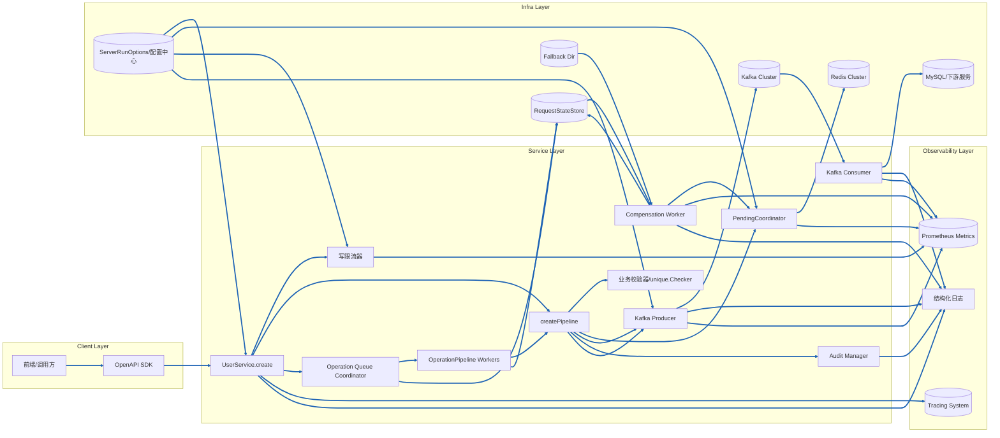
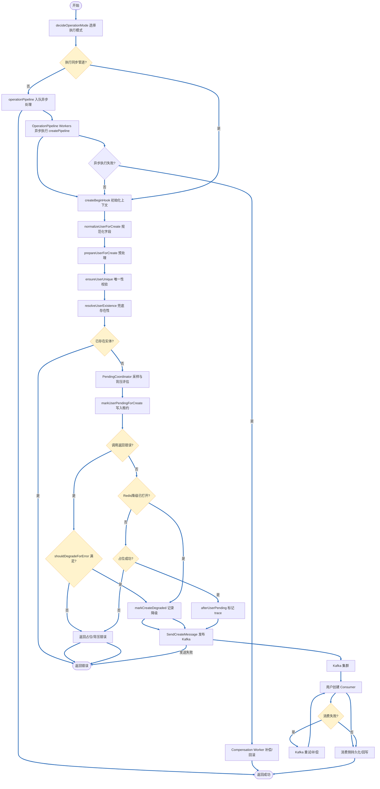
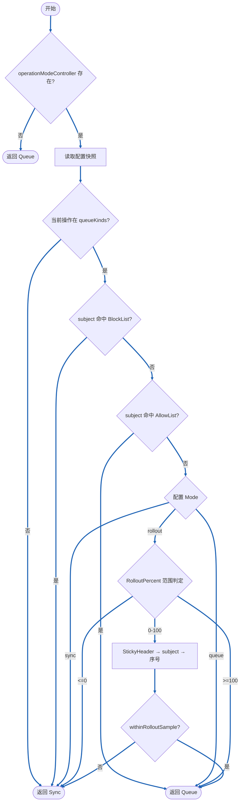
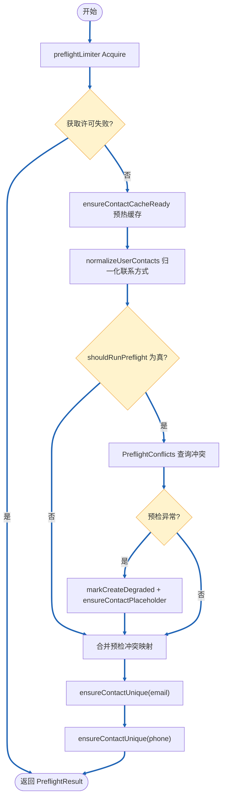
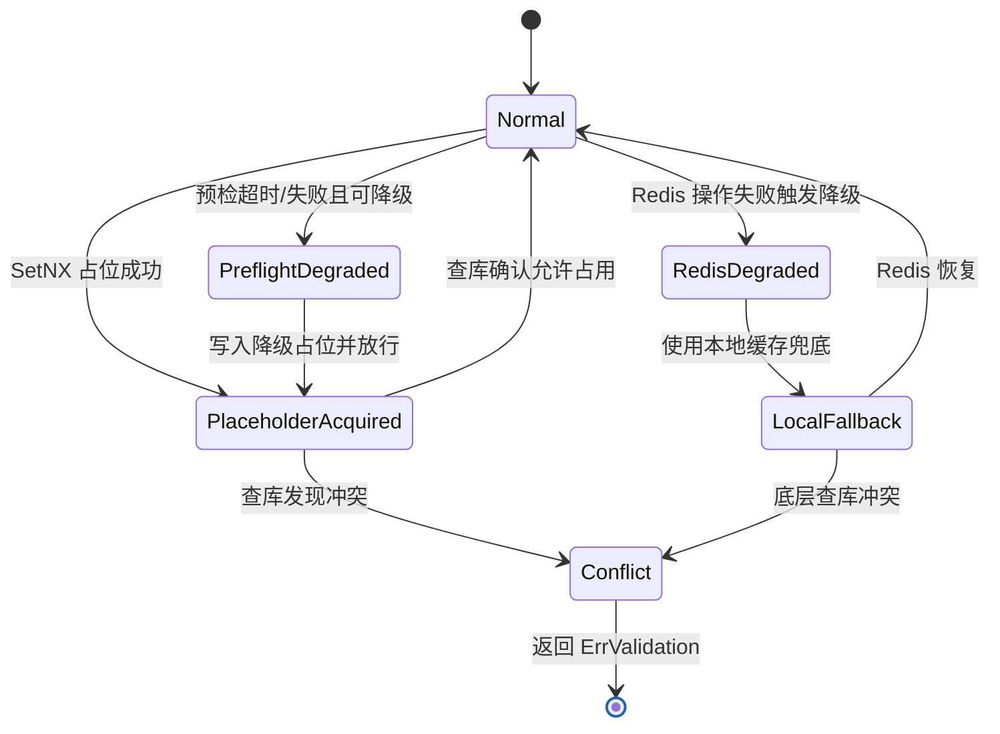
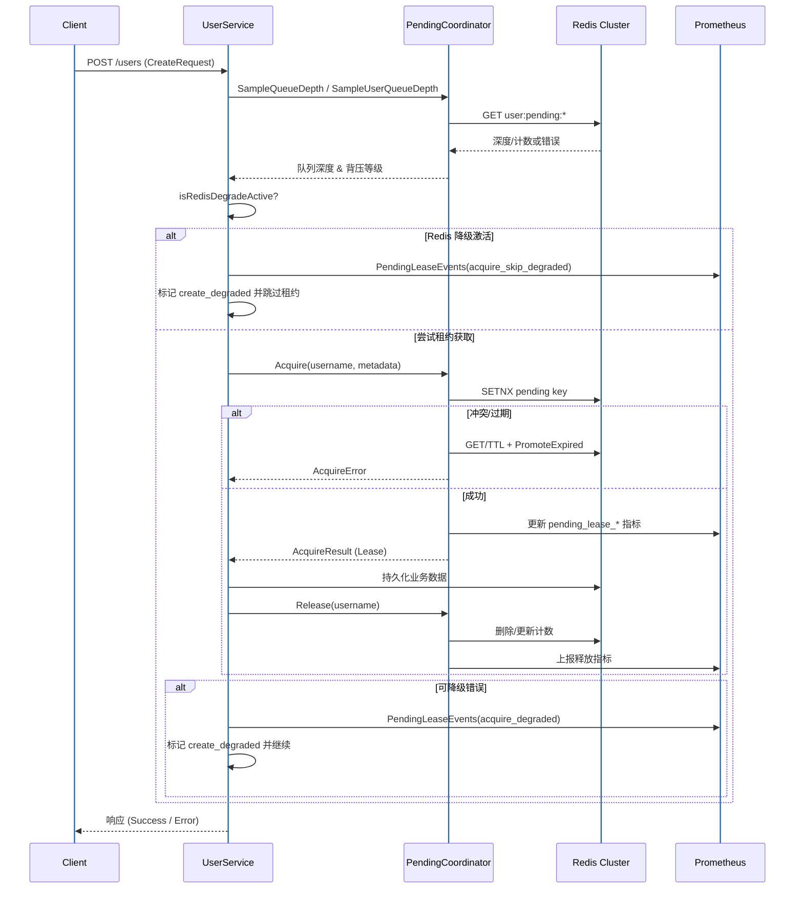
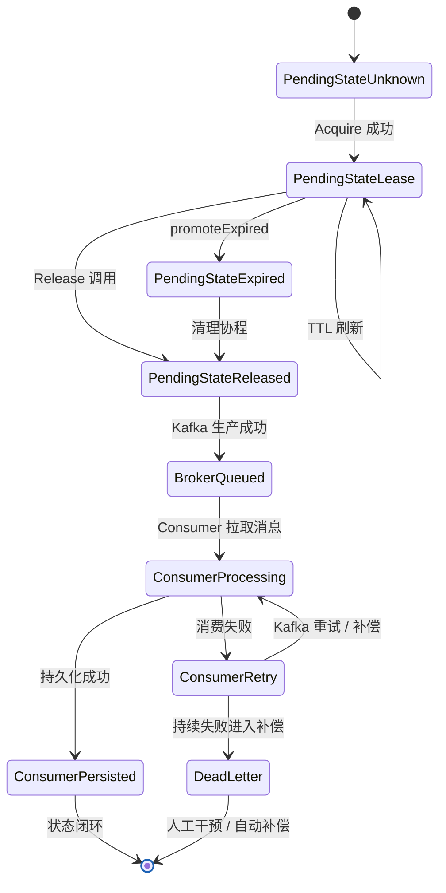
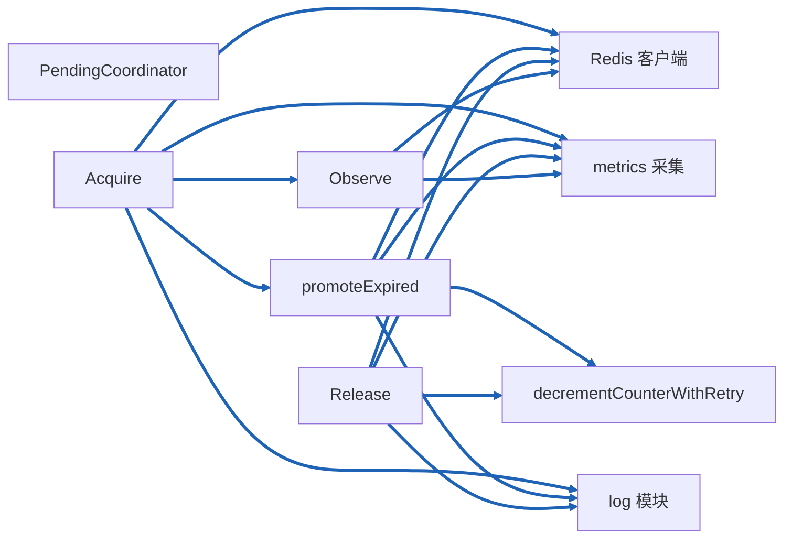
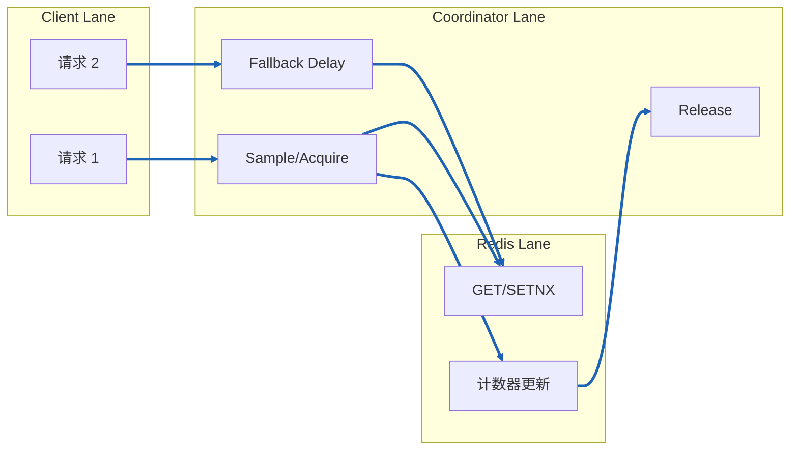

# Create API 全链路分析

本文聚合创建用户（Create API）在 *cdmp-mini* 中的全生命周期执行路径，覆盖架构视角、执行流程、组件交互、状态演进、数据流与依赖关系，便于排查高并发、背压与一致性相关问题。

---
## 0. 名词解释
1. 背压
在数据流处理过程，，当下游消费者处理速度跟不上上游生产者的速度时，为了防止系统过载或崩溃，上游会主动减缓数据发送速率，称为背压（Backpressure）。在 *cdmp-mini* 中，背压主要通过 `PendingCoordinator` 实现。

## 1. 架构图（Architecture Diagram）



- **架构分层说明**

| 层级 | 组件 | 职责 |
| --- | --- | --- |
| Client Layer | `UI`、`SDK` | 外部调用方通过前端页面或 OpenAPI SDK 进入，统一处理鉴权、重试与幂等头部。 |
| Service Layer | `UserService.create`、`createPipeline`、`unique.Checker`、`RateLimiter`、`PendingCoordinator`、`Audit Manager`、`Kafka Producer`、`Kafka Consumer`、`Operation Queue Coordinator`、`OperationPipeline Workers`、`Compensation Worker` | 接口入口承担限流、模式判定与 trace 建立；流水线执行业务校验、租约占位、审计与 Kafka 投递；异步模式下请求写入操作队列，由后台 Worker 拉起同一流水线，失败场景交由补偿线程恢复。 |
| Observability Layer | `Logger`、`Prometheus Metrics`、`Tracing System` | 统一采集结构化日志、指标与分布式追踪，为 SLO 监控、链路定位和容量分析提供数据。 |
| Infra Layer | `Redis Cluster`、`Kafka Cluster`、`MySQL/下游服务`、`ServerRunOptions`、`RequestStateStore`、`Fallback Dir` | Redis 提供租约、缓存与去重；Kafka 承载异步消息链路；MySQL/下游服务用于最终持久化；配置中心提供动态限流与降级参数；状态存储与 Fallback 目录支撑异步任务恢复与失败持久化。 |

- `UI → SDK → UserService.create`：外部请求先经 SDK 规范化参数和鉴权，再进入 API 层完成模式决策与全局限流。
- `UserService.create → createPipeline`：同步模式直接进入流水线，依次执行 `unique.Checker` 校验、`PendingCoordinator` 背压占位、`Audit Manager` 记录审计，并在 `Kafka Producer` 处发出创建消息。
- `Operation Queue Coordinator → OperationPipeline Workers`：异步或灰度命中的请求写入队列，由 Worker 后台调用同一条 `createPipeline`，执行过程中持续写入 `RequestStateStore` 并与 `Logger`、`Metrics`、`Tracing System` 对齐观测数据。
- `Kafka Producer → Kafka Cluster → Kafka Consumer → MySQL/下游服务`：消息经 Kafka 投递、消费与最终写库，消费者将结果和错误反馈至日志与指标，用于判断是否需要补偿。
- `Compensation Worker ↔ PendingCoordinator/RequestStateStore/Fallback Dir`：补偿线程读取失败记录或降级文件，交互 Redis 释放租约、补发 Kafka 消息，并将修复进度写回状态存储和监控系统。

---

## 2. 主流程图（Flow Chart）



要点：
- `decideOperationMode` 在请求入口判定同步/异步执行路径；默认值来自运行时配置，若选择异步会直接入队 `operationPipeline`，API 立即返回，同时后台 `OperationPipeline Workers` 拉起同一套 `createPipeline`。
- `createBeginHook` 建立 trace、降级标记与通用上下文，串联后续步骤的观测维度。
- `prepareUserForCreate` 完成密码加密及联系方式缓存预热，为唯一性检查提前构建热路径。
- `ensureUserUnique` 与 `PendingCoordinator` 串联：先进行全量预检与限流，再按租约背压策略决定是否进入写入阶段，过程中可能触发降级。
- `markUserPendingForCreate` 在 Redis 正常时写入租约；当 `shouldDegradeForError` 或全局 Redis 降级触发时，直接走降级分支并记录 `PendingLeaseEvents` 指标。
- `SendCreateMessage` 将用户实体推送至 Kafka，消费者异步完成持久化与下游派发，是创建 API 得以快速返回的关键。
- 异步管道失败（如占位未释放、Kafka 投递失败）时，会携带 `pending` 元信息触发 `Compensation Worker`，对租约释放、消息补发和缓存对齐进行补充处理，保证「异步补充模式」闭环。

---

### decideOperationMode 决策流程

`decideOperationMode` 负责在 `UserService.Create/Update/Delete` 入口决定当前请求走同步管道还是进入异步队列，核心基于控制器快照、操作类型、名单规则与灰度百分比做出选择：

- **控制器缺失默认排队**：未初始化或运行时故障时直接退回 `OperationModeQueue`，保障服务可用。
设计目的：兜底保障服务可用性，避免故障扩散
**核心痛点**
控制器是「操作模式决策」的核心依赖，若控制器未初始化（c == nil）或运行时故障（如配置加载失败、状态异常），若返回「同步模式」，高并发场景下会直接压垮数据库 / 下游服务，导致服务不可用；而「队列模式」是「流量削峰」的兜底方案，即使队列消费慢，也能保证请求不丢失、服务不崩溃。
**设计合理性**
1. **队列模式的容错性更强**
同步模式：请求必须「立即处理、同步返回」，依赖下游服务实时可用，故障时直接失败；
队列模式：请求先存入队列（如 Kafka/Redis List），异步消费，即使下游故障，队列可暂存请求，下游恢复后补发，避免请求丢失。
2. **符合「故障时优先保服务可用」的原则**
控制器故障属于「决策层异常」，而非「业务层异常」，此时应选择「最安全的操作模式」—— 队列模式能隔离故障、缓冲流量，而同步模式会放大故障。
3. **反例（若默认同步）**
秒杀场景下，控制器初始化失败→默认同步模式→10 万并发请求直接打向数据库→数据库连接池耗尽→服务宕机→全量请求失败；而默认队列模式→请求存入队列，即使消费慢，至少服务能响应，后续可人工扩容消费端
- **操作类型白名单**：`QueueKinds` 定义允许进入异步管道的操作，未命中的操作强制走同步。
**设计目的：精细化管控异步风险，避免非核心操作占用队列资源**
**核心痛点**
并非所有操作都适合异步：
1. 适合异步的操作：非实时、允许延迟的（如「用户行为日志」「订单状态异步通知」「积分更新」）；
2. 不适合异步的操作：实时性要求高、需同步返回结果的（如「用户登录验证」「支付结果查询」「库存扣减」）。
若所有操作都走队列，会导致「实时操作延迟返回」（用户体验差）、「队列资源被非核心操作占满」（核心操作排队超时）
**设计合理性**
**白名单机制更安全（黑名单易遗漏）**
1. 白名单（QueueKinds）：明确「只有这些操作能走队列」，未配置的操作默认同步，符合「最小权限原则」，避免误将核心操作纳入异步；
若用黑名单（禁止异步的操作）：易遗漏新增的核心操作，导致非预期的异步延迟。
2. 资源聚焦核心操作：
队列的吞吐能力有限，白名单可保证「只有核心异步操作占用队列资源」，非核心操作走同步，避免队列堆积。
3. 典型场景
QueueKinds 配置 ["order_create", "refund"]（订单创建、退款）：
这两类操作允许异步（用户可接受「下单后稍等生效」），走队列削峰；
而「login」「pay_query」（登录、支付查询）未在白名单中，

- **用户名单优先级**：阻止名单 (`BlockUsers`) 优先级最高，命中后立即同步；允许名单 (`AllowUsers`) 命中后直接队列。
**设计目的：通过名单机制实现「精细化用户级流量管控」**  
1. 核心痛点
不同用户的「服务体验优先级」和「风险等级」不同：
* 风险用户（如恶意刷单、测试账号）：若走队列，可能利用队列异步特性发起大量无效请求，导致队列堆积；
* 核心用户（如 VIP、企业用户）：需优先保证其操作的异步体验（避免同步延迟）；
* 普通用户：按全局规则（灰度 / 默认）处理即可。
**设计合理性**
1. BlockUsers 优先级最高
风险用户必须「强制同步」—— 同步模式下，请求的处理效率受限于下游服务的限流 / 熔断规则，可直接拦截恶意请求（如同步调用时触发接口限流）；若走队列，恶意请求会先占满队列，导致核心请求无法入队。
2. AllowUsers 次之：
核心用户「强制走队列」—— 保证其操作不受灰度比例限制，优先体验异步的低延迟（或避免同步模式的性能瓶颈），符合「核心用户优先」的业务策略。
3. 优先级分层符合业务认知：
「风险隔离」（BlockUsers）>「核心保障」（AllowUsers）>「全局规则」，是企业级服务的典型分级管控逻辑。
**典型场景**
* BlockUsers：["blacklist_001", "test_*"]（黑名单用户、测试账号）→ 强制同步，避免占用队列资源；
* AllowUsers：["vip_001", "enterprise_001"]（VIP 用户、企业用户）→ 强制走队列，优先处理；
* 普通用户：按全局灰度规则（如 30% 走队列）处理。
- **Mode 决策顺序**：`sync → queue → rollout`，逐项匹配；灰度模式下再结合 `RolloutPercent`、`StickyHeader` 和 subject 进行一致性采样。
**设计目的：风险可控的灰度放量，避免全量切换的突发问题**
**核心痛点**
* 直接将「同步模式」切换为「全量队列模式」风险极高,队列消费能力不足→请求堆积→用户体验差.
* 异步逻辑有 BUG→全量请求异常；
* 不同用户的体验不一致（某次请求走同步、某次走队列）。
**设计合理性**
1. Mode 决策顺序（sync → queue → rollout）：从保守到激进，逐步放量
* 优先匹配「sync」（全量同步）：故障兜底模式，一键切回可快速止损；
* 其次匹配「queue」（全量队列）：灰度验证通过后，全量切换；
* 最后匹配「rollout」（灰度）：介于同步和队列之间的过渡模式，逐步放量，可控试错。
这种顺序符合「灰度发布」的核心原则：小流量验证→逐步放量→全量上线，避免一次性切换的风险。
2. 灰度一致性采样（RolloutPercent + StickyHeader + subject）：保证体验一致
* RolloutPercent：精准控制放量比例（如 10%→30%→50%→100%），放量过程中可实时监控队列消费、业务异常率，异常时立即调低比例；
* StickyHeader/subject：保证「同一用户 / 同一标识始终命中同一模式」（粘性），避免「某次请求走队列、某次走同步」的体验不一致问题（如用户下单时走队列延迟生效，查询时走同步查不到订单，导致用户困惑）；
* 无标识时用自增序列：保证采样随机性，避免灰度比例偏斜（如仅高 ID 用户命中队列）。
**总结：设计的核心逻辑闭环**
所有设计都围绕「安全兜底→精细化管控→风险可控放量」的核心思路：
1. 故障时（控制器缺失）→ 队列兜底（保服务可用）；
2. 操作层面→ 白名单管控（仅核心操作异步）；
3. 用户层面→ 黑白名单分级（隔离风险、保障核心）；
4. 全局模式→ 灰度放量（小流量试错、逐步上线）。
这种设计既保证了「故障时的服务可用性」，又实现了「异步化改造的风险可控」，同时兼顾「核心用户体验」和「资源合理分配」，是企业级高可用服务的典型设计范式。

**粘性哈希混合策略**
- 默认：`StickyHeader` 仍然优先，便于网关 / 测试通过请求头强制落入指定模式。
- 新增配置：`operation-rollout-prefer-subject-kinds`、`operation-rollout-prefer-subject-users` 可在灰度阶段为特定操作或用户启用「subject 优先」。命中后若 subject 可用，将直接作为哈希 key；subject 缺失时才回落到 `StickyHeader` 或自增序列。
- 效果：既保留历史行为兼容性，又允许对重点账号/操作按账号维度粘性落位，降低 Header 维护成本，支撑更细粒度的灰度和差异化策略。
[注释]:
目前 UserService.Create 的模式决策完全由 operationModeController 的配置决定：默认是同步 (sync)，除非显式切换到 queue 或 rollout。代码里没有“检测到高并发就自动改成灰度”的逻辑——要么你在外部配置中心/管理接口调用 UpdateOperationMode 更新成 rollout，要么保持同步模式。

如果想做到“默认同步 + 高并发时自动灰度”这一策略，得额外做两件事：

设定触发条件：比如根据 preflight_limiter_wait 的平均时长、PendingQueueDepth 指标、请求错误率等判断当前负载已经逼近阈值。
在触发后调用 UpdateOperationMode(OperationModeConfig{Mode: OperationModeRollout, RolloutPercent: xxx})，并在负载恢复时再切回同步。
核心还是要有外部的“策略引擎”或控制面来根据监控做动态调节。生产环境常见的做法是：默认同步 → 观测到高并发风险时切到 rollout（10%→30%→50%）→ 确认稳定再切 queue，全过程由 SRE/自动化脚本根据指标驱动。单靠当前代码，无法自动完成这一步。

**stickyHeader--subject--序号补充说明**：
判断是否命中队列（rolloutPercent范围）→ 生成采样Key：
   ↓
1. 检查是否配置了StickyHeader？
   → 是 → 从ctx中提取Header值 → 有值则用该值作为Key；
   → 否 → 进入下一步；
   ↓
2. 检查subject是否非空？
   → 是 → 用归一化后的subject（小写+去空格）作为Key；
   → 否 → 进入下一步；
   ↓
3. 生成自增序号 → 用"rollout:序号"作为Key；
   ↓
4. 对Key做哈希取模 → 判断hash(Key)%100 < rolloutPercent？
   → 是 → 返回队列模式；
   → 否 → 返回同步模式。
决策完成后，`decideOperationMode` 会返回枚举值驱动后续逻辑：同步模式进入 `createPipeline`，异步模式写入 `operationPipeline`，灰度模式按照采样决定。

| 判定阶段 | 条件 | 结果 |
| --- | --- | --- |
| 控制器初始化 | `ensureOperationModeController` 返回 `nil` | 默认 `queue`，避免阻塞创建能力 |
| 操作类型 | 不在 `QueueKinds` 中 | 强制同步，保障特殊操作实时性 |
| 用户名单 | 命中 `BlockUsers` / `AllowUsers` | Block → Sync；Allow → Queue |
| Mode=Sync | 固定同步 | 返回 `sync` |
| Mode=Queue | 固定排队 | 返回 `queue` |
| Mode=Rollout | `RolloutPercent <=0` | 降级同步 |
| Mode=Rollout | `RolloutPercent >=100` | 全量排队 |
| Mode=Rollout | 0~100 之间 | 使用 Sticky Header/subject/自增序号生成 key，`withinRolloutSample` 决定 `queue` 或 `sync` |

---

## 2.2 Create Service Pipeline

在进入流水线之前，`UserService.Create` 会通过 `decideOperationMode` 判定执行模式：若为 `OperationModeQueue` 则直接入队异步执行；仅当判定为 `OperationModeSync` 时才会落入同步 `createpipeline.Pipeline`。`UserService.Create` 通过 `createpipeline.Pipeline` 串联一组幂等钩子，每个阶段都记录 trace / metrics，并在失败时返回携带业务码的错误。流水线的关键步骤如下：

| 顺序 | 钩子 | 说明 |
| --- | --- | --- |
| 1 | `createBeginHook` | 建立根 Span，向上下文写入创建态标识，准备结束回调以统一收敛状态码。 |
| 2 | `normalizeUserForCreate` | 归一化邮箱、手机号，确保后续缓存键一致。 |
| 3 | `prepareUserForCreate` | 加密密码、预热联系方式缓存，记录耗时指标。 |
| 4 | `ensureUserUnique` | 统一执行用户名/联系方式唯一性校验，详见下节。 |
| 5 | `resolveUserExistence` | 当预检未覆盖用户名时补充库查，并将结果写入 trace tag。 |
| 6 | `handleUserExisting` | 若已存在冲突实体，按照业务码返回 `ErrUserAlreadyExist`。 |
| 7 | `markUserPendingForCreate` | 与 `PendingCoordinator` 互动写入租约；若 Redis 降级激活或 `shouldDegradeForError` 判定可降级错误，则跳过 SetNX，调用 `markCreateDegraded` 并上报 `PendingLeaseEvents`（`acquire_skip_degraded` / `acquire_degraded`）。 |
| 8 | `afterUserPending` | 为 trace 增加租约相关标签，便于串联后续链路。 |
| 9 | `SendCreateMessage` | 发送 Kafka 事件，失败时打点并返回 `ErrKafkaFailed`。 |

### 2.2.1 业务指标总览（SRE 指南）

| 业务点 | 指标英文名 | 指标中文名 | 业务含义 / SRE 使用指南 |
| --- | --- | --- | --- |
| 请求入口 `Create` | `user_create_requests_total{mode,account_type,outcome}` | 用户创建请求总数 | 统计同步 / 异步（mode）及账号类型的成功 / 失败次数；SRE 用于区分模式故障（队列 vs 同步）与特定账号类型异常，建议结合 `outcome` 中的业务错误类型设置分组告警。 |
| 全链路步骤 | `user_create_step_duration_seconds{step,field,account_type}` | 用户创建步骤耗时分布 | 各子步骤耗时直方图，默认阈值 200 ms；监控 p95/p99 变化识别慢查询、Redis、Kafka 尾延迟，按 `account_type` 精细化分析特俗用户。 |
| 全链路步骤 | `user_create_step_total{step,field,account_type,outcome}` | 用户创建步骤执行次数 | 记录每个步骤的成功 / 失败次数，定位是哪一步骤抛出 `validation_error`、`duplicate` 等业务错误；SRE 可按 outcome 建立 TopN 面板。 |
| 慢步骤 | `user_create_slow_steps_total{step,field,account_type}` | 用户创建慢步骤计数 | 步骤耗时超过 200 ms 时自增，适合做告警基线；当该计数快速增长时优先排查对应步骤的耗时直方图。 |
| 占位 & 降级 | `user_contact_placeholder_set_duration_seconds{step,field,status}` | 联系方式占位耗时分布 | 记录 Redis SetNX / 刷新耗时，`status=slow` 表示超过 20 ms；与 Redis 慢查询告警联动，定位缓存热点或网络问题。 |
| 占位 & 降级 | `user_contact_placeholder_events_total{step,field,result}` | 联系方式占位事件计数 | 标记占位命中 / 降级 / miss 等路径；SRE 可观察 `result=degraded`、`result=refresh` 等标签判断是否频繁退化。 |
| 降级管理 | `user_create_degrade_total{reason,account_type}` | 用户创建降级次数 | 聚合记录降级原因（Redis 占位失败、预检超时等）；当某个 reason 持续升高时，可触发自动脚本拉起降级保护或通知人工干预。 |
| Kafka 出口 | `user_create_message_total{account_type,result}` | 用户创建消息发送结果 | 统计 Kafka 发送成功 / 失败；SRE 用于区分账号类型的消息发送质量，`result` 与 `GetBusinessErrorType` 一致，可快速定位网络、超时、认证等异常。 |

> 标签说明：新增指标统一携带 `account_type`（来源于用户 Extend / 管理员标识），请在 Grafana 透视表中保留该维度，以便区分管理员 / 普通用户、租户等业务线；`outcome`、`result` 使用 `metrics.GetBusinessErrorType` 的枚举值，便于与其他业务指标对齐。

**Step 标签取值（与代码一致）：**

- `createBeginHook` 阶段：`encrypt_password`
- 唯一性校验：`ensure_contacts_unique`
- 用户存在兜底：`check_user_exist`
- Redis 占位：`mark_pending_create`
- Redis 唯一性保障：`redis_placeholder_setnx`、`redis_placeholder_get`、`redis_placeholder_refresh`
- 降级路径：`ensure_contact_unique_degraded_cache`、`ensure_contact_unique_degraded_lookup`
- 限流与预检：`preflight_limiter_wait`、`preflight_limiter_release`、`preflight_query`
- Kafka 发送：`kafka_send_create_user`
- 其他场景（占位刷新、预检跳过等）：`preflight_query_skip` 等，详见 `recordUserCreateStep` 调用处。

**其他标签取值速查（按代码定义）：**

- `field`：`password`、`all`、`username`、`redis`、`kafka`、`limiter`、`database`，以及联系方式字段 `email` / `phone`（由占位流程生成）。
- `mode`：`sync` / `queue` / `rollout`（若未识别将回落为 `queue`）。
- `account_type`：优先取 `Extend.accountType` 的小写值；若缺失则可能为 `admin`（IsAdmin=1）、`inactive`（Status<=0）、`standard`（默认活跃）、`unknown`（无法推断）。
- `outcome`、`result`：沿用 `metrics.GetBusinessErrorType` 的枚举值，常见有 `success`、`business_error`、`validation_error`、`timeout`、`database_error`、`network_error`、`permission_error`、`serialization_error`、`not_found`、`duplicate`、`unknown_error`。
- `reason`（`user_create_degrade_total`）：当前实现会写入 `redis_cache_error`、`redis_placeholder_error`、`preflight_timeout` 等原因字符串，新增原因可直接扩展。
- `status`（`user_contact_placeholder_set_duration_seconds`）：`success` / `slow` / `error`，其中 `slow` 表示 SetNX/刷新耗时超过 20 ms。

### ensureContactCacheReady 阶段细节

该钩子在 `ensureUserUnique` 之前执行，用于确认联系方式唯一性缓存已经处于热状态，避免后续校验大量访问冷缓存或触发重复加热。完整流程如下：

1. **就绪快速路径**：读取 `contactCacheReady` 原子标记；若已为真立即返回，整个阶段耗时接近 0。
2. **配置与依赖校验**：当关闭 `EnableContactWarmup`、缺少 Store/Redis 或检测到降级标记时，直接跳过预热但记录日志，避免无意义的重试。
[注释]：降级标记由 `markCreateDegraded` 写入，表示 Redis 故障或高延迟，预热阶段不应继续尝试访问 Redis。
降级的本质：已放弃 “高性能”，优先保证 “可用性”

3. **重试退避窗口**：比较 `contactWarmupNextRetry` 时间戳；若仍在冷却期，返回并等待后续请求触发，下游将按降级策略处理唯一性校验。
[注释]：退避窗口通过 `contactWarmupNextRetry` 控制，避免高频率重试 Redis 导致雪崩。
下游降级策略的意义
退避窗口的核心是「延迟重试」，而非「终止业务」，因此下游必须有兜底逻辑；
唯一性校验的降级需平衡可用性与准确性：核心场景（如支付联系人校验）：降级为「查数据库」（保证准确性，牺牲性能）；非核心场景（如普通消息联系人校验）：降级为「放行 / 返回默认值」（保证可用性，牺牲部分准确性）。
4. **互斥启动预热**：通过 `contactWarmupMu` 与 `contactWarming` 双重检查，只允许一个 goroutine 真正进入 `warmContactCache()` 执行批量扫描、缓存填充。
5. **结果写回**：预热成功则设置 `contactCacheReady=true` 并清除重试时间；失败时写入下一次重试时间、保持降级标记，并将原因记录在结构化日志与指标中。

预热阶段的状态会被后续的 `ensureUserUnique` 消费：若缓存仍未就绪或处于降级窗口，该阶段会自动走存储兜底分支，同时把降级原因透出到 trace 与 metrics 中，便于结合运维监控快速定位问题。

### EnsureUnique 阶段细节

`ensureUserUnique` 负责兜底所有唯一性校验，流程可以拆解为以下数步：

1. **限流与熔断**：若配置了 `preflightLimiter`，先阻塞等待许可，超时则直接返回 `ErrDatabaseTimeout`。无论成败都会通过 `recordUserCreateStep` 打点。 
2. **缓存预热与归一化**：调用 `ensureContactCacheReady`、`normalizeUserContacts`，确保邮箱/手机号键经过统一处理，并在必要时补齐降级占位。
3. **数据库预检（可选）**：根据 `shouldRunPreflight` 判断是否访问存储层执行 `PreflightConflicts`。该步骤支持按配置重试、记录耗时，并在失败时视错误类型决定是否降级：
    - 可降级错误（超时、Redis 故障）会触发 `markCreateDegraded`，向 Redis 写入占位符并继续流程；
    - 不可降级错误直接向调用方抛出。成功命中时将冲突用户写入 `preflight` map，并标记 `UsernameChecked`。
4. **按字段逐一校验**：分别对邮箱、手机执行 `ensureContactUnique`：
    - 基于 `unique.NewChecker` 组合 Redis 缓存、占位符、数据库兜底与重试策略；
    - 命中缓存或预检冲突时快速返回；
    - 查库命中返回携带 `ErrValidation` 的错误（提示具体字段）；
    - 当处于降级模式或 Redis 不可用时自动走 `ensureContactUniqueDegraded`，依赖本地缓存与数据库唯一索引保证一致性。
5. **指标与日志对齐**：整个阶段统一记录 `ensure_contact_unique`、`preflight_*` 等步骤指标，所有降级、占位写入都会通过 `PendingLeaseEvents`/结构化日志可视化，最终返回冲突映射与用户名校验标记。

综上该阶段兼顾“尽量早失败”和“故障可降级”两类诉求，为后续 Pending 与 Kafka 操作提供干净的前置条件。

#### EnsureUnique 主流程图


[ 注释 ]：
预检不会对每一次请求都打库。shouldRunPreflight（    user_service.go 1537 行起）在以下场景才返回 true：Redis 已降级、调用方要求强一致、用户字段全空之外、或者缓存还没预热。生产长跑情况下 ① Redis 正常 ② contactCacheReady 已为 true 时，   runPreflight 是 false，代码会走 preflight_query_skip，所以不会触发    store.PreflightConflicts。 • “命中率 5%~10%”通常发生在两类场景：服务刚升起/缓存还未热好（预热前必须跑预检防止脏写），或最近 Redis 发生故障被标记降级。这时才会走限流 + 预检，限流只是在保护数据库并发，属于短期兜底。 • 真正的唯一性校验在 ensureContactUnique（1968 行起）里，通过    unique.NewChecker 先与 Redis 交互： ◦ 读取/写入缓存占位符（SetNX）确保同一联系方式只有一个请求持有； ◦ 缓存命中直接返回，跳过查库； ◦ 仅在缓存缺失、强一致请求或需要兜底时才调用 GetByEmail、GetByPhone。
这就是“先查 Redis，必要时再查库”的落地实现。   • Redis 的意义在于： 1. 高并发下为每个邮箱/手机号提供租约，占住后续请求避免并发写冲突； 2. 作为热点缓存，大多数查询在 Redis 命中，无需访问数据库； 3. 在降级或缓存未就绪时，再退回数据库 + 本地缓存，保证一致性。   • 如果实际监控看到预检占比一直偏高，建议排查 contactCacheReady 是否为 true、是否处于降级（user_create_degrade_total、ensure_contact_*_degraded_* 指标）、或是否频繁触发强一致调用；根因在这些条件，而不是流程本身必须查库。
#### EnsureUnique 数据流程图

```mermaid
%%{init: {'themeVariables': {'lineColor': '#1E63B5', 'flowchartLinkColor': '#1E63B5', 'lineWidth': 3}}}%%
graph LR
    Ctx[请求上下文] --> Limiter[preflightLimiter]
    Limiter --> WarmupStep[ensureContactCacheReady]
    WarmupStep --> Redis[(Redis Cluster)]
    WarmupStep --> LocalCache[降级本地缓存]
    WarmupStep -->|预热状态| StateFlag[contactCacheReady]
    WarmupStep --> NormalizeStep[normalizeUserContacts]
    NormalizeStep --> PreflightDecision[shouldRunPreflight]
    PreflightDecision -->|是| Preflight[PreflightConflicts]
    Preflight --> UserStore[UserStore.ReadOnly]
    Preflight --> Metrics[recordUserCreateStep]
    Preflight --> Trace[Trace Span]
    PreflightDecision -->|否| SkipPreflight[跳过预检]
    Preflight --> Conflicts[冲突映射]
    SkipPreflight --> Conflicts
    Conflicts --> EmailUnique[ensureContactUnique(email)]
    Conflicts --> PhoneUnique[ensureContactUnique(phone)]
    EmailUnique --> Redis
    PhoneUnique --> Redis
    EmailUnique --> UserStore
    PhoneUnique --> UserStore
    EmailUnique --> Metrics
    PhoneUnique --> Metrics
    EmailUnique --> Trace
    PhoneUnique --> Trace
    EmailUnique --> DegradeFlag[降级标记]
    PhoneUnique --> DegradeFlag
    DegradeFlag --> LocalCache
    DegradeFlag --> Placeholder[Redis 占位符]
    Conflicts --> Result[PreflightResult+UsernameChecked]

    linkStyle default stroke:#1E63B5,stroke-width:3px
```

#### EnsureUnique 状态机



### Kafka 生产与消费链路

- `SendCreateMessage` 通过 `producer.MessageProducer` 将创建事件转换为标准化的 Kafka 消息。调用会记录 trace、metrics，并在失败时立即返回 `ErrKafkaFailed` 以便调用方执行幂等重试。
- Kafka 集群承担解耦与缓冲职责：API 层保证同步流程在消息成功投递后即可返回，后续延伸逻辑通过 Topic 进行松耦合扩展。
- `Kafka Consumer`（后台服务）订阅同一 Topic，负责将用户实体落库、刷新缓存以及触发后续自动化流程；消费失败时依赖 Kafka 重试与业务补偿机制确保最终一致性。
- 生产端与消费端的指标、日志统一打点，方便通过 Prometheus 与集中日志快速定位消息积压或处理异常。

---

## 2.3 联系方式缓存预热机制

`ensureContactCacheReady` 不在进程启动时常驻运行，而是在请求路径上按需触发：每次进入创建流程都会先调用该函数，由它判断是否需要异步预热邮箱/手机号唯一性缓存。

- 首先检查 `contactCacheReady` 原子标记；若缓存已完成预热，直接返回。
- 当配置关闭 `EnableContactWarmup` 时，会将 `contactCacheReady` 置为 `true` 并退出，相当于跳过预热。
- 若底层依赖（`Store`、`Redis`）未就绪，同样会立即返回，避免无效重试。
- `contactWarmupNextRetry`（`atomic.Int64`）记录上次失败后的下一次重试时间；在窗口未到时新请求只会提前返回，防止频繁拉起后台任务。
- 通过 `contactWarmupMu` 和 `contactWarming` 实现双重检查锁：再次确认状态后仅允许一个 goroutine 真正启动预热。
- 真正的预热逻辑在单独的 goroutine 内执行 `warmContactCache()`；成功时写回 `contactCacheReady=true` 并清除重试时间，失败时记录 `Warn` 日志并把 `contactWarmupNextRetry` 推迟 30 秒，同时复位 `contactWarming` 状态。

该机制保证在高并发场景下仍能以最少的后台任务完成缓存预热，同时对失败场景提供退避与状态复位能力。

## 2.4 Redis 降级策略（2025-12 更新）

- **触发条件**：`shouldDegradeForError` 会识别 Redis/数据库超时、上下文取消以及包含超时关键词的错误；另外在联系方式唯一性检测中发生哨兵占位失败时也会调用 `markCreateDegraded`。
- **请求级降级**：`markCreateDegraded` 将降级标记写入请求上下文（`userctx.MarkCreateDegraded`），首次触发会输出告警日志与 trace 标签 `create_degraded=true`，确保同一链路后续步骤知晓降级状态。
- **全局降级开关**：当降级原因属于占位或缓存失败（`redisDegradeReasonPlaceholder` / `redisDegradeReasonCache`）时，`enableRedisDegrade` 会拉起全局标志，使得后续请求在 `markUserPendingCreate` 中直接跳过 Redis 租约尝试。
- **指标补充**：降级路径会通过 `metrics.PendingLeaseEvents` 追加事件，其中 `acquire_degraded` 表示因错误进入降级流程，`acquire_skip_degraded` 表示因为全局降级开关而跳过租约。
- **恢复逻辑**：后台监控协程 `startContactDegradeMonitor` 会周期性探测 Redis 健康度；一旦恢复即调用 `disableRedisDegrade` 清理临时缓存并重置降级状态。
- **业务影响**：降级模式仍允许创建请求继续执行，但更多依赖数据库幂等校验和本地缓存兜底；需要关注 Redis 恢复后及时回切以避免长时间缺失租约保护。

---

## 3. 时序图（Sequence Diagram）



---

## 4. 状态图（State Diagram）



- `PendingStateUnknown`：租约键不存在或首次创建。
- `PendingStateLease`：持有租约，快照记录 owner、队列深度。
- `PendingStateExpired`：超出 TTL，等待清理或重试抢占。
- `PendingStateReleased`：释放后短暂保留用于审计，同时等待 Kafka 生产确认。
- `BrokerQueued`：消息已进入 Kafka，等待消费侧拉取。
- `ConsumerProcessing`：消费服务正在处理创建事件。
- `ConsumerRetry`：消费失败进入 Kafka 重试或业务补偿。
- `ConsumerPersisted`：消费侧持久化成功，链路闭环。
- `DeadLetter`：持续失败进入补偿队列，需人工或自动治理。

---

## 5. 数据流程图（Data Flow Diagram）

```mermaid
%%{init: {'themeVariables': {'lineColor': '#1E63B5', 'flowchartLinkColor': '#1E63B5', 'lineWidth': 3}}}%%
graph TD
    Client[客户端请求] --> Req[HTTP 请求
(CreateRequest)]
    Req --> API[UserService]
    API -->|构造| Meta[LeaseMetadata]
    API -->|调用| PC[PendingCoordinator]
    PC -->|读写| Redis[(Redis 集群)]
    Redis --> Snapshot[JSON Snapshot]
    Snapshot -->|解析| State[PendingState]
    State -->|决策| Response[租约结果]
    Response --> API
    API -->|写入| DB[(业务 DB / 下游服务)]
    API -->|返回| Client
    PC --> Metrics[(Prometheus)]
    PC --> Log[结构化日志]

    linkStyle default stroke:#1E63B5,stroke-width:3px
```

- 数据源：客户端输入、Redis 中的租约快照、业务数据库。
- 处理：Snapshot → State → AcquireResult → ReleaseSnapshot。
- 存储：Redis 保留租约状态，指标系统存储可观测数据。

---

## 6. 依赖关系图（Dependency Graph）



- **强依赖**：Redis、metrics、日志模块异常都会影响租约一致性（建议降级策略）。
- **关键路径**：`Acquire`→`Observe`→`promoteExpired`→`Release`，共享计数器与快照操作。

---

## 7. 可选图示（高并发泳道）



- 展示不同请求在协调器与 Redis 间的并行执行，突出延迟与争抢窗口。

---

## 8. 关键风险与优化建议

1. **Redis 依赖较重**：已补充 `pending_lease_*` Redis 操作指标（GET/SETNX/TTL/计数器），结合哨兵或 Proxy 监控可快速锁定热点命令的延迟与失败率。
2. **计数器漂移观测**：新增 `pending_lease_calibration_duration_seconds` 直方图与取消事件，配合 `calibration_*` 计数可量化后台校准的耗时、失败与恢复情况。
3. **背压策略调优**：`PendingCoordinator.UpdateBackpressureProfile` 支持热更新延迟曲线，可通过聚合配置中心或运维指令动态调整桶阈值与延迟梯度。
4. **日志/指标一致性**：统一使用 `PendingLeaseEvents` 记录背压曲线变更、校准重试等关键事件，与 Trace Tag 共享相同枚举，辅助排障。
5. **配置热更新**：保留 `UpdateCalibration` + `Stop()` 优雅退出流程，结合新的背压曲线热更新接口，实现租约与背压配置的在线调整。

---

> 文档初稿完成时间：2025-11-28。后续如业务流程调整，请同步更新流程图与依赖描述。
