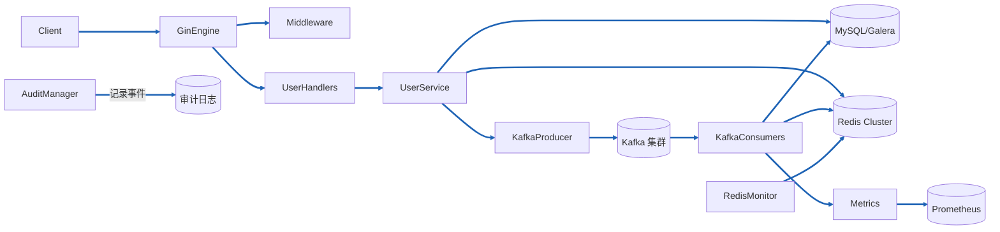

# GenericAPIServer 架构与流程解析

本文针对 `internal/pkg/server/genericapiserver.go` 的实现进行全景梳理，覆盖核心架构、组件交互、关键流程、运维部署以及扩展规范，便于研发与运维团队快速理解和定位问题。

---

## 1. 核心架构总览

**核心定位**
- 用户域 API 网关：承载 REST 接入、认证限流、审计、异步任务调度以及后台消费者管理。
- 多后端协调器：统一驱动 MySQL、Redis Cluster、Kafka 等基础设施并提供降级与自愈机制。

**技术栈清单**
- Web 框架：Gin
- 配置与选项：`internal/apiserver/options`
- 数据存储：MySQL（GORM/自研 Datastore）、Redis Cluster
- 消息系统：Kafka（`segmentio/kafka-go`）
- 日志与审计：自研 `pkg/log`、`internal/pkg/audit`
- 指标监控：Prometheus (`internal/pkg/metrics`)
- 其他：`context`、`sync`、`atomic`、`net/http`

**核心模块划分**
| 模块 | 主要职责 |
| --- | --- |
| HTTP Engine (`*gin.Engine`) | 负责路由、处理中间件、对外 HTTP 服务；支持 Debug/Fast Startup 模式。 |
| Options (`*options.Options`) | 聚合 Server/Kafka/Redis/MySQL/Audit 等运行期配置。 |
| 数据层 (`mysql.Datastore`, `interfaces.Factory`) | 提供用户服务、凭证存储等 DAO；支持 Galera 集群检测与健康监控。 |
| Redis Cluster (`storage.RedisCluster`) | 提供租约、缓存、凭证等能力，支持异步连接与健康监控。 |
| Producer/Consumer Registry (`producer.Registry` / `consumer.Registry`) | 负责注册与管理多业务消息生产者与消费者，托管用户操作链路并统一生命周期、降级与指标管理。 |
| Audit 管理器 (`audit.Manager`) | 统一记录系统级事件、支持缓冲与优雅停机。 |
| UserService (`internal/apiserver/service/v1/user`) | 暴露用户领域服务，复用 Redis/Kafka/MySQL 等资源。 |
| 登录更新子系统 (`loginUpdates`、`credentialCache`) | 用户登录凭证缓存与批量异步刷新。 |

**关键特性**
- InitOnce & ShutdownOnce：保证初始化与关闭幂等。
- Fast Debug Startup：允许在调试模式下忽略部分依赖未就绪并异步补偿。
- 生产者/消费者注册中心：通过 `producer.Registry` 与 `consumer.Registry` 管理多业务生产者和消费者，支持降级到 `noop`、统一启动与优雅关闭。
- Kafka 动态限速、重试与分区监控：提升吞吐与稳定性。
- Redis 健康监控与降级：对连接池和集群状态进行轮询，支持跳过租约。
- 审计闭环：对启动、关闭、服务事件进行结构化记录。
- Login Update Worker：批量刷新登录态，降低数据库压力。

---

## 2. 组件交互架构

**关键交互流程**
- 请求接入：Gin Engine 接收到 HTTP 请求，经中间件链（审计、限流等）转发至业务 Handler。
- 业务处理：Handler 调用 `UserService`，内部协调 MySQL 查询、Redis 租约、Kafka 消息发送。
- 异步消费：Kafka Consumer 根据分区启动 Worker，处理用户操作并回写数据库或缓存。
- 审计与监控：核心操作均通过 `audit.Manager`、`metrics` 记录行为、异常与耗时。
- 资源健康：Redis/Kafka/MySQL 的健康检查与监控在后台 goroutine 中持续运行。

---

## 3. 核心流程设计

### 3.1 服务器初始化流程（`NewGenericAPIServer`）
1. **日志与环境标识**：根据 `ServerRunOptions` 输出模式信息，记录 Kafka InstanceID。
2. **实例构造**：创建 `GenericAPIServer`、Gin Engine，初始化登录限流阈值。
3. **审计管理器**：`audit.NewManager` 装载缓冲、超时、指标等能力，并打点启动事件。
4. **Gin 配置与中间件**：调用 `configureGin` 设置运行模式，注入审计中间件。
5. **MySQL 初始化**：
	- `mysql.GetMySQLFactoryOr` 获取数据工厂与底层 `*gorm.DB`；
	- 对 Galera 集群执行 `initializeGaleraCluster`、`monitorClusterHealth`；
	- `waitForMySQLReady` 等待就绪（支持 Fast Debug 降级）。
6. **Redis Cluster 初始化**：
	- 构造 `storage.RedisCluster` 并启动 `ConnectToRedis` 异步连接；
	- `waitForBasicConnection`、`waitForHealthyCluster` 阻塞直到连接与健康检查通过（调试模式降级）；
	- 启动 `monitorRedisConnection` 与 `metrics.NewRedisClusterMonitor`。
7. **Kafka 组件初始化**（详见 3.2）：
	- 创建生产者、动态限速器与消费者集合；
	- 启动 operation/retry 消费者并注册指标刷新循环。
8. **领域服务初始化**：
	- `initUserService` 注入 Store/Redis/Kafka/Audit；
	- `initCredentialCache`、`initLoginUpdater` 构建登录态缓存与后台 worker。
9. **消费者与路由**：
	- 统一 `consumerCtx`，按配置启动所有消费者并等待 ready；
	- 安装中间件、路由，返回服务器实例。

### 3.2 Kafka 消费者与生产者设计
- **生产者/消费者注册中心**：`initKafkaComponents` 创建 `producer.Registry` 与 `consumer.Registry`，按业务键注册 Kafka 生产者与消费者；若启动阶段检测到 Kafka 不可用会注册 `noop` 生产者作为兜底，后续业务通过 `ensure*Producer` / 注册中心索引按键获取实例。
- **生产端**：`NewUserProducer` 支持动态限速、WAL 落盘目录 (`ProducerFallbackDir`)；收集成功/失败指标，并在注册中心被覆盖时确保旧实例优雅关闭。
- **Operation Consumers**：按 `WorkerCount` 创建 `UserConsumer`，每个实例绑定唯一 `InstanceID`，可配置池统计与 Lag 监控。
- **Retry Consumers**：按 `RetryWorkerCount` 创建 `RetryConsumer`，基于重试 Topic，支持动态 worker 数量与 Kafka 分区监控。
- **指标与监控**：
  - `metrics.ConsumerTopicPartitions`, `ConsumerGroupInstances`, `ConsumerPartitionsNoOwner` 实时观测分区与消费者覆盖率；
  - 可选 `EnableMetricsRefresh` 周期性刷新 Kafka 集群信息；
  - 生产端通过 `metrics.ProducerSuccess/Failures/Attempts`、`ProducerDeliveryLatency` 等指标反馈吞吐与错误。
- **优雅停机**：`shutdownKafka` 会依次取消上下文，通过 `consumer.Registry.CloseAll` 关闭所有消费者，再调用 `producer.Registry.CloseAll` 统一关闭生产者，结合审计事件跟踪状态。

### 3.3 Redis Cluster 管理流程
- **初始化阶段**：构造 `RedisCluster` 并异步连接，随后通过 `waitForBasicConnection` 与 `waitForHealthyCluster` 阻塞等待。
- **健康检查**：
  - `pingRedis` 对集群执行 `CLUSTER INFO`、`CLUSTER NODES` 检测节点数量、槽位状态；
  - 支持在调试模式下宽松处理，并将状态记录在日志与指标中。
- **监控体系**：`metrics.NewRedisClusterMonitor` 周期性采集节点指标（命中率、内存、复制延迟等），并调用 `RecordRedisClusterMetrics` 系列方法上报。
- **降级策略**：当 Redis 不可用时，业务侧（例如 `UserService`）可触发降级标记，跳过租约或使用本地缓存兜底。
- **关闭流程**：`shutdownRedis` 取消上下文、关闭统一连接池。

---

## 4. 部署 & 运维架构

### 4.1 部署依赖
- MySQL / Galera 集群（提供用户等结构化数据存储）。
- Redis Cluster（租约、缓存、登录凭证、队列数据）。
- Kafka 集群（异步任务、操作日志、重试通道）。
- Prometheus & Grafana（指标采集与可视化）。
- 日志系统（结构化日志与审计日志）。
- 操作系统与网络：Linux x86_64，需开放 HTTP 服务端口与 Kafka/Redis/MySQL 连接。

### 4.2 关键配置项说明

| 配置项 | 作用 |
| --- | --- |
| `ServerRunOptions.Mode` | Gin 运行模式（release/debug）；影响日志与 Fast Startup。 |
| `ServerRunOptions.FastDebugStartup` | 调试场景下放宽依赖检测，允许后台补偿。 |
| `ServerRunOptions.LoginRateLimit` | 登录接口限流阈值，写入原子计数器。 |
| `ServerRunOptions.LoginCredentialCacheTTL/Size` | 登录凭证缓存有效期与容量。 |
| `ServerRunOptions.ProducerFallbackDir` | Kafka 生产失败时 WAL 落盘目录。 |
| `KafkaOptions.Brokers` | Kafka Broker 列表。 |
| `KafkaOptions.WorkerCount/RetryWorkerCount` | 主通道/重试通道消费实例数量。 |
| `KafkaOptions.StartingRate/MinRate/MaxRate/AdjustPeriod` | 生产者动态限速器参数。 |
| `KafkaOptions.EnableMetricsRefresh` | 是否后台刷新分区指标。 |
| `RedisOptions.Addrs / Host / Port / Timeout` | Redis Cluster 节点与连接超时配置。 |
| `MysqlOptions` (DSN, HealthCheckInterval) | MySQL 连接、集群健康检测周期。 |
| `AuditOptions.*` | 审计缓冲、超时、日志位置、指标开关。 |

### 4.3 指标监控清单（节选）

| 指标名称 | 中文名称 | 作用 |
| --- | --- | --- |
| `kafka_producer_success_total` | Kafka 生产成功总数 | 监控生产端吞吐与成功率。 |
| `kafka_producer_failures_total` | Kafka 生产失败总数 | 观测生产端错误类型与数量。 |
| `business_processing_seconds` | 业务处理耗时直方图 | 细分服务/操作级别耗时。 |
| `consumer_messages_processed_total` | 消费成功总数 | Kafka 消费者吞吐指标。 |
| `consumer_processing_errors_total` | 消费处理失败总数 | 监控消费链路异常。 |
| `consumer_topic_partitions` | Topic 分区数 | 对比分区与消费者数量，评估均衡性。 |
| `consumer_group_instances` | 消费者实例数 | 观测实际在线实例。 |
| `consumer_partitions_without_owner` | 无主分区数 | 提醒消费组存在挂载缺失。 |
| `kafka_broker_health_status` | Kafka Broker 心跳状态 | 轮询各 Broker TCP 连接结果，1 为健康、0 为异常。 |
| `kafka_broker_heartbeat_latency_seconds` | Kafka Broker 心跳延迟 | 记录 Broker 心跳探测耗时，评估网络/节点抖动。 |
| `kafka_cluster_health_status` | Kafka 集群元数据健康度 | 通过 Metadata 请求检测集群可用性，1 为正常、0 为异常。 |
| `kafka_cluster_broker_count` | Kafka Broker 数量 | 元数据中发现的 Broker 总数，用于对比集群配置。 |
| `kafka_topic_health_status` | Kafka Topic 健康状态 | 关注核心 Topic 是否存在元数据错误或缺失。 |
| `kafka_heartbeat_failures_total` | Kafka 心跳失败次数 | 按失败原因统计 Broker/Metadata/Topic 等异常次数。 |
| `redis_operation_duration_seconds` | Redis 操作耗时 | Redis 命令延迟分布。 |
| `redis_cluster_nodes_total` | Redis 节点总数 | 集群节点状态监控。 |
| `mysql_pool_in_use` | MySQL 连接池 in-use | 数据库连接池使用情况。 |
| `database_heartbeat_status` | MySQL 心跳状态 | 区分主库/读库的健康状况，1 为健康、0 为异常。 |
| `database_heartbeat_latency_seconds` | MySQL 心跳延迟 | `SELECT 1` 探测耗时，监控数据库响应速度。 |
| `database_replica_status` | MySQL 副本统计 | 区分 `replica_total` / `replica_healthy`，观测集群冗余。 |
| `trace_span_duration_seconds` | Trace Span 耗时 | 链路级别耗时分析。 |

### 4.4 故障处理预案
- **MySQL 未就绪**：`waitForMySQLReady` 超时 → 生产环境直接失败并阻断启动；调试模式记录降级并后台重试。建议检查 DSN、网络、权限并重启。
- **Redis 连接失败**：初始化阶段记录超时并退出；调试模式会降级启动。运行中由 `monitorRedisConnection`/业务降级机制保障，需关注 `PendingLeaseEvents` 中的 `acquire_skip_degraded` 增长。
- **Kafka 异常**：`initKafkaComponents` 失败时，调试模式切换到 `noop` 生产者，后续需手动恢复；生产环境直接返错。运行中关注消费者指标与日志，必要时重启消费者组。
- **审计阻塞**：`shutdownAudit` 支持超时，若持续失败需检查日志磁盘、权限。
- **HTTP 健康检查失败**：`waitForPortReady`/`健康检查` 日志会输出失败原因，需检查端口占用、反向代理配置。

---

## 5. 代码规范 & 扩展架构

### 5.1 核心接口 / 结构体
- `type GenericAPIServer struct`：聚合 HTTP 服务、依赖实例、后台 Worker、审计与限流状态，并持有 `producer.Registry`/`consumer.Registry` 统一管理多业务消息链路。
- `initKafkaComponents`：构建生产者、消费者集合并注入指标；完成 `Register` 后即可通过注册中心统一启动与关闭。
- `initRedisStore`：负责 Redis Cluster 初始化、健康检查、监控启动。
- `initUserService`：创建用户服务实例，桥接 Store、Redis、Kafka、Audit。
- `loginUpdateWorker`：后台批处理登录更新，依赖 channel 与 WaitGroup 管理生命周期。

### 5.2 扩展点说明
- **中间件扩展**：通过 `middleware.InstallMiddlewares` 挂载，新增全局中间件需在此注册。
- **路由扩展**：`installRoutes` 负责注册 REST 接口，新增业务接口从该函数扩展。
- **Kafka 消费者**：可在 `initKafkaComponents` 中追加新的 Topic/Consumer 类型，通过 `consumer.Registry.Register` 统一托管生命周期。
- **监控扩展**：`internal/pkg/metrics` 可新增业务指标，在关键流程调用封装函数上报。
- **登录刷新**：`loginUpdateWorker` 支持调整 `batchSize`/`flushInterval`，可扩展为多租户管道。
- **健康探针**：`waitForPortReady`、`pingRedis` 等提供模板，可扩展自定义健康检查。

### 5.3 代码规范
- 遵循 `context` 传递：所有后台 goroutine/网络调用均需依据 `context` 控制生命周期。
- 使用 `sync.Once`/`shutdownOnce` 保证重复操作幂等，避免竞态。
- 日志统一使用结构化 `log.Infof/Warnf/Errorf`，必要时附带上下文字段。
- 指标上报采用 `internal/pkg/metrics` 封装，避免直接访问 Prometheus 原生 API。
- 资源关闭需通过 `closeWithAudit` 记录审计事件，保持运维可追溯性。
- Fast Debug 模式相关逻辑需明确标注，避免误用于生产路径。

---

以上内容同步至 `GenericAPIServer` 最新实现，如后续扩展（如新增存储、队列或监控项）请补充对应章节以保持文档与代码一致。
